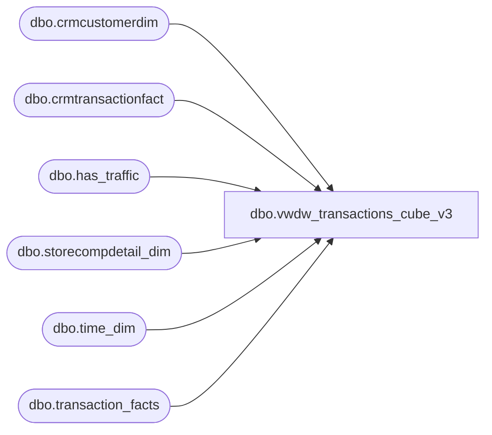

# dbo.vwdw_transactions_cube_v3

**Database:** LH_Reporting  
**Server:** 4db76rlxaxcuvmuh5kw37wbnqq-oxjjwecel5tehm2dtna3lt5qia.datawarehouse.fabric.microsoft.com  

## Architecture Diagram



## Table Dependencies

| Referenced Table |
|---|
| dbo.crmcustomerdim |
| dbo.crmtransactionfact |
| dbo.has_traffic |
| dbo.storecompdetail_dim |
| dbo.time_dim |
| dbo.transaction_facts |

## View Code

```sql
CREATE VIEW [dbo].[vwdw_transactions_cube_v3]
 AS
 -- =============================================================================================================
 -- Name: [dbo].[vwDW_Transactions_Cube_V3]
 --
 -- Description: View underlying the SSAS Papa Mart Cube used on the dashboard.   
 -- Aggregates POS transactions sales and product group metrics by store and date
 --
 -- NOTE: IF YOU CHANGE THIS, YOU WILL PROBABLY HAVE TO ALSO CHANGE spDW_Build_Transaction_Facts
 --
 -- Dependencies: 
 --
 -- Revision History
 --  Name:    Date:   Comments:
 --  Kevin Shyr   2/7/2015  Added Scents data
 --  Kevin Shyr   10/2/2014  Change age calculation
 --  Gary Murrish  5/7/2014  Added Cost Measures
 --  Gary Murrish  7/9/2013  Added Fiscal GAAP Sales
 --  Gary Murrish  9/12/2012  Changed the ShopperTrak Source
 --  Gary Murrish  6/5/2012  Added Count of number of transactions with a discount
 --  Gary Murrish  5/24/2012  Added Shopper Trak Flag for those days where we have shopper trak info
 --  Gary Murrish  5/10/2012  Changed Comp Store Selection
 --  Gary Murrish  2/14/2012  Complete remodel
 --  Dan Tweedie   06/09/2016  Added new columns related to new Enterprise Selling transactions handling
 --            Store_transaction_flag,
 --            Store_Sales_Amount,
 --            Store_units,
 --            numStoreTransWithDiscount,
 --            Financial_Store_Sales_Amount
 --  Dan Tweedie   06/22/2016  Added hasTraffic flag
 --  Dan Tweedie   06/29/2016  Removed 'AND td.hour BETWEEN cmp.ShopperTrakStartHour AND cmp.ShopperTrakEndHour'  so no longer filtering by this
 --  Dan Tweedie   08/09/2016  New Measures
 --           • Enterprise Selling Amount = Sales amount associated with Enterprise Selling Orders / Cancels / Returns
 --           • Enterprise Selling Transaction Count = Transaction count associated with Enterprise Selling Orders / Cancels / Returns
 --           • Enterprise Selling Units = Unit count associated with Enterprise Selling Orders / Cancels / Returns
 --           • Gaap Units = Merchandise Units, not including Enterprise Selling Orders / Cancels / Returns
 --           • Enterprise Selling Only Amount = Sale amount for transactions which only contain ES Orders / Cancels Returns
 --           • Enterprise Selling Only Transaction Count = Count of transactions which only contain ES Orders / Cancels Returns
 --           • Enterprise Selling Only Units = Unit count for transactions which only contain ES Orders / Cancels Returns
 --  Dan Tweedie  10/03/2016   Added left join to CRMTransactionFact to get the CRMTransactionType values for column SFS_TRN_TYP_CD
 --  Dan Tweedie  10/04/2016   Added [TransactionEligibleForLoyaltyCapture]
 --  Tim Bytnar  11/14/2017   Added in support for Party Master column
 --      John Eck        1/18/2017           Added Direct Mailable transaction flag.
 --      John Eck  7/12/18    REemoved has traffic cte and replaced with an indexed table
 --  Dan TWeedie  10/08/2018   Removed join to crm_trn_sum_fact and clnsd_addr_dim, replaced columns to source from CRMTransactionFact and CRMCustomerDim
 --      Kelly Farrar 4/24/2019   Add Has Phone Number Flag to view
 --  Dan Tweedie  2020-1-11   Added PickupFromStore,ShipFromStore,Curbside,SameDayShipt measures
 -- =============================================================================================================
 
 
 SELECT TOP 1
  transaction_id,
  tf.store_key,
  tf.date_key,
  tf.time_key,
  transaction_type_key,
  currency_key,
  party_flag,
  GAAP_transaction_flag,
  CAST(ISNULL(cmp.isCompTY, 0) AS integer) AS isComp,
  CAST(ISNULL(cmp.isCompNY, 0) AS integer) AS isCompNextYear,
  line_count,
  unit_net_amount,
  unit_gross_amount,
  unit_discount_amount,
  animal_UGA,
  animal_units,
  non_animal_UGA,
  non_animal_units,
  footwear_UGA,
  footwear_units,
  accessories_UGA,
  accessories_units,
  sounds_UGA,
  sounds_units,
  Scents_UGA,
  Scents_units,
  clothing_UGA,
  clothing_units,
  other_UGA,
  other_
```

