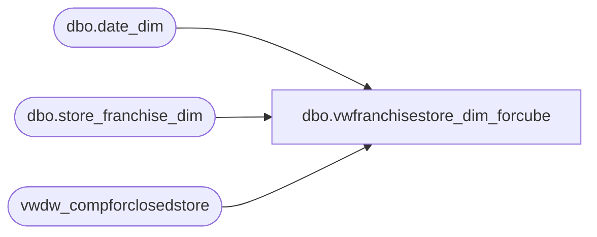

# dbo.vwfranchisestore_dim_forcube

**Database:** LH_Reporting  
**Server:** 4db76rlxaxcuvmuh5kw37wbnqq-oxjjwecel5tehm2dtna3lt5qia.datawarehouse.fabric.microsoft.com  

## Architecture Diagram



## Table Dependencies

| Referenced Table |
|---|
| dbo.date_dim |
| dbo.store_franchise_dim |
| vwdw_compforclosedstore |

## View Code

```sql
CREATE VIEW vwfranchisestore_dim_forcube
   
 /*-- =============================================================================================================  
 -- Name: [dbo].[vwFranchiseStore_dim_ForCube]  
 --  
 -- Description: Created to simplify vwDW_Store - underlying store view for cube.    
     Accesses all franchise store information for cube.    
     Joins store_franchise_dim to date_dim and vwDW_CompForClosedStore  
 --  
 -- Dependencies:   
 --  
 -- Revision History  
   
 --  Name:   Date:   Comments:  
    
 --  Funmi Agbebi 02/16/2010  Creation   
   
 -- =============================================================================================================*/  
   
 AS  
   
    SELECT  TOp 1
   
     f.store_key  
     ,CAST(f.store_id AS varchar) AS store_id  
     ,'Unranked' as StoreRanking  
     ,f.store_name  
     ,storeNameNum = f.store_id + ' ' + f.store_name  
     ,f.bearea  
     ,f.bearritory  
     ,f.region  
     ,f.region AS GeographyRegion  
     ,f.country_name AS ParentCountry --FA 9/29/2009  
     ,f.country_name AS ChildCountry --FA 9/29/2009  
     ,f.country  
     ,f.country_name  
     ,f.country_name as country_display  
        ,f.state_province  
     ,state_province_key = isnull(f.country,'') + '-' + ISNULL(f.state_province, '')  
     ,f.city  
     ,f.postal_code  
     ,f.latitude  
     ,f.longitude  
     ,dma_name = 'Other'  
     ,f.opening_date  
     ,dd.day_id AS opening_date_id  
 --    ,f.closing_date  
     ,f.comp_week_id  
     ,dd.period_id AS open_fp_id  
     ,dd.week_id AS open_week_id  
     ,(SELECT date_key FROM LH_Mart.dbo.date_dim WHERE actual_date = f.comp_date) AS comp_date_key  
     ,ReportFlag = 1  
     ,ClubMaxFlag = 0  
     ,f.BearRange  
     ,CompanyLevel = 'Franchisees'  
   
 --   new fields added 02/16/2010  
     ,clsd.isclosed  
     ,clsd.closing_date_key  
     ,f.closing_date   
     ,clsd.closing_max_comp_date_key  
     ,clsd.closing_max_comp_date  
     ,clsd.closing_max_ly_comp_date_key  
     ,clsd.closing_max_ly_comp_date  
   
     , 'Franchisees' AS MerchCompanyLevel  
     ,f.BearRange AS MerchBearRange  
     ,f.country_name AS MerchCountry   
     ,f.region AS MerchStrCntRegion  
     ,f.region AS MerchRegion  
     ,f.bearritory AS MerchBearritory  
    FROM LH_Mart.dbo.store_franchise_dim f  
    LEFT JOIN LH_Mart.dbo.date_dim dd ON f.opening_date = dd.actual_date  
    LEFT JOIN vwdw_compforclosedstore clsd ON f.store_key = clsd.store_key
```

