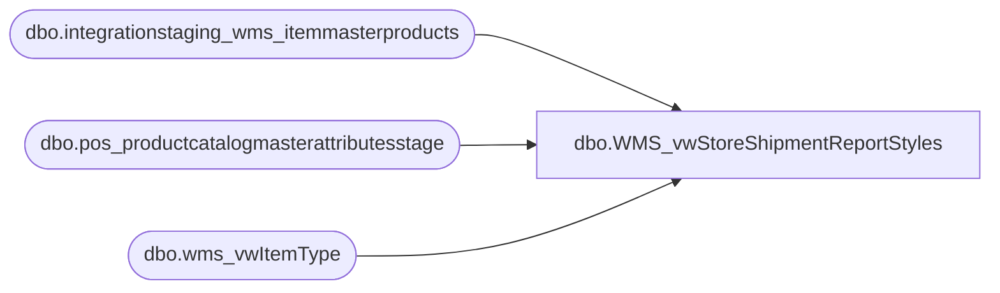

# dbo.WMS_vwStoreShipmentReportStyles

**Database:** LH_Source  
**Server:** 4db76rlxaxcuvmuh5kw37wbnqq-oxjjwecel5tehm2dtna3lt5qia.datawarehouse.fabric.microsoft.com  

## Architecture Diagram



## Table Dependencies

| Referenced Table |
|---|
| dbo.integrationstaging_wms_itemmasterproducts |
| dbo.pos_productcatalogmasterattributesstage |
| dbo.wms_vwItemType |

## View Code

```sql
CREATE view [dbo].[WMS_vwStoreShipmentReportStyles]
as
select  a.ProductNumber, 
a.ProductDescription as Product_Desc, 
a.SubClass
from dbo.pos_productcatalogmasterattributesstage a

union 

select 
imp.productnumber, 
imp.productname as Product_Desc, 
'Supplies' as SubClass
from LH_Mart.dbo.integrationstaging_wms_itemmasterproducts imp 
join dbo.wms_vwItemType t 
on t.itemnumber=imp.productnumber 
and t.entity=imp.entity
where lower(t.ItemType) = 'supplies'
	and NOT EXISTS 
	(
		select a.ProductNumber
		from dbo.pos_productcatalogmasterattributesstage a 
		where a.ProductNumber=imp.productnumber
	)
```

