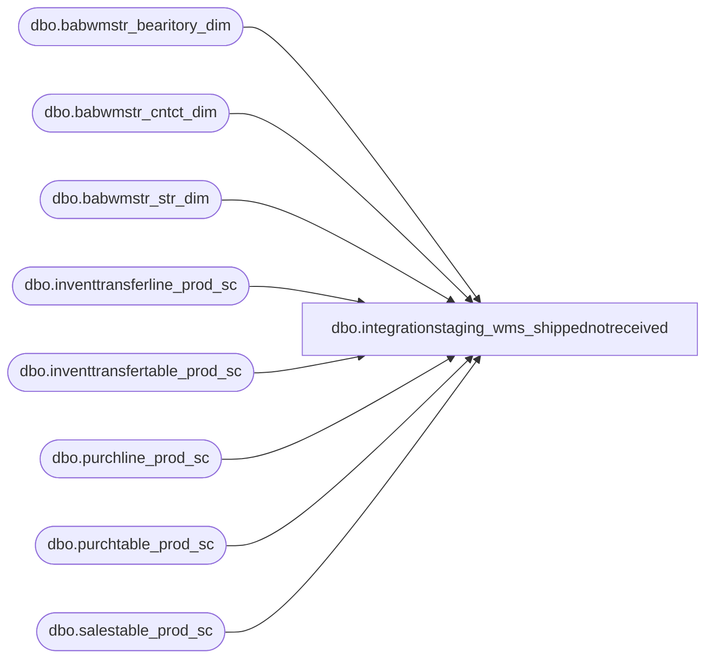

# dbo.integrationstaging_wms_shippednotreceived

**Database:** LH_Source  
**Server:** 4db76rlxaxcuvmuh5kw37wbnqq-oxjjwecel5tehm2dtna3lt5qia.datawarehouse.fabric.microsoft.com  

## Architecture Diagram



## Table Dependencies

| Referenced Table |
|---|
| dbo.babwmstr_bearitory_dim |
| dbo.babwmstr_cntct_dim |
| dbo.babwmstr_str_dim |
| dbo.inventtransferline_prod_sc |
| dbo.inventtransfertable_prod_sc |
| dbo.purchline_prod_sc |
| dbo.purchtable_prod_sc |
| dbo.salestable_prod_sc |

## View Code

```sql
create view dbo.integrationstaging_wms_shippednotreceived
AS
select  p.purchid as OrderNumber, 'Open Order' as OrderStatus , s.inventlocationid as FromWarehouse,  p.inventlocationid as ToWarehouse,
p.deliverydate as Receipt_Date, isnull(p.dlvmode,'') as ModeOfDelivery, isnull(p.babaptosposhipmentnum,'') as AptosShipmentNumber
,cast(isnull(sum(purchqty),0) as float) as QuantityShipped,  cast(isnull(sum(purchqty) - sum(remaininventphysical),0) as float) as QuantityReceived,
cast(isnull(sum(remaininventphysical),0) as float) as QuantityNotReceived
,sd.NM as DistrictName, sd.EMAIL as DistrictManager
,sd.BEARITORY_ID as DmId, sd.FRST_NM as DMfirstName, sd.LAST_NM as DMlastName
from LH_D365.dbo.purchtable_prod_sc p
left join LH_D365.dbo.salestable_prod_sc s on p.purchid = s.intercompanypurchid
inner join LH_D365.dbo.purchline_prod_sc pl on p.purchid = pl.purchid
left join (
select case when s.STR_NUM < 1000 then 1000 + s.STR_NUM else s.STR_NUM end as STR_NUM,s.BEARITORY_ID ,BD.BEARITORY_NUM, BD.NM, CD.FRST_NM, CD.LAST_NM, CD.EMAIL
FROM LH_Source.dbo.babwmstr_str_dim s
left join LH_Source.dbo.babwmstr_bearitory_dim BD on s.BEARITORY_ID = BD.BEARITORY_ID
join LH_Source.dbo.babwmstr_cntct_dim CD  ON BD.CNTCT_ID = CD.CNTCT_ID
) as sd on p.inventlocationid = cast(sd.STR_NUM as varchar)
where 1=1 
and p.purchstatus = 1
and p.orderaccount = '99001'
and cast(p.deliverydate as date) < cast(getdate() as date) 
group by p.purchid ,p.purchstatus ,  s.inventlocationid,  p.inventlocationid, p.deliverydate, p.dlvmode,
p.babaptosposhipmentnum,sd.NM, sd.FRST_NM, sd.LAST_NM, sd.EMAIL,sd.BEARITORY_ID, sd.FRST_NM, sd.LAST_NM


union 

select itt.transferid as OrderNumber, 'Shipped' as OrderStatus,  
 itt.inventlocationidfrom as FromWarehouse  , itt.inventlocationidto as ToWarehouse , itt.receivedate as Receipt_Date,
isnull(itt.dlvmodeid,'') as ModeOfDelivery, isnull(itt.babaptosshipmentnumber,'')  as AptosShipmentNumber
,cast(isnull(sum(itl.qtyshipped),0) as float) as QuantityShipped, cast(isnull(sum(itl.qtyreceived),0) as float) as QuantityReceived, cast(isnull(sum(itl.qtyremainreceive),0) as float) as QuantityNotReceived
,sd.NM as 'District Name', sd.EMAIL as DistrictManager
,sd.BEARITORY_ID as DmId, sd.FRST_NM as DMfirstName, sd.LAST_NM as DMlastName
from LH_D365.dbo.inventtransfertable_prod_sc itt
join LH_D365.dbo.inventtransferline_prod_sc itl on itt.transferid = itl.transferid
left join (
select case when s.STR_NUM < 1000 then 1000 + s.STR_NUM else s.STR_NUM end as STR_NUM,s.BEARITORY_ID ,BD.BEARITORY_NUM, BD.NM, CD.FRST_NM, CD.LAST_NM, CD.EMAIL
FROM LH_Source.dbo.babwmstr_str_dim s
left join LH_Source.dbo.babwmstr_bearitory_dim BD on s.BEARITORY_ID = BD.BEARITORY_ID
join LH_Source.dbo.babwmstr_cntct_dim CD  ON BD.CNTCT_ID = CD.CNTCT_ID
) as sd on itt.inventlocationidto = cast(sd.STR_NUM as varchar)
where 1=1
and itt.transferstatus = 1
and cast(itt.receivedate as date) < cast(getdate() as date) 
group by itt.transferid , itt.transferstatus,   itt.receivedate, itt.dlvmodeid , itt.babaptosshipmentnumber , itt.inventlocationidto,
itt.inventlocationidfrom ,sd.NM, sd.FRST_NM, sd.LAST_NM, sd.EMAIL,sd.BEARITORY_ID, sd.FRST_NM, sd.LAST_NM
```

