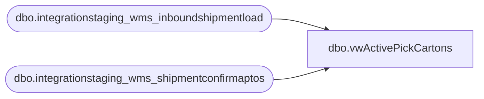

# dbo.vwActivePickCartons

**Database:** LH_Source  
**Server:** 4db76rlxaxcuvmuh5kw37wbnqq-oxjjwecel5tehm2dtna3lt5qia.datawarehouse.fabric.microsoft.com  

## Architecture Diagram



## Table Dependencies

| Referenced Table |
|---|
| dbo.integrationstaging_wms_inboundshipmentload |
| dbo.integrationstaging_wms_shipmentconfirmaptos |

## View Code

```sql
create view  dbo.vwActivePickCartons
as
select ContainerID, convert(varchar(23), s.ShipConfirmDateTime,121) as ShipConfirmDateTime, ToLocation
from dbo.integrationstaging_wms_shipmentconfirmaptos s
where 1=1 
	   and   cast(s.ShipConfirmDateTime as date) >= '04/01/2023' -- Retail Inventory Cutover Date
	--    and  DATEDIFF(dd, s.ShipConfirmDateTime, getdate()) <= @DateDiff  
	--    and s.ToLocation = @StoreNumber
group by ContainerID, ShipConfirmDateTime, ToLocation
having count (distinct ItemNumber) > 1 

UNION

select  i.LicensePlate as ContainerID ,i.ShipDate as ShipConfirmDateTime, i.ToWarehouse
from dbo.integrationstaging_wms_inboundshipmentload i 
where 1=1 
	   and i.BatchID <> 'Shipped Prior to Pilot Begin' -- Pre Retail Inventory Cutover 
	--    and  DATEDIFF(dd, i.ShipDate, getdate()) <= @DateDiff  
	--    and i.ToWarehouse = @StoreNumber
group by i.LicensePlate, i.ShipDate, i.ToWarehouse
having count (distinct ItemNumber) > 1
```

