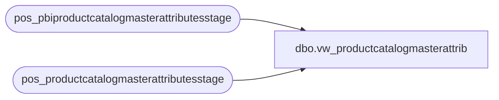

# dbo.vw_productcatalogmasterattrib

**Database:** LH_Source  
**Server:** 4db76rlxaxcuvmuh5kw37wbnqq-oxjjwecel5tehm2dtna3lt5qia.datawarehouse.fabric.microsoft.com  

## Architecture Diagram



## Table Dependencies

| Referenced Table |
|---|
| pos_pbiproductcatalogmasterattributesstage |
| pos_productcatalogmasterattributesstage |

## View Code

```sql
-- ===============================================================
-- Create View template for Azure Synapse SQL Analytics on-demand
-- ===============================================================


CREATE VIEW [dbo].[vw_productcatalogmasterattrib] AS

	SELECT *
	FROM pos_pbiproductcatalogmasterattributesstage


	union
	select *
	from pos_productcatalogmasterattributesstage
```

