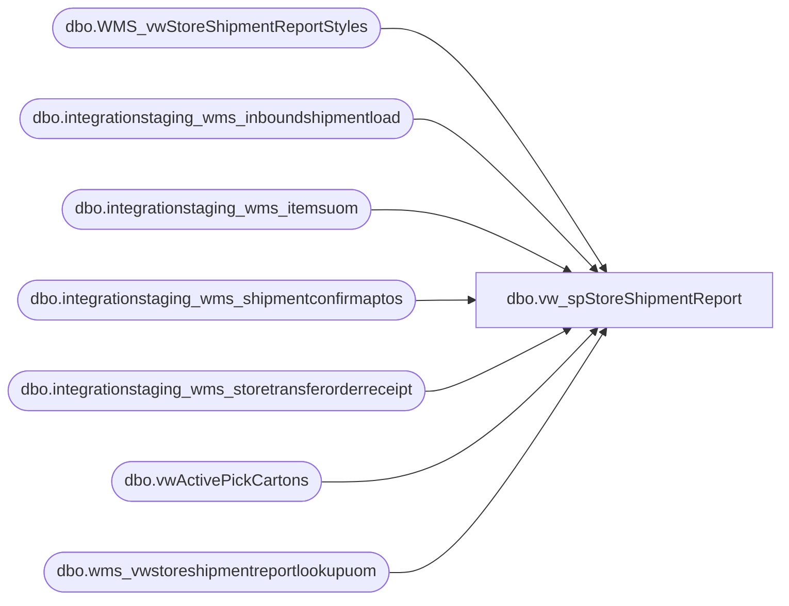

# dbo.vw_spStoreShipmentReport

**Database:** LH_Source  
**Server:** 4db76rlxaxcuvmuh5kw37wbnqq-oxjjwecel5tehm2dtna3lt5qia.datawarehouse.fabric.microsoft.com  

## Architecture Diagram



## Table Dependencies

| Referenced Table |
|---|
| dbo.WMS_vwStoreShipmentReportStyles |
| dbo.integrationstaging_wms_inboundshipmentload |
| dbo.integrationstaging_wms_itemsuom |
| dbo.integrationstaging_wms_shipmentconfirmaptos |
| dbo.integrationstaging_wms_storetransferorderreceipt |
| dbo.vwActivePickCartons |
| dbo.wms_vwstoreshipmentreportlookupuom |

## View Code

```sql
Create view dbo.vw_spStoreShipmentReport
as
select 
s.OrderNumber as OrderNumber ,
s.ContainerID as LicensePlate, 
s.ItemNumber as ItemNumber, 
p.Product_Desc as ProductName, 
s.Warehouse as ShippingLocation, 
s.ToLocation as ReceivingLocation,
p.SubClass as ProductHierarchy, 
cast(s.ShipConfirmDateTime as date) as ShipDate,
sum((isnull(uom.Factor,1) * s.ContainerUnitsShipped)) as QtyOfItemsBeingShipped, 
count(distinct s.ContainerID) as QtyOfCartonsInShipment, 
case 
	when apc.ContainerID is not null 
		then 'Yes'
	else 'No'
end as isActivePickCarton,
case when apc.ContainerID is not null and s.ContainerUnitOfMeasure = 'IP'
       then concat(cast (s.ContainerUnitsShipped as varchar) , ' : Inner Packs')
	when apc.ContainerID is not null and s.ContainerUnitOfMeasure = 'EA'
	   then concat(cast (s.ContainerUnitsShipped as varchar) , ' : Eaches')
	when apc.ContainerID is not null and s.ContainerUnitOfMeasure = 'CS'
		then concat(cast (s.ContainerUnitsShipped as varchar) , ' : Cases')
	when apc.ContainerID is not null and s.ContainerUnitOfMeasure not in ('IP','EA','CS')
		then concat(cast (s.ContainerUnitsShipped as varchar) , ' : ' , s.ContainerUnitOfMeasure)
	else 'N\A' 
end as ActivePickDetails, 
s.ContainerUnitOfMeasure,
cast(s.ShipConfirmDateTime as date) as ShipConfirmDateTime,
s.ToLocation
from dbo.integrationstaging_wms_shipmentconfirmaptos s  
join dbo.WMS_vwStoreShipmentReportStyles p on p.ProductNumber=s.ItemNumber
left join LH_Mart.dbo.integrationstaging_wms_itemsuom uom   on s.ItemNumber=uom.ProductNumber and s.ContainerUnitOfMeasure=uom.FromUnitSymbol and uom.ToUnitSymbol='ea' and uom.Entity=1100
left join dbo.vwActivePickCartons apc  
 on apc.ContainerID=s.ContainerID
where 1=1 
and  cast(s.ShipConfirmDateTime as date) >= '04/01/2023'
-- and  DATEDIFF(dd, s.ShipConfirmDateTime, getdate()) <= @DateDiff  -- Added for Performance
-- and s.ToLocation = @StoreNumber
and NOT EXISTS (
				select SourceOrderNumber, Entity 
				from dbo.integrationstaging_wms_storetransferorderreceipt  r
				where r.SourceOrderNumber = s.OrderNumber
				group by SourceOrderNumber, Entity
				) 
group by 
s.OrderNumber, 
s.ContainerID, 
s.ItemNumber, 
s.Warehouse, 
s.ToLocation, 
s.ShipConfirmDateTime, 
p.Product_Desc, 
p.SubClass, 
s.ShippedQuantity, 
case 
	when apc.ContainerID is not null 
		then 'Yes'
	else 'No'
end ,
case when apc.ContainerID is not null and s.ContainerUnitOfMeasure = 'IP'
       then concat(cast (s.ContainerUnitsShipped as varchar) , ' : Inner Packs')
	when apc.ContainerID is not null and s.ContainerUnitOfMeasure = 'EA'
	   then concat(cast (s.ContainerUnitsShipped as varchar) , ' : Eaches')
	when apc.ContainerID is not null and s.ContainerUnitOfMeasure = 'CS'
		then concat(cast (s.ContainerUnitsShipped as varchar) , ' : Cases')
	when apc.ContainerID is not null and s.ContainerUnitOfMeasure not in ('IP','EA','CS')
		then concat(cast (s.ContainerUnitsShipped as varchar) , ' : ' , s.ContainerUnitOfMeasure)
	else 'N\A' 
End,
s.ContainerUnitOfMeasure



UNION 

SELECT 
i.OrderId as OrderNumber,
i.LicensePlate,
i.ItemNumber as ItemNumber,  
p.Product_Desc as ProductName, 
i.FromWarehouse as ShippingLocation, 
i.ToWarehouse as ReceivingLocation,
p.SubClass as ProductHierarchy, 
convert(varchar(10), i.ShipDate, 101) as ShipDate, 
sum(i.TransferQuantity) as QtyOfItemsBeingShipped, 
count(i.ContainerID) as QtyOfCartonsInShipment,

case 
    when apc.ContainerID is not null 
        then 'Yes'
    else 'No'
end as isActivePickCarton, 

case 
    when apc.ContainerID is not null
        then concat(cast(i.TransferQuantity / isnull(u.unitsinpack,1) as varchar) 
             , ' : Inner Packs 3PL')
    else 'N\A' 
end as ActivePickDetails, 
i.UOM as ContainerUnitOfMeasure,
cast(i.ShipDate as date) as ShipConfirmDateTime,
i.ToWarehouse
from dbo.integrationstaging_wms_inboundshipmentload i

join dbo.WMS_vwStoreShipmentReportSty
```

