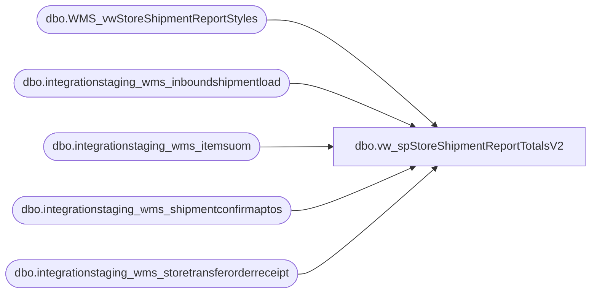

# dbo.vw_spStoreShipmentReportTotalsV2

**Database:** LH_Source  
**Server:** 4db76rlxaxcuvmuh5kw37wbnqq-oxjjwecel5tehm2dtna3lt5qia.datawarehouse.fabric.microsoft.com  

## Architecture Diagram



## Table Dependencies

| Referenced Table |
|---|
| dbo.WMS_vwStoreShipmentReportStyles |
| dbo.integrationstaging_wms_inboundshipmentload |
| dbo.integrationstaging_wms_itemsuom |
| dbo.integrationstaging_wms_shipmentconfirmaptos |
| dbo.integrationstaging_wms_storetransferorderreceipt |

## View Code

```sql
CREATE view [dbo].[vw_spStoreShipmentReportTotalsV2]
as
select s.ToLocation as ReceivingLocation,
		sum((isnull(uom.Factor,1) * s.ContainerUnitsShipped)) as QtyOfItemsBeingShipped, 
		count(distinct(s.ContainerID)) as QtyOfCartonsInShipment,
        cast(s.ShipConfirmDateTime as date) as ShipConfirmDateTime,
        s.ToLocation
		from dbo.integrationstaging_wms_shipmentconfirmaptos s
		join dbo.WMS_vwStoreShipmentReportStyles p
            on p.ProductNumber=s.ItemNumber
		left join LH_Mart.dbo.integrationstaging_wms_itemsuom uom 
             on s.ItemNumber=uom.ProductNumber 
             and s.ContainerUnitOfMeasure=uom.FromUnitSymbol 
             and uom.ToUnitSymbol='ea' and uom.Entity=1100
		 where 1=1 
		    and cast(s.ShipConfirmDateTime as date) >= '04/01/2023'
		-- and datediff(dd, s.ShipConfirmDateTime, getdate()) <= @DateDiff
		-- and s.ToLocation = @storeNumber
		and NOT EXISTS (
				select SourceOrderNumber, Entity 
				from dbo.integrationstaging_wms_storetransferorderreceipt  r
				where r.SourceOrderNumber = s.OrderNumber
				group by SourceOrderNumber, Entity
				) 
		 group by s.ToLocation, cast(s.ShipConfirmDateTime as date)

UNION 

 select i.ToWarehouse as ReceivingLocation,
		  sum(i.TransferQuantity) as QtyOfItemsBeingShipped, 
		  count(distinct i.LicensePlate) as QtyOfCartonsInShipment,
          cast(i.ShipDate as date) as ShipConfirmDateTime,
          i.ToWarehouse
		 from  dbo.integrationstaging_wms_inboundshipmentload i
		 join dbo.WMS_vwStoreShipmentReportStyles p  
         on p.ProductNumber=i.ItemNumber
		 where 1=1
		 and i.BatchID <> 'Shipped Prior to Pilot Begin'
		--  and datediff(dd, i.ShipDate, getdate()) <= @DateDiff
		--  and i.ToWarehouse = @storeNumber
		 and NOT EXISTS (
							select SourceOrderNumber, Entity 
							from dbo.integrationstaging_wms_storetransferorderreceipt  r
							where r.SourceOrderNumber = i.OrderId --and r.Entity=i.Entity -- Entity Hurt Performance May Need to revisit
							group by SourceOrderNumber, Entity
						) 
		 group by i.ToWarehouse,cast(i.ShipDate as date)
```

