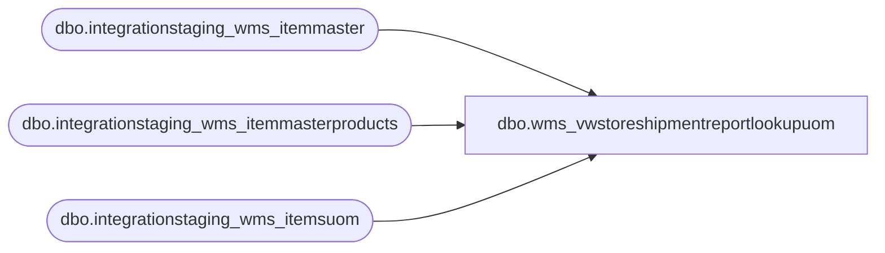

# dbo.wms_vwstoreshipmentreportlookupuom

**Database:** LH_Source  
**Server:** 4db76rlxaxcuvmuh5kw37wbnqq-oxjjwecel5tehm2dtna3lt5qia.datawarehouse.fabric.microsoft.com  

## Architecture Diagram



## Table Dependencies

| Referenced Table |
|---|
| dbo.integrationstaging_wms_itemmaster |
| dbo.integrationstaging_wms_itemmasterproducts |
| dbo.integrationstaging_wms_itemsuom |

## View Code

```sql
create view dbo.wms_vwstoreshipmentreportlookupuom
as
with items as
(
    select
        imp.entity,
        imp.productnumber,
        imp.productname,
        im.necessaryproductionworkingtimeschedulingpropertyid as itemtype
    from lh_mart.dbo.integrationstaging_wms_itemmasterproducts imp
    join lh_mart.dbo.integrationstaging_wms_itemmaster im
        on imp.productnumber = im.productnumber
        and im.entity = 1100
    where 1 = 1
    group by
        imp.entity,
        imp.productnumber,
        imp.productname,
        im.necessaryproductionworkingtimeschedulingpropertyid
),

unitsincase as
(
    select
        u.Entity,
        u.ProductNumber,
        u.Factor as unitsincase
    from lh_mart.dbo.integrationstaging_wms_itemsuom u
    where 1 = 1
        and LOWER(u.FromUnitSymbol) = 'cs'
        and LOWER(u.ToUnitSymbol) = 'ea'
),

unitsinpack as
(
    select
        u.Entity,
        u.ProductNumber,
        u.Factor as unitsinpack
    from lh_mart.dbo.integrationstaging_wms_itemsuom u
    where 1 = 1
        and lower(u.FromUnitSymbol) = 'ip'
        and lower(u.ToUnitSymbol) = 'ea'
),

packsincase as
(
    select
        u.Entity,
        u.ProductNumber,
        u.Factor as packsincase
    from lh_mart.dbo.integrationstaging_wms_itemsuom u
    where 1 = 1
        and lower(u.FromUnitSymbol) = 'cs'
        and lower(u.ToUnitSymbol) = 'ip'
)

select
    i.entity,
    i.productnumber,
    i.productname,
    i.itemtype,
    isnull(uic.unitsincase, 1) as unitsincase,
    isnull(pic.packsincase, 1) as packsincase,
    isnull(uip.unitsinpack, 1) as unitsinpack
from items i
left join unitsincase uic
    on uic.Entity = i.entity
    and uic.ProductNumber = i.productnumber
left join unitsinpack uip
    on uip.Entity = i.entity
    and uip.ProductNumber = i.productnumber
left join packsincase pic
    on pic.Entity = i.entity
    and pic.ProductNumber = i.productnumber
where 1 = 1;
```

