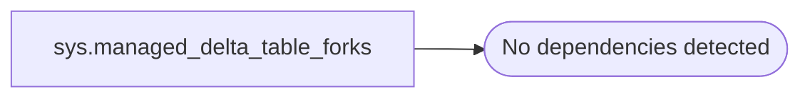

# sys.managed_delta_table_forks

**Database:** LH_Staging  
**Server:** 4db76rlxaxcuvmuh5kw37wbnqq-oxjjwecel5tehm2dtna3lt5qia.datawarehouse.fabric.microsoft.com  

## Architecture Diagram



## Table Dependencies

_No table dependencies detected._

## View Code

```sql
CREATE   VIEW sys.managed_delta_table_forks
AS
SELECT f.commit_sequence_id, f.fork_guid, f.source_table_guid, f.source_database_guid, f.xdes_ts, f.commit_time, t.table_guid, UPPER(CAST(f.fork_guid AS NVARCHAR(40))) as folder_name
FROM sys.manageddeltatables t
JOIN sys.manageddeltatableforks f
ON t.table_id = f.table_id and t.drop_commit_time <= '1900-01-01T00:00:00'
```

