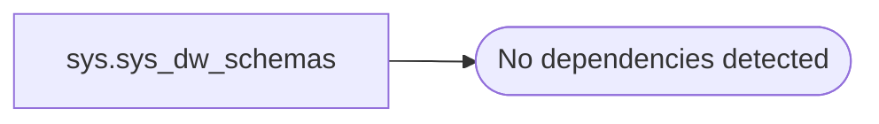

# sys.sys_dw_schemas

**Database:** Temp_Lakehouse  
**Server:** 4db76rlxaxcuvmuh5kw37wbnqq-oxjjwecel5tehm2dtna3lt5qia.datawarehouse.fabric.microsoft.com  

## Architecture Diagram



## Table Dependencies

_No table dependencies detected._

## View Code

```sql
CREATE   VIEW sys.sys_dw_schemas
AS
SELECT s.*, i.* 
FROM sys.schemas s
OUTER APPLY OpenRowSet(TABLE DW_SCHEMAS, s.schema_id) i
```

