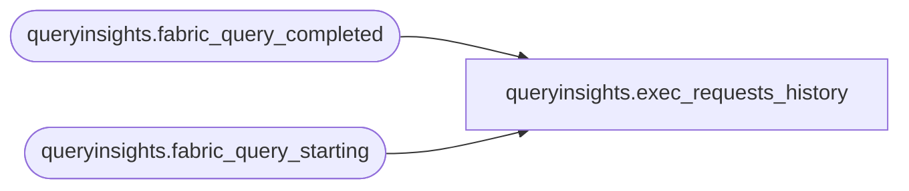

# queryinsights.exec_requests_history

**Database:** WH_Staging  
**Server:** 4db76rlxaxcuvmuh5kw37wbnqq-oxjjwecel5tehm2dtna3lt5qia.datawarehouse.fabric.microsoft.com  

## Architecture Diagram



## Table Dependencies

| Referenced Table |
|---|
| queryinsights.fabric_query_completed |
| queryinsights.fabric_query_starting |

## View Code

```sql
CREATE VIEW queryinsights.exec_requests_history AS (
            SELECT
                t1.distributed_statement_id AS distributed_statement_id,
                t1.database_name,
                t1.submit_time,
                t1.TIMESTAMP AS start_time,
                t2.TIMESTAMP AS end_time,
                CASE
                    WHEN t2.distributed_request_id != '00000000-0000-0000-0000-000000000000'
                    AND t2.distributed_request_id IS NOT NULL THEN 1
                    ELSE 0
                END AS is_distributed,
                ISNULL(t1.is_accelerated, 0) AS is_accelerated,
                CASE
                    WHEN t2.result_cache_hit > 0 THEN 'SELECT'
                    ELSE t1.statement_type
                END AS statement_type,
                GREATEST(
                    DATEDIFF_BIG(MILLISECOND, t1.submit_time, t2.TIMESTAMP),
                    DATEDIFF_BIG(MILLISECOND, t1.TIMESTAMP, t2.TIMESTAMP),
                    10
                ) AS total_elapsed_time_ms,
                t1.login_name,
                t2.row_count,
                t2.query_status AS status,
                t1.session_id,
                t1.connection_id,
                t1.program_name,
                t1.batch_id,
                t1.root_batch_id,
                CASE
                    WHEN obfuscated_query_text_hash NOT LIKE '0x%[^A-Za-z1-9]'
                    AND obfuscated_query_text_hash != '0x' THEN obfuscated_query_text_hash
                    ELSE query_text_hash
                END AS query_hash,
                t1.label,
                t2.result_cache_hit,
                t2.sql_pool_name,
                t2.error_code,
                t2.error_severity,
                t2.error_state,
                (
                    CAST(t2.cpu_time_fe_ms * 1.0 / 1000 AS BIGINT) + t2.cpu_time_be_ms
                ) AS allocated_cpu_time_ms,
                CAST(
                    t2.data_scanned_remote_storage_bytes * 1.0 / (1024 * 1024) AS DECIMAL(18, 3)
                ) AS data_scanned_remote_storage_mb,
                CAST(
                    t2.data_scanned_memory_bytes * 1.0 / (1024 * 1024) AS DECIMAL(18, 3)
                ) AS data_scanned_memory_mb,
                CAST(
                    t2.data_scanned_disk_bytes * 1.0 / (1024 * 1024) AS DECIMAL(18, 3)
                ) AS data_scanned_disk_mb,
                COALESCE(t1.command_lob, t1.statement) AS command
            FROM
                queryinsights.fabric_query_starting AS t1
                JOIN queryinsights.fabric_query_completed AS t2 ON t1.distributed_statement_id = t2.distributed_statement_id
                AND t1.database_name = t2.database_name
                AND t1.batch_id = t2.batch_id
            WHERE
                t1.submit_time > DATEADD(DAY, -30, GETDATE())
        );
```

