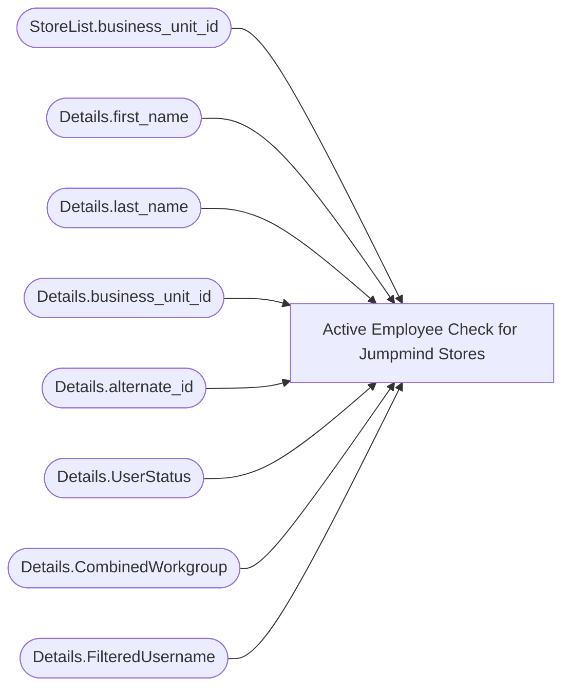

# Active Employee Check for Jumpmind Stores

**Workspace:** BI-Accounting  
**Report ID:** fc115308-1b8e-4a9d-9464-de02171b32f6  
**Dataset ID:** e610d1e9-0844-4dea-b792-7667a2d34a9c  
**Web URL:** https://app.powerbi.com/groups/e996caff-15ec-41d5-ae2b-cc9137531fb6/reports/fc115308-1b8e-4a9d-9464-de02171b32f6  
**Semantic Model:** [Active Employee Check for Jumpmind Stores](../../SemanticModels/BI-Accounting/Active Employee Check for Jumpmind Stores.md)  

## Architecture Diagram

## Field Dependencies

| Referenced Field |
|---|
| StoreList.business_unit_id |
| Details.first_name |
| Details.last_name |
| Details.business_unit_id |
| Details.alternate_id |
| Details.UserStatus |
| Details.CombinedWorkgroup |
| Details.FilteredUsername |

## Pages

| Page | Visuals |
|---|---|
| Page 1 | 3 |

## Visuals

### Page 1

| Visual | Type | Fields |
|---|---|---|
| 331d78a9ac88a9707429 | tableEx | StoreList.business_unit_id |
| 54521d91aaa6d8568f92 | textbox |  |
| a7a941994ce3d5bb772e | tableEx | Details.first_name, Details.last_name, Details.business_unit_id, Details.alternate_id, Details.UserStatus, Details.CombinedWorkgroup, Details.FilteredUsername |
