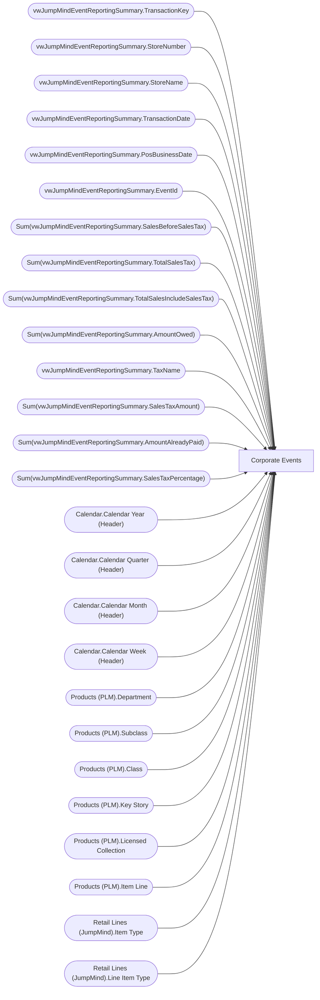

# Corporate Events

**Workspace:** BI-Accounting  
**Report ID:** 61daf991-3823-47f7-9392-8e52cd746294  
**Dataset ID:** 459ad959-d71a-481e-ae77-34987085c611  
**Web URL:** https://app.powerbi.com/groups/e996caff-15ec-41d5-ae2b-cc9137531fb6/reports/61daf991-3823-47f7-9392-8e52cd746294  
**Semantic Model:** [Sales Audit Data Model](../../SemanticModels/Enterprise Analytics Prod/Sales Audit Data Model.md)  

## Architecture Diagram

## Field Dependencies

| Referenced Field |
|---|
| vwJumpMindEventReportingSummary.TransactionKey |
| vwJumpMindEventReportingSummary.StoreNumber |
| vwJumpMindEventReportingSummary.StoreName |
| vwJumpMindEventReportingSummary.TransactionDate |
| vwJumpMindEventReportingSummary.PosBusinessDate |
| vwJumpMindEventReportingSummary.EventId |
| Sum(vwJumpMindEventReportingSummary.SalesBeforeSalesTax) |
| Sum(vwJumpMindEventReportingSummary.TotalSalesTax) |
| Sum(vwJumpMindEventReportingSummary.TotalSalesIncludeSalesTax) |
| Sum(vwJumpMindEventReportingSummary.AmountOwed) |
| vwJumpMindEventReportingSummary.TaxName |
| Sum(vwJumpMindEventReportingSummary.SalesTaxAmount) |
| Sum(vwJumpMindEventReportingSummary.AmountAlreadyPaid) |
| Sum(vwJumpMindEventReportingSummary.SalesTaxPercentage) |
| Calendar.Calendar Year (Header) |
| Calendar.Calendar Quarter (Header) |
| Calendar.Calendar Month (Header) |
| Calendar.Calendar Week (Header) |
| Products (PLM).Department |
| Products (PLM).Subclass |
| Products (PLM).Class |
| Products (PLM).Key Story |
| Products (PLM).Licensed Collection |
| Products (PLM).Item Line |
| Retail Lines (JumpMind).Item Type |
| Retail Lines (JumpMind).Line Item Type |

## Pages

| Page | Visuals |
|---|---|
| Corporate Events | 30 |

## Visuals

### Corporate Events

| Visual | Type | Fields |
|---|---|---|
| 363d3089689cc31382ce | textbox |  |
| a9c3ddc70ed01abb2fd6 | tableEx | vwJumpMindEventReportingSummary.TransactionKey, vwJumpMindEventReportingSummary.StoreNumber, vwJumpMindEventReportingSummary.StoreName, vwJumpMindEventReportingSummary.TransactionDate, vwJumpMindEventReportingSummary.PosBusinessDate, vwJumpMindEventReportingSummary.EventId, Sum(vwJumpMindEventReportingSummary.SalesBeforeSalesTax), Sum(vwJumpMindEventReportingSummary.TotalSalesTax), Sum(vwJumpMindEventReportingSummary.TotalSalesIncludeSalesTax), Sum(vwJumpMindEventReportingSummary.AmountOwed), vwJumpMindEventReportingSummary.TaxName, Sum(vwJumpMindEventReportingSummary.SalesTaxAmount), Sum(vwJumpMindEventReportingSummary.AmountAlreadyPaid), Sum(vwJumpMindEventReportingSummary.SalesTaxPercentage) |
| 0b4140222c5f6ce0edbe | unknown |  |
| f920f4a3989b72fd51af | textbox |  |
| 0bcd43cda8b8c9272764 | textbox |  |
| 97f4659a5a12bc988c51 | image |  |
| 9ea736d49b75db93980e | textbox |  |
| ec739d70b14b7c06805a | actionButton |  |
| 44b856414f1a82fa1972 | unknown |  |
| f492ce29c681642c039d | slicer | vwJumpMindEventReportingSummary.StoreNumber |
| 122ea31d98d5e46b728a | bookmarkNavigator |  |
| ebf4a2dc4872072b777f | unknown |  |
| 9a7956cae86f44783ec2 | slicer | vwJumpMindEventReportingSummary.TransactionDate |
| 4df0d921ab0b5d077f2c | slicer | Calendar.Calendar Year (Header), Calendar.Calendar Quarter (Header), Calendar.Calendar Month (Header), Calendar.Calendar Week (Header) |
| cca8d761cff72ee6b8d5 | bookmarkNavigator |  |
| 826e14c9840c3793285e | unknown |  |
| e8e740717323d0200f7a | slicer | Products (PLM).Department |
| 7869095a179dc31dae86 | slicer | Products (PLM).Subclass, Products (PLM).Class |
| 3edf860c41bfa20e56ed | slicer | Products (PLM).Key Story |
| 22da671c0667f2a982ae | slicer | Products (PLM).Licensed Collection |
| ebefc5b86b1ea14d3bca | slicer | Products (PLM).Item Line |
| c5bb2e2d468b021899e9 | slicer | Retail Lines (JumpMind).Item Type |
| 0990f82a5dbf1a44dadb | slicer | Retail Lines (JumpMind).Line Item Type |
| d60b44ab0994153302b3 | unknown |  |
| 6638838506cceec393e7 | slicer | vwJumpMindEventReportingSummary.StoreNumber |
| df86f06e967c91d2414a | slicer | vwJumpMindEventReportingSummary.EventId |
| 1247fc727a61c0856ee0 | slicer | vwJumpMindEventReportingSummary.TaxName |
| 9a867bcecd3d326e700a | slicer | vwJumpMindEventReportingSummary.PosBusinessDate |
| 172c32e50b240ce9090b | slicer | vwJumpMindEventReportingSummary.TransactionKey |
| 3907067465cb97118580 | textbox |  |
