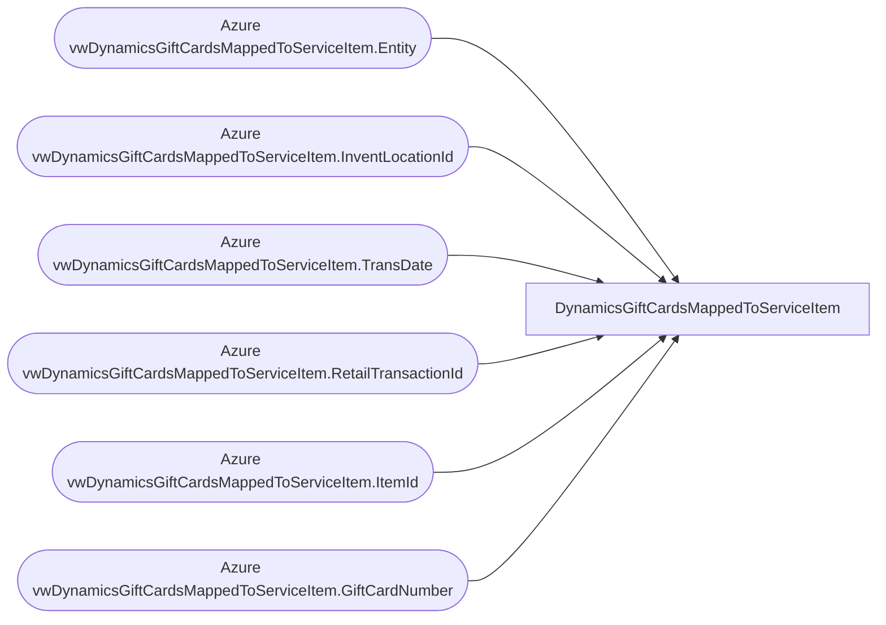

# DynamicsGiftCardsMappedToServiceItem

**Workspace:** BI-Accounting  
**Report ID:** 518c50f7-3fff-460e-ae1a-b91db07ede10  
**Dataset ID:** ea90321c-029a-4c62-adbb-a84cc7ba3a47  
**Web URL:** https://app.powerbi.com/groups/e996caff-15ec-41d5-ae2b-cc9137531fb6/reports/518c50f7-3fff-460e-ae1a-b91db07ede10  
**Semantic Model:** [GiftCardsMappedToServiceItem](../../SemanticModels/BI-Accounting/GiftCardsMappedToServiceItem.md)  

## Architecture Diagram

## Field Dependencies

| Referenced Field |
|---|
| Azure vwDynamicsGiftCardsMappedToServiceItem.Entity |
| Azure vwDynamicsGiftCardsMappedToServiceItem.InventLocationId |
| Azure vwDynamicsGiftCardsMappedToServiceItem.TransDate |
| Azure vwDynamicsGiftCardsMappedToServiceItem.RetailTransactionId |
| Azure vwDynamicsGiftCardsMappedToServiceItem.ItemId |
| Azure vwDynamicsGiftCardsMappedToServiceItem.GiftCardNumber |

## Pages

| Page | Visuals |
|---|---|
| Page 1 | 4 |

## Visuals

### Page 1

| Visual | Type | Fields |
|---|---|---|
| 17a005b1206500319497 | tableEx | Azure vwDynamicsGiftCardsMappedToServiceItem.Entity, Azure vwDynamicsGiftCardsMappedToServiceItem.InventLocationId, Azure vwDynamicsGiftCardsMappedToServiceItem.TransDate, Azure vwDynamicsGiftCardsMappedToServiceItem.RetailTransactionId, Azure vwDynamicsGiftCardsMappedToServiceItem.ItemId, Azure vwDynamicsGiftCardsMappedToServiceItem.GiftCardNumber |
| df79a380aaa5875d40ca | slicer | Azure vwDynamicsGiftCardsMappedToServiceItem.Entity |
| 3dafe3bc656dbe8123b0 | slicer | Azure vwDynamicsGiftCardsMappedToServiceItem.InventLocationId |
| 131ed7c400cdbcc8c578 | slicer | Azure vwDynamicsGiftCardsMappedToServiceItem.TransDate |
