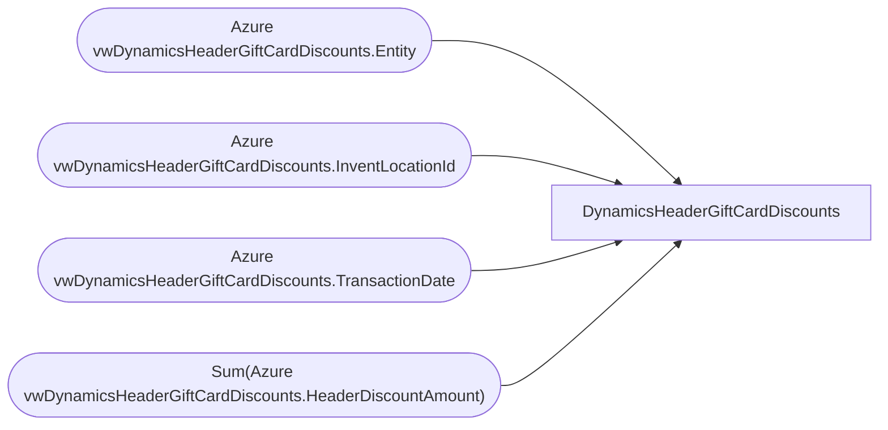

# DynamicsHeaderGiftCardDiscounts

**Workspace:** BI-Accounting  
**Report ID:** e6df2fe2-b17b-4b2a-b7c7-e9c276ac2e50  
**Dataset ID:** f9e93a87-9a37-4fce-b5c2-be12cc983f58  
**Web URL:** https://app.powerbi.com/groups/e996caff-15ec-41d5-ae2b-cc9137531fb6/reports/e6df2fe2-b17b-4b2a-b7c7-e9c276ac2e50  
**Semantic Model:** [DynamicsHeaderGiftCardDiscounts](../../SemanticModels/BI-Accounting/DynamicsHeaderGiftCardDiscounts.md)  

## Architecture Diagram

## Field Dependencies

| Referenced Field |
|---|
| Azure vwDynamicsHeaderGiftCardDiscounts.Entity |
| Azure vwDynamicsHeaderGiftCardDiscounts.InventLocationId |
| Azure vwDynamicsHeaderGiftCardDiscounts.TransactionDate |
| Sum(Azure vwDynamicsHeaderGiftCardDiscounts.HeaderDiscountAmount) |

## Pages

| Page | Visuals |
|---|---|
| Page 1 | 3 |

## Visuals

### Page 1

| Visual | Type | Fields |
|---|---|---|
| c1c5e0220284ebb41b20 | tableEx | Azure vwDynamicsHeaderGiftCardDiscounts.Entity, Azure vwDynamicsHeaderGiftCardDiscounts.InventLocationId, Azure vwDynamicsHeaderGiftCardDiscounts.TransactionDate, Sum(Azure vwDynamicsHeaderGiftCardDiscounts.HeaderDiscountAmount) |
| add9f908df2a75e690c8 | slicer | Azure vwDynamicsHeaderGiftCardDiscounts.TransactionDate |
| 6415a274b8bcf1e499f3 | slicer | Azure vwDynamicsHeaderGiftCardDiscounts.InventLocationId |
