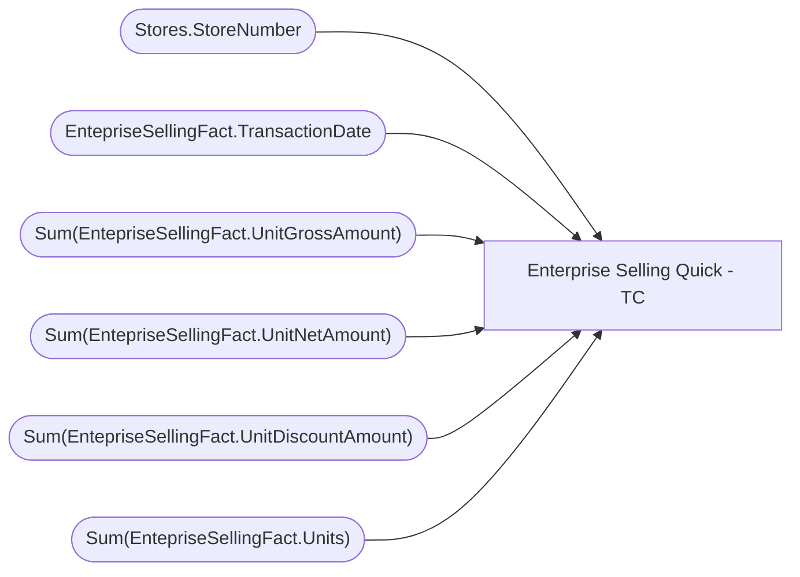

# Enterprise Selling Quick - TC

**Workspace:** BI-Accounting  
**Report ID:** cad934e8-9728-4119-9409-0291827b8b9d  
**Dataset ID:** cd0eac43-3dae-4ad7-8999-10da37f19290  
**Web URL:** https://app.powerbi.com/groups/e996caff-15ec-41d5-ae2b-cc9137531fb6/reports/cad934e8-9728-4119-9409-0291827b8b9d  

## Architecture Diagram

## Field Dependencies

| Referenced Field |
|---|
| Stores.StoreNumber |
| EntepriseSellingFact.TransactionDate |
| Sum(EntepriseSellingFact.UnitGrossAmount) |
| Sum(EntepriseSellingFact.UnitNetAmount) |
| Sum(EntepriseSellingFact.UnitDiscountAmount) |
| Sum(EntepriseSellingFact.Units) |

## Pages

| Page | Visuals |
|---|---|
| Page 1 | 3 |

## Visuals

### Page 1

| Visual | Type | Fields |
|---|---|---|
| 9095dd7b88863b6b9c0d | slicer | Stores.StoreNumber |
| 6a4dee0d917982b39a71 | slicer | EntepriseSellingFact.TransactionDate |
| aae1889ae8eb479262df | tableEx | Stores.StoreNumber, EntepriseSellingFact.TransactionDate, Sum(EntepriseSellingFact.UnitGrossAmount), Sum(EntepriseSellingFact.UnitNetAmount), Sum(EntepriseSellingFact.UnitDiscountAmount), Sum(EntepriseSellingFact.Units) |
