# Gift Card Research

**Workspace:** BI-Accounting  
**Report ID:** d85a876e-7df9-4d24-8af0-b2ad7576b3b1  
**Dataset ID:** 459ad959-d71a-481e-ae77-34987085c611  
**Web URL:** https://app.powerbi.com/groups/e996caff-15ec-41d5-ae2b-cc9137531fb6/reports/d85a876e-7df9-4d24-8af0-b2ad7576b3b1  
**Semantic Model:** [Sales Audit Data Model](../../SemanticModels/Enterprise Analytics Prod/Sales Audit Data Model.md)  

## Architecture Diagram

```mermaid
flowchart LR
    REPORT["Gift Card Research"]
    Retail_Lines__JumpMind__Item_Type(["Retail Lines (JumpMind).Item Type"]) --> REPORT
    Products__PLM__Item_Line(["Products (PLM).Item Line"]) --> REPORT
    Products__PLM__Licensed_Collection(["Products (PLM).Licensed Collection"]) --> REPORT
    Products__PLM__Key_Story(["Products (PLM).Key Story"]) --> REPORT
    Products__PLM__Subclass(["Products (PLM).Subclass"]) --> REPORT
    Products__PLM__Class(["Products (PLM).Class"]) --> REPORT
    Products__PLM__Department(["Products (PLM).Department"]) --> REPORT
    Calendar_Calendar_Year__Header_(["Calendar.Calendar Year (Header)"]) --> REPORT
    Calendar_Calendar_Quarter__Header_(["Calendar.Calendar Quarter (Header)"]) --> REPORT
    Calendar_Calendar_Month__Header_(["Calendar.Calendar Month (Header)"]) --> REPORT
    Calendar_Calendar_Week__Header_(["Calendar.Calendar Week (Header)"]) --> REPORT
    Calendar_Fiscal_Year__Header_(["Calendar.Fiscal Year (Header)"]) --> REPORT
    Calendar_Fiscal_Quarter__Header_(["Calendar.Fiscal Quarter (Header)"]) --> REPORT
    Calendar_Fiscal_Month__Header_(["Calendar.Fiscal Month (Header)"]) --> REPORT
    Calendar_Fiscal_Week__Header_(["Calendar.Fiscal Week (Header)"]) --> REPORT
    Calendar_Actual_Date(["Calendar.Actual Date"]) --> REPORT
    Locations__Store_MDM__Country_name(["Locations (Store MDM).Country name"]) --> REPORT
    Locations__Store_MDM__State_Province_name(["Locations (Store MDM).State/Province name"]) --> REPORT
    Locations__Store_MDM__City(["Locations (Store MDM).City"]) --> REPORT
    Locations__Store_MDM__Country(["Locations (Store MDM).Country"]) --> REPORT
    Transactions__JumpMind__Associate_Work_Group(["Transactions (JumpMind).Associate Work Group"]) --> REPORT
    Transactions__JumpMind__retail_transaction_id(["Transactions (JumpMind).retail_transaction_id"]) --> REPORT
    Business_Units__JumpMind__Business_Unit_Id(["Business Units (JumpMind).Business Unit Id"]) --> REPORT
    Tender_Card_Lines__JumpMind__Card_Number(["Tender Card Lines (JumpMind).Card Number"]) --> REPORT
    Retail_Lines__JumpMind__Line_Item_Type(["Retail Lines (JumpMind).Line Item Type"]) --> REPORT
    Locations__Store_MDM__Location_Line(["Locations (Store MDM).Location Line"]) --> REPORT
    Locations__Store_MDM__Active(["Locations (Store MDM).Active"]) --> REPORT
    Transactions__JumpMind__Sequence_Number(["Transactions (JumpMind).Sequence Number"]) --> REPORT
    Transactions__JumpMind__Transaction_Date(["Transactions (JumpMind).Transaction Date"]) --> REPORT
    Retail_Lines__JumpMind__Item_Line(["Retail Lines (JumpMind).Item Line"]) --> REPORT
    Sum_Retail_Lines__JumpMind__Actual_Unit_Price__Native_Currency__(["Sum(Retail Lines (JumpMind).Actual Unit Price (Native Currency))"]) --> REPORT
    Sum_Retail_Lines__JumpMind__Tax_Amount__Native_Currency__(["Sum(Retail Lines (JumpMind).Tax Amount (Native Currency))"]) --> REPORT
    Transactions__JumpMind__Business_Unit_Id(["Transactions (JumpMind).Business Unit Id"]) --> REPORT
    Transactions__JumpMind__Username_Id(["Transactions (JumpMind).Username Id"]) --> REPORT
    Sum_Tender_Lines__JumpMind__Tender_Amount__Native_Currency__(["Sum(Tender Lines (JumpMind).Tender Amount (Native Currency))"]) --> REPORT
    Retail_Transactions__JumpMind__Customer_Name(["Retail Transactions (JumpMind).Customer Name"]) --> REPORT
    Retail_Transactions__JumpMind__Loyalty_Card_Number(["Retail Transactions (JumpMind).Loyalty Card Number"]) --> REPORT
    Tender_Lines__JumpMind__tender_auth_method_code(["Tender Lines (JumpMind).tender_auth_method_code"]) --> REPORT
    Tender_Card_Lines__JumpMind__Tender_Type_Code(["Tender Card Lines (JumpMind).Tender Type Code"]) --> REPORT
    Retail_Lines__JumpMind__Item_Description(["Retail Lines (JumpMind).Item Description"]) --> REPORT
    Activated_Gift_Cards__JumpMind__Gift_Card_Action_Code(["Activated Gift Cards (JumpMind).Gift Card Action Code"]) --> REPORT
    Activated_Gift_Cards__JumpMind__Card_Number(["Activated Gift Cards (JumpMind).Card Number"]) --> REPORT
    Measure_Table_Activated_Gift_Cards_Gross_Amount_TE__Native_(["Measure Table.Activated Gift Cards Gross Amount TE (Native)"]) --> REPORT
    Measure_Table_Activated_Gift_Cards_Net_Amount_TE__Native_(["Measure Table.Activated Gift Cards Net Amount TE (Native)"]) --> REPORT
    Transactions__JumpMind__Created_Datetime(["Transactions (JumpMind).Created Datetime"]) --> REPORT
    Retail_Transactions__JumpMind__RegisterNo(["Retail Transactions (JumpMind).RegisterNo"]) --> REPORT
    Tender_Lines__JumpMind__Tender_Amount__Native_Currency_(["Tender Lines (JumpMind).Tender Amount (Native Currency)"]) --> REPORT
```

## Field Dependencies

| Referenced Field |
|---|
| Retail Lines (JumpMind).Item Type |
| Products (PLM).Item Line |
| Products (PLM).Licensed Collection |
| Products (PLM).Key Story |
| Products (PLM).Subclass |
| Products (PLM).Class |
| Products (PLM).Department |
| Calendar.Calendar Year (Header) |
| Calendar.Calendar Quarter (Header) |
| Calendar.Calendar Month (Header) |
| Calendar.Calendar Week (Header) |
| Calendar.Fiscal Year (Header) |
| Calendar.Fiscal Quarter (Header) |
| Calendar.Fiscal Month (Header) |
| Calendar.Fiscal Week (Header) |
| Calendar.Actual Date |
| Locations (Store MDM).Country name |
| Locations (Store MDM).State/Province name |
| Locations (Store MDM).City |
| Locations (Store MDM).Country |
| Transactions (JumpMind).Associate Work Group |
| Transactions (JumpMind).retail_transaction_id |
| Business Units (JumpMind).Business Unit Id |
| Tender Card Lines (JumpMind).Card Number |
| Retail Lines (JumpMind).Line Item Type |
| Locations (Store MDM).Location Line |
| Locations (Store MDM).Active |
| Transactions (JumpMind).Sequence Number |
| Transactions (JumpMind).Transaction Date |
| Retail Lines (JumpMind).Item Line |
| Sum(Retail Lines (JumpMind).Actual Unit Price (Native Currency)) |
| Sum(Retail Lines (JumpMind).Tax Amount (Native Currency)) |
| Transactions (JumpMind).Business Unit Id |
| Transactions (JumpMind).Username Id |
| Sum(Tender Lines (JumpMind).Tender Amount (Native Currency)) |
| Retail Transactions (JumpMind).Customer Name |
| Retail Transactions (JumpMind).Loyalty Card Number |
| Tender Lines (JumpMind).tender_auth_method_code |
| Tender Card Lines (JumpMind).Tender Type Code |
| Retail Lines (JumpMind).Item Description |
| Activated Gift Cards (JumpMind).Gift Card Action Code |
| Activated Gift Cards (JumpMind).Card Number |
| Measure Table.Activated Gift Cards Gross Amount TE (Native) |
| Measure Table.Activated Gift Cards Net Amount TE (Native) |
| Transactions (JumpMind).Created Datetime |
| Retail Transactions (JumpMind).RegisterNo |
| Tender Lines (JumpMind).Tender Amount (Native Currency) |

## Pages

| Page | Visuals |
|---|---|
| Gift Card Redeemed | 37 |
| Gift Card Sold | 36 |

## Visuals

### Gift Card Redeemed

| Visual | Type | Fields |
|---|---|---|
| cef6c899a11086912015 | unknown |  |
| ddcb92d7b02896dca6c9 | slicer | Retail Lines (JumpMind).Item Type |
| 38ffd3e2883d6970dac5 | slicer | Products (PLM).Item Line |
| c14fbf6802411282c094 | slicer | Products (PLM).Licensed Collection |
| 5795056e8830290b0bed | slicer | Products (PLM).Key Story |
| c091ec68aa5769854ea9 | slicer | Products (PLM).Subclass, Products (PLM).Class |
| 1fe78fa50890abc900a1 | slicer | Products (PLM).Department |
| f2bbc049d087db6004a6 | bookmarkNavigator |  |
| f4fda8b32817035b9dd0 | slicer | Calendar.Calendar Year (Header), Calendar.Calendar Quarter (Header), Calendar.Calendar Month (Header), Calendar.Calendar Week (Header) |
| c202f234c78e85c066b6 | slicer | Calendar.Fiscal Year (Header), Calendar.Fiscal Quarter (Header), Calendar.Fiscal Month (Header), Calendar.Fiscal Week (Header), Calendar.Actual Date |
| 05443540d6802a2034e0 | slicer | Calendar.Actual Date |
| 671f725e8014939e7e62 | unknown |  |
| ea2dce6200b87415a64d | bookmarkNavigator |  |
| e415dbfb1961ac333304 | slicer | Locations (Store MDM).Country name, Locations (Store MDM).State/Province name, Locations (Store MDM).City |
| a4353178804a3355be38 | slicer | Locations (Store MDM).Country |
| 63f25a605552c3c3dd01 | unknown |  |
| 35372cb27a7435c6b18e | textbox |  |
| 2b6e100d0bab66674212 | slicer | Transactions (JumpMind).Associate Work Group |
| e8b911500a0e33c656d7 | slicer | Transactions (JumpMind).Associate Work Group |
| 606584f0ee084726d251 | slicer | Transactions (JumpMind).retail_transaction_id |
| daba0f43d0beb111b1c5 | slicer | Business Units (JumpMind).Business Unit Id |
| 2321641fe13407184cd6 | slicer | Tender Card Lines (JumpMind).Card Number |
| dc1c610f685bd06241d4 | unknown |  |
| 426d2cfe0a76b1520e90 | slicer | Retail Lines (JumpMind).Line Item Type |
| 5b054426057901e2033d | slicer | Locations (Store MDM).Location Line |
| 177c2967c18e64b0bcaa | slicer | Locations (Store MDM).Active |
| c3bd3a7544eb34e312c7 | unknown |  |
| f0d665728ee456823ee3 | actionButton |  |
| 76d96a4bd80ae2022e68 | textbox |  |
| 972fc6e0900405d5e680 | image |  |
| 3b263da54c1003bac458 | textbox |  |
| 827096d0de4e907a2a39 | textbox |  |
| a45ecb5fa2818c60e4f9 | tableEx | Transactions (JumpMind).Sequence Number, Transactions (JumpMind).Transaction Date, Retail Lines (JumpMind).Item Line, Sum(Retail Lines (JumpMind).Actual Unit Price (Native Currency)) |
| cb488a1ae20d730780d5 | actionButton |  |
| 7b0b6a804c11e517c690 | tableEx | Calendar.Actual Date, Sum(Retail Lines (JumpMind).Tax Amount (Native Currency)), Transactions (JumpMind).Sequence Number |
| 2523489aa1e51a167000 | tableEx | Calendar.Actual Date, Transactions (JumpMind).Business Unit Id, Transactions (JumpMind).Username Id, Sum(Tender Lines (JumpMind).Tender Amount (Native Currency)), Retail Transactions (JumpMind).Customer Name, Retail Transactions (JumpMind).Loyalty Card Number, Tender Lines (JumpMind).tender_auth_method_code, Transactions (JumpMind).retail_transaction_id, Tender Card Lines (JumpMind).Card Number, Transactions (JumpMind).Sequence Number, Tender Card Lines (JumpMind).Tender Type Code |
| 07b328d18ecdab001d0b | textbox |  |

### Gift Card Sold

| Visual | Type | Fields |
|---|---|---|
| 122ea31d98d5e46b728a | bookmarkNavigator |  |
| 826e14c9840c3793285e | unknown |  |
| e8e740717323d0200f7a | slicer | Products (PLM).Department |
| c5bb2e2d468b021899e9 | slicer | Retail Lines (JumpMind).Item Type |
| ebefc5b86b1ea14d3bca | slicer | Products (PLM).Item Line |
| 22da671c0667f2a982ae | slicer | Products (PLM).Licensed Collection |
| 3edf860c41bfa20e56ed | slicer | Products (PLM).Key Story |
| 7869095a179dc31dae86 | slicer | Products (PLM).Subclass, Products (PLM).Class |
| cca8d761cff72ee6b8d5 | bookmarkNavigator |  |
| 4df0d921ab0b5d077f2c | slicer | Calendar.Calendar Year (Header), Calendar.Calendar Quarter (Header), Calendar.Calendar Month (Header), Calendar.Calendar Week (Header) |
| cc9c621b0f8156219228 | slicer | Calendar.Fiscal Year (Header), Calendar.Fiscal Quarter (Header), Calendar.Fiscal Month (Header), Calendar.Fiscal Week (Header), Calendar.Actual Date |
| 9a7956cae86f44783ec2 | slicer | Calendar.Actual Date |
| ebf4a2dc4872072b777f | unknown |  |
| b5ffd4d7c9991e903df4 | slicer | Locations (Store MDM).Country name, Locations (Store MDM).State/Province name, Locations (Store MDM).City |
| f492ce29c681642c039d | slicer | Locations (Store MDM).Location Line |
| 0b4140222c5f6ce0edbe | unknown |  |
| 720c9cdd1e389d91e560 | tableEx | Calendar.Actual Date, Transactions (JumpMind).Business Unit Id, Transactions (JumpMind).Username Id, Retail Lines (JumpMind).Item Description, Activated Gift Cards (JumpMind).Gift Card Action Code, Activated Gift Cards (JumpMind).Card Number, Sum(Tender Lines (JumpMind).Tender Amount (Native Currency)), Measure Table.Activated Gift Cards Gross Amount TE (Native), Retail Transactions (JumpMind).Customer Name, Measure Table.Activated Gift Cards Net Amount TE (Native), Retail Transactions (JumpMind).Loyalty Card Number, Transactions (JumpMind).Created Datetime, Transactions (JumpMind).retail_transaction_id, Retail Transactions (JumpMind).RegisterNo |
| 363d3089689cc31382ce | textbox |  |
| 3907067465cb97118580 | textbox |  |
| 172c32e50b240ce9090b | slicer | Retail Transactions (JumpMind).Loyalty Card Number |
| 9a867bcecd3d326e700a | slicer | Retail Transactions (JumpMind).Customer Name |
| 1247fc727a61c0856ee0 | slicer | Transactions (JumpMind).Username Id |
| df86f06e967c91d2414a | slicer | Transactions (JumpMind).retail_transaction_id |
| 6638838506cceec393e7 | slicer | Activated Gift Cards (JumpMind).Card Number |
| d60b44ab0994153302b3 | unknown |  |
| 0990f82a5dbf1a44dadb | slicer | Retail Lines (JumpMind).Line Item Type |
| 563e21e900833896b544 | slicer | Locations (Store MDM).Country |
| cd771722998da0d815e8 | slicer | Locations (Store MDM).Active |
| 44b856414f1a82fa1972 | unknown |  |
| ec739d70b14b7c06805a | actionButton |  |
| 9ea736d49b75db93980e | textbox |  |
| 97f4659a5a12bc988c51 | image |  |
| 0bcd43cda8b8c9272764 | textbox |  |
| f920f4a3989b72fd51af | textbox |  |
| fc4b38ec71ab641069c9 | slicer | Retail Transactions (JumpMind).Loyalty Card Number |
| db2992d334940202bd54 | slicer | Tender Lines (JumpMind).Tender Amount (Native Currency) |
