# Guest Transactions Report

**Workspace:** BI-Accounting  
**Report ID:** a4222aec-5f79-4784-8150-8920fcb48b19  
**Dataset ID:** 459ad959-d71a-481e-ae77-34987085c611  
**Web URL:** https://app.powerbi.com/groups/e996caff-15ec-41d5-ae2b-cc9137531fb6/reports/a4222aec-5f79-4784-8150-8920fcb48b19  
**Semantic Model:** [Sales Audit Data Model](../../SemanticModels/Enterprise Analytics Prod/Sales Audit Data Model.md)  

## Architecture Diagram

```mermaid
flowchart LR
    REPORT["Guest Transactions Report"]
    Transactions__JumpMind__Business_Unit_Id(["Transactions (JumpMind).Business Unit Id"]) --> REPORT
    Transactions__JumpMind__Username_Id(["Transactions (JumpMind).Username Id"]) --> REPORT
    Retail_Transactions__JumpMind__Customer_Name(["Retail Transactions (JumpMind).Customer Name"]) --> REPORT
    Transactions__JumpMind__Transaction_Key(["Transactions (JumpMind).Transaction Key"]) --> REPORT
    Transactions__JumpMind__Associate_Name(["Transactions (JumpMind).Associate Name"]) --> REPORT
    Business_Units__JumpMind__Business_Unit_Name(["Business Units (JumpMind).Business Unit Name"]) --> REPORT
    Transactions__JumpMind__retail_transaction_id(["Transactions (JumpMind).retail_transaction_id"]) --> REPORT
    Calendar_Actual_Date(["Calendar.Actual Date"]) --> REPORT
    Retail_Transactions__JumpMind__Loyalty_Card_Number(["Retail Transactions (JumpMind).Loyalty Card Number"]) --> REPORT
    Sum_Tender_Lines__JumpMind__currency_Rounding_adjustment_(["Sum(Tender Lines (JumpMind).currency Rounding adjustment)"]) --> REPORT
    Sum_Tender_Lines__JumpMind__Tender_Total_with_Currency_Rouding_(["Sum(Tender Lines (JumpMind).Tender Total with Currency Rouding)"]) --> REPORT
    Sum_Tender_Lines__JumpMind__Tender_Amount__Native_Currency__(["Sum(Tender Lines (JumpMind).Tender Amount (Native Currency))"]) --> REPORT
    Tender_Lines__JumpMind__ISO_Currency_Code(["Tender Lines (JumpMind).ISO Currency Code"]) --> REPORT
    Tender_Lines__JumpMind__Tender_Amount_with_Currency_Rounding(["Tender Lines (JumpMind).Tender Amount with Currency Rounding"]) --> REPORT
    Retail_Transactions__JumpMind__Guest_Address1(["Retail Transactions (JumpMind).Guest_Address1"]) --> REPORT
    Retail_Transactions__JumpMind__Guest_Address2(["Retail Transactions (JumpMind).Guest_Address2"]) --> REPORT
    Retail_Transactions__JumpMind__Guest_PostalCode(["Retail Transactions (JumpMind).Guest_PostalCode"]) --> REPORT
    Retail_Transactions__JumpMind__City__State(["Retail Transactions (JumpMind).City, State"]) --> REPORT
    Locations__Store_MDM__Active(["Locations (Store MDM).Active"]) --> REPORT
    Locations__Store_MDM__Country(["Locations (Store MDM).Country"]) --> REPORT
    Locations__Store_MDM__Location_Line(["Locations (Store MDM).Location Line"]) --> REPORT
    Retail_Lines__JumpMind__Line_Item_Type(["Retail Lines (JumpMind).Line Item Type"]) --> REPORT
    Retail_Lines__JumpMind__Item_Type(["Retail Lines (JumpMind).Item Type"]) --> REPORT
    Products__PLM__Item_Line(["Products (PLM).Item Line"]) --> REPORT
    Products__PLM__Licensed_Collection(["Products (PLM).Licensed Collection"]) --> REPORT
    Products__PLM__Key_Story(["Products (PLM).Key Story"]) --> REPORT
    Products__PLM__Subclass(["Products (PLM).Subclass"]) --> REPORT
    Products__PLM__Class(["Products (PLM).Class"]) --> REPORT
    Products__PLM__Department(["Products (PLM).Department"]) --> REPORT
    Calendar_Calendar_Year__Header_(["Calendar.Calendar Year (Header)"]) --> REPORT
    Calendar_Calendar_Quarter__Header_(["Calendar.Calendar Quarter (Header)"]) --> REPORT
    Calendar_Calendar_Month__Header_(["Calendar.Calendar Month (Header)"]) --> REPORT
    Calendar_Calendar_Week__Header_(["Calendar.Calendar Week (Header)"]) --> REPORT
    Calendar_Fiscal_Year__Header_(["Calendar.Fiscal Year (Header)"]) --> REPORT
    Calendar_Fiscal_Quarter__Header_(["Calendar.Fiscal Quarter (Header)"]) --> REPORT
    Calendar_Fiscal_Month__Header_(["Calendar.Fiscal Month (Header)"]) --> REPORT
    Calendar_Fiscal_Week__Header_(["Calendar.Fiscal Week (Header)"]) --> REPORT
    Locations__Store_MDM__Country_name(["Locations (Store MDM).Country name"]) --> REPORT
    Locations__Store_MDM__State_Province_name(["Locations (Store MDM).State/Province name"]) --> REPORT
    Locations__Store_MDM__City(["Locations (Store MDM).City"]) --> REPORT
    Transactions__JumpMind__Associate_Work_Group(["Transactions (JumpMind).Associate Work Group"]) --> REPORT
```

## Field Dependencies

| Referenced Field |
|---|
| Transactions (JumpMind).Business Unit Id |
| Transactions (JumpMind).Username Id |
| Retail Transactions (JumpMind).Customer Name |
| Transactions (JumpMind).Transaction Key |
| Transactions (JumpMind).Associate Name |
| Business Units (JumpMind).Business Unit Name |
| Transactions (JumpMind).retail_transaction_id |
| Calendar.Actual Date |
| Retail Transactions (JumpMind).Loyalty Card Number |
| Sum(Tender Lines (JumpMind).currency Rounding adjustment) |
| Sum(Tender Lines (JumpMind).Tender Total with Currency Rouding) |
| Sum(Tender Lines (JumpMind).Tender Amount (Native Currency)) |
| Tender Lines (JumpMind).ISO Currency Code |
| Tender Lines (JumpMind).Tender Amount with Currency Rounding |
| Retail Transactions (JumpMind).Guest_Address1 |
| Retail Transactions (JumpMind).Guest_Address2 |
| Retail Transactions (JumpMind).Guest_PostalCode |
| Retail Transactions (JumpMind).City, State |
| Locations (Store MDM).Active |
| Locations (Store MDM).Country |
| Locations (Store MDM).Location Line |
| Retail Lines (JumpMind).Line Item Type |
| Retail Lines (JumpMind).Item Type |
| Products (PLM).Item Line |
| Products (PLM).Licensed Collection |
| Products (PLM).Key Story |
| Products (PLM).Subclass |
| Products (PLM).Class |
| Products (PLM).Department |
| Calendar.Calendar Year (Header) |
| Calendar.Calendar Quarter (Header) |
| Calendar.Calendar Month (Header) |
| Calendar.Calendar Week (Header) |
| Calendar.Fiscal Year (Header) |
| Calendar.Fiscal Quarter (Header) |
| Calendar.Fiscal Month (Header) |
| Calendar.Fiscal Week (Header) |
| Locations (Store MDM).Country name |
| Locations (Store MDM).State/Province name |
| Locations (Store MDM).City |
| Transactions (JumpMind).Associate Work Group |

## Pages

| Page | Visuals |
|---|---|
| Guest Transaction | 33 |

## Visuals

### Guest Transaction 

| Visual | Type | Fields |
|---|---|---|
| 747b07453e96bfce0fff | tableEx | Transactions (JumpMind).Business Unit Id, Transactions (JumpMind).Username Id, Retail Transactions (JumpMind).Customer Name, Transactions (JumpMind).Transaction Key, Transactions (JumpMind).Associate Name, Business Units (JumpMind).Business Unit Name, Transactions (JumpMind).retail_transaction_id, Calendar.Actual Date, Retail Transactions (JumpMind).Loyalty Card Number, Sum(Tender Lines (JumpMind).currency Rounding adjustment), Sum(Tender Lines (JumpMind).Tender Total with Currency Rouding), Sum(Tender Lines (JumpMind).Tender Amount (Native Currency)), Tender Lines (JumpMind).ISO Currency Code, Tender Lines (JumpMind).Tender Amount with Currency Rounding, Retail Transactions (JumpMind).Guest_Address1, Retail Transactions (JumpMind).Guest_Address2, Retail Transactions (JumpMind).Guest_PostalCode, Retail Transactions (JumpMind).City, State |
| 0b26b368745121333f30 | slicer | Transactions (JumpMind).retail_transaction_id |
| 0b4140222c5f6ce0edbe | unknown |  |
| f920f4a3989b72fd51af | textbox |  |
| 0bcd43cda8b8c9272764 | textbox |  |
| 97f4659a5a12bc988c51 | image |  |
| 9ea736d49b75db93980e | textbox |  |
| ec739d70b14b7c06805a | actionButton |  |
| 44b856414f1a82fa1972 | unknown |  |
| cd771722998da0d815e8 | slicer | Locations (Store MDM).Active |
| 563e21e900833896b544 | slicer | Locations (Store MDM).Country |
| f492ce29c681642c039d | slicer | Locations (Store MDM).Location Line |
| d60b44ab0994153302b3 | unknown |  |
| 0990f82a5dbf1a44dadb | slicer | Retail Lines (JumpMind).Line Item Type |
| c5bb2e2d468b021899e9 | slicer | Retail Lines (JumpMind).Item Type |
| ebefc5b86b1ea14d3bca | slicer | Products (PLM).Item Line |
| 22da671c0667f2a982ae | slicer | Products (PLM).Licensed Collection |
| 3edf860c41bfa20e56ed | slicer | Products (PLM).Key Story |
| 7869095a179dc31dae86 | slicer | Products (PLM).Subclass, Products (PLM).Class |
| e8e740717323d0200f7a | slicer | Products (PLM).Department |
| 826e14c9840c3793285e | unknown |  |
| cca8d761cff72ee6b8d5 | bookmarkNavigator |  |
| 4df0d921ab0b5d077f2c | slicer | Calendar.Calendar Year (Header), Calendar.Calendar Quarter (Header), Calendar.Calendar Month (Header), Calendar.Calendar Week (Header) |
| cc9c621b0f8156219228 | slicer | Calendar.Fiscal Year (Header), Calendar.Fiscal Quarter (Header), Calendar.Fiscal Month (Header), Calendar.Fiscal Week (Header), Calendar.Actual Date |
| 9a7956cae86f44783ec2 | slicer | Calendar.Actual Date |
| ebf4a2dc4872072b777f | unknown |  |
| 122ea31d98d5e46b728a | bookmarkNavigator |  |
| b5ffd4d7c9991e903df4 | slicer | Locations (Store MDM).Country name, Locations (Store MDM).State/Province name, Locations (Store MDM).City |
| 1247fc727a61c0856ee0 | slicer | Transactions (JumpMind).Username Id |
| df86f06e967c91d2414a | slicer | Retail Transactions (JumpMind).Loyalty Card Number |
| 6638838506cceec393e7 | slicer | Transactions (JumpMind).Associate Work Group |
| 3907067465cb97118580 | textbox |  |
| 9a867bcecd3d326e700a | slicer | Retail Transactions (JumpMind).Customer Name |
