# Receivable Authorizations Report

**Workspace:** BI-Accounting  
**Report ID:** 464ad500-8140-4b29-a7c8-62a033f0255e  
**Dataset ID:** 459ad959-d71a-481e-ae77-34987085c611  
**Web URL:** https://app.powerbi.com/groups/e996caff-15ec-41d5-ae2b-cc9137531fb6/reports/464ad500-8140-4b29-a7c8-62a033f0255e  
**Semantic Model:** [Sales Audit Data Model](../../SemanticModels/Enterprise Analytics Prod/Sales Audit Data Model.md)  

## Architecture Diagram

```mermaid
flowchart LR
    REPORT["Receivable Authorizations Report"]
    Transactions__JumpMind__Business_Unit_Id(["Transactions (JumpMind).Business Unit Id"]) --> REPORT
    Sum_Tender_Lines__JumpMind__Tender_Amount__Native_Currency__(["Sum(Tender Lines (JumpMind).Tender Amount (Native Currency))"]) --> REPORT
    Tender_Lines__JumpMind__Tender_Code(["Tender Lines (JumpMind).Tender Code"]) --> REPORT
    Tender_Lines__JumpMind__Tender_Type_Code(["Tender Lines (JumpMind).Tender Type Code"]) --> REPORT
    Tender_Lines__JumpMind__ISO_Currency_Code(["Tender Lines (JumpMind).ISO Currency Code"]) --> REPORT
    Transactions__JumpMind__Transaction_Key(["Transactions (JumpMind).Transaction Key"]) --> REPORT
    Transactions__JumpMind__Till_Id(["Transactions (JumpMind).Till Id"]) --> REPORT
    Transaction_Summaries__JumpMind__Tender1_Authorization_Code(["Transaction Summaries (JumpMind).Tender1 Authorization Code"]) --> REPORT
    Transactions__JumpMind__retail_transaction_id(["Transactions (JumpMind).retail_transaction_id"]) --> REPORT
    Transactions__JumpMind__Transaction_Date(["Transactions (JumpMind).Transaction Date"]) --> REPORT
    Tender_Lines__JumpMind__Warehouse_Code(["Tender Lines (JumpMind).Warehouse Code"]) --> REPORT
    Locations__Store_MDM__Active(["Locations (Store MDM).Active"]) --> REPORT
    Locations__Store_MDM__Country(["Locations (Store MDM).Country"]) --> REPORT
    Locations__Store_MDM__Location_Line(["Locations (Store MDM).Location Line"]) --> REPORT
    Locations__Store_MDM__Country_name(["Locations (Store MDM).Country name"]) --> REPORT
    Locations__Store_MDM__State_Province_name(["Locations (Store MDM).State/Province name"]) --> REPORT
    Locations__Store_MDM__City(["Locations (Store MDM).City"]) --> REPORT
    Calendar_Actual_Date(["Calendar.Actual Date"]) --> REPORT
    Calendar_Fiscal_Year__Header_(["Calendar.Fiscal Year (Header)"]) --> REPORT
    Calendar_Fiscal_Quarter__Header_(["Calendar.Fiscal Quarter (Header)"]) --> REPORT
    Calendar_Fiscal_Month__Header_(["Calendar.Fiscal Month (Header)"]) --> REPORT
    Calendar_Fiscal_Week__Header_(["Calendar.Fiscal Week (Header)"]) --> REPORT
    Calendar_Calendar_Year__Header_(["Calendar.Calendar Year (Header)"]) --> REPORT
    Calendar_Calendar_Quarter__Header_(["Calendar.Calendar Quarter (Header)"]) --> REPORT
    Calendar_Calendar_Month__Header_(["Calendar.Calendar Month (Header)"]) --> REPORT
    Calendar_Calendar_Week__Header_(["Calendar.Calendar Week (Header)"]) --> REPORT
    Products__PLM__Department(["Products (PLM).Department"]) --> REPORT
    Products__PLM__Subclass(["Products (PLM).Subclass"]) --> REPORT
    Products__PLM__Class(["Products (PLM).Class"]) --> REPORT
    Products__PLM__Key_Story(["Products (PLM).Key Story"]) --> REPORT
    Products__PLM__Licensed_Collection(["Products (PLM).Licensed Collection"]) --> REPORT
    Products__PLM__Item_Line(["Products (PLM).Item Line"]) --> REPORT
    Retail_Lines__JumpMind__Item_Type(["Retail Lines (JumpMind).Item Type"]) --> REPORT
    Retail_Lines__JumpMind__Line_Item_Type(["Retail Lines (JumpMind).Line Item Type"]) --> REPORT
    Tender_Lines__JumpMind__Tender_Amount__Native_Currency_(["Tender Lines (JumpMind).Tender Amount (Native Currency)"]) --> REPORT
    Tender_Lines__JumpMind__Reference_No(["Tender Lines (JumpMind).Reference No"]) --> REPORT
    Dict_Payment_Transaction_Type_PaymentTransactionType(["Dict Payment Transaction Type.PaymentTransactionType"]) --> REPORT
    Dict_Payment_Transaction_Type_Payment_Transaction_Type_ID(["Dict Payment Transaction Type.Payment Transaction Type ID"]) --> REPORT
    Transactions__JumpMind__Capture_Date_CST(["Transactions (JumpMind).Capture Date CST"]) --> REPORT
    Tender_Lines__JumpMind__Actual_Date(["Tender Lines (JumpMind).Actual Date"]) --> REPORT
```

## Field Dependencies

| Referenced Field |
|---|
| Transactions (JumpMind).Business Unit Id |
| Sum(Tender Lines (JumpMind).Tender Amount (Native Currency)) |
| Tender Lines (JumpMind).Tender Code |
| Tender Lines (JumpMind).Tender Type Code |
| Tender Lines (JumpMind).ISO Currency Code |
| Transactions (JumpMind).Transaction Key |
| Transactions (JumpMind).Till Id |
| Transaction Summaries (JumpMind).Tender1 Authorization Code |
| Transactions (JumpMind).retail_transaction_id |
| Transactions (JumpMind).Transaction Date |
| Tender Lines (JumpMind).Warehouse Code |
| Locations (Store MDM).Active |
| Locations (Store MDM).Country |
| Locations (Store MDM).Location Line |
| Locations (Store MDM).Country name |
| Locations (Store MDM).State/Province name |
| Locations (Store MDM).City |
| Calendar.Actual Date |
| Calendar.Fiscal Year (Header) |
| Calendar.Fiscal Quarter (Header) |
| Calendar.Fiscal Month (Header) |
| Calendar.Fiscal Week (Header) |
| Calendar.Calendar Year (Header) |
| Calendar.Calendar Quarter (Header) |
| Calendar.Calendar Month (Header) |
| Calendar.Calendar Week (Header) |
| Products (PLM).Department |
| Products (PLM).Subclass |
| Products (PLM).Class |
| Products (PLM).Key Story |
| Products (PLM).Licensed Collection |
| Products (PLM).Item Line |
| Retail Lines (JumpMind).Item Type |
| Retail Lines (JumpMind).Line Item Type |
| Tender Lines (JumpMind).Tender Amount (Native Currency) |
| Tender Lines (JumpMind).Reference No |
| Dict Payment Transaction Type.PaymentTransactionType |
| Dict Payment Transaction Type.Payment Transaction Type ID |
| Transactions (JumpMind).Capture Date CST |
| Tender Lines (JumpMind).Actual Date |

## Pages

| Page | Visuals |
|---|---|
| Duplicate of Receivable | 33 |
| Receivable | 34 |

## Visuals

### Duplicate of Receivable

| Visual | Type | Fields |
|---|---|---|
| 683da1f57d6cbb22be73 | tableEx | Transactions (JumpMind).Business Unit Id, Sum(Tender Lines (JumpMind).Tender Amount (Native Currency)), Tender Lines (JumpMind).Tender Code, Tender Lines (JumpMind).Tender Type Code, Tender Lines (JumpMind).ISO Currency Code, Transactions (JumpMind).Transaction Key, Transactions (JumpMind).Till Id, Transaction Summaries (JumpMind).Tender1 Authorization Code, Transactions (JumpMind).retail_transaction_id, Transactions (JumpMind).Transaction Date, Tender Lines (JumpMind).Warehouse Code |
| 054bd83fa73ac722a22f | unknown |  |
| c361f9e3ee56afd0f37f | textbox |  |
| 4900f9e5ad5977e9a51f | textbox |  |
| aad5eb8855ae981c8131 | image |  |
| d3dd4176f1e06ef19899 | textbox |  |
| cbc8696ef4074f67c6d4 | actionButton |  |
| 3ed5279db9ba82e7a6f8 | unknown |  |
| 18906ac23e346fe0b1e7 | slicer | Locations (Store MDM).Active |
| cd634ac1248a47bfd32b | slicer | Locations (Store MDM).Country |
| 6d809064318a2f4def5a | slicer | Locations (Store MDM).Location Line |
| 1e2ea003961b18344f4b | slicer | Locations (Store MDM).Country name, Locations (Store MDM).State/Province name, Locations (Store MDM).City |
| 0f0e77889db0025c82c7 | bookmarkNavigator |  |
| 7aa28ff505fc7236bada | unknown |  |
| 1fd29cccac376037b412 | slicer | Calendar.Actual Date |
| 4b5f71021a15b4064f59 | slicer | Calendar.Fiscal Year (Header), Calendar.Fiscal Quarter (Header), Calendar.Fiscal Month (Header), Calendar.Fiscal Week (Header), Calendar.Actual Date |
| d9654205971ca31f56f1 | slicer | Calendar.Calendar Year (Header), Calendar.Calendar Quarter (Header), Calendar.Calendar Month (Header), Calendar.Calendar Week (Header) |
| 7e6befa8c7af5ea79976 | bookmarkNavigator |  |
| abc83cb78c868b01fa11 | unknown |  |
| ecf554d4ced88bb2848b | slicer | Products (PLM).Department |
| 3257fe1ac68d89962e43 | slicer | Products (PLM).Subclass, Products (PLM).Class |
| f9dfe4db3754fd41ffde | slicer | Products (PLM).Key Story |
| 1605b3c9cc0ada2a3c4b | slicer | Products (PLM).Licensed Collection |
| 73175491fcfdaae5428d | slicer | Products (PLM).Item Line |
| 9858433e9399e5acd3aa | slicer | Retail Lines (JumpMind).Item Type |
| 44b9765e5891b621ab84 | slicer | Retail Lines (JumpMind).Line Item Type |
| 4d69b36707ab2ca93144 | unknown |  |
| 1ce05172e5d9e31b1472 | slicer | Transactions (JumpMind).retail_transaction_id |
| 21af6e0d2aee93db4055 | slicer | Transactions (JumpMind).Transaction Key |
| 2cb350fc0811a1dc8648 | slicer | Tender Lines (JumpMind).Tender Amount (Native Currency) |
| 7819367cb7ba00cf7bb9 | slicer | Tender Lines (JumpMind).Tender Code |
| 865a8f25cd9ab9147b65 | slicer | Transaction Summaries (JumpMind).Tender1 Authorization Code |
| 6983835190835d6ed455 | textbox |  |

### Receivable

| Visual | Type | Fields |
|---|---|---|
| 6f3233d4024d2be1c93d | tableEx | Transactions (JumpMind).Business Unit Id, Sum(Tender Lines (JumpMind).Tender Amount (Native Currency)), Tender Lines (JumpMind).Tender Code, Tender Lines (JumpMind).Tender Type Code, Tender Lines (JumpMind).ISO Currency Code, Transactions (JumpMind).Transaction Key, Transactions (JumpMind).Till Id, Transactions (JumpMind).retail_transaction_id, Tender Lines (JumpMind).Warehouse Code, Tender Lines (JumpMind).Reference No, Dict Payment Transaction Type.PaymentTransactionType, Dict Payment Transaction Type.Payment Transaction Type ID, Transactions (JumpMind).Capture Date CST |
| 0b4140222c5f6ce0edbe | unknown |  |
| f920f4a3989b72fd51af | textbox |  |
| 0bcd43cda8b8c9272764 | textbox |  |
| 97f4659a5a12bc988c51 | image |  |
| 9ea736d49b75db93980e | textbox |  |
| ec739d70b14b7c06805a | actionButton |  |
| 44b856414f1a82fa1972 | unknown |  |
| cd771722998da0d815e8 | slicer | Locations (Store MDM).Active |
| 563e21e900833896b544 | slicer | Locations (Store MDM).Country |
| f492ce29c681642c039d | slicer | Locations (Store MDM).Location Line |
| b5ffd4d7c9991e903df4 | slicer | Locations (Store MDM).Country name, Locations (Store MDM).State/Province name, Locations (Store MDM).City |
| 122ea31d98d5e46b728a | bookmarkNavigator |  |
| ebf4a2dc4872072b777f | unknown |  |
| 9a7956cae86f44783ec2 | slicer | Tender Lines (JumpMind).Actual Date |
| cc9c621b0f8156219228 | slicer | Calendar.Fiscal Year (Header), Calendar.Fiscal Quarter (Header), Calendar.Fiscal Month (Header), Calendar.Fiscal Week (Header), Calendar.Actual Date |
| 4df0d921ab0b5d077f2c | slicer | Calendar.Calendar Year (Header), Calendar.Calendar Quarter (Header), Calendar.Calendar Month (Header), Calendar.Calendar Week (Header) |
| cca8d761cff72ee6b8d5 | bookmarkNavigator |  |
| 826e14c9840c3793285e | unknown |  |
| e8e740717323d0200f7a | slicer | Products (PLM).Department |
| 7869095a179dc31dae86 | slicer | Products (PLM).Subclass, Products (PLM).Class |
| 3edf860c41bfa20e56ed | slicer | Products (PLM).Key Story |
| 22da671c0667f2a982ae | slicer | Products (PLM).Licensed Collection |
| ebefc5b86b1ea14d3bca | slicer | Products (PLM).Item Line |
| c5bb2e2d468b021899e9 | slicer | Retail Lines (JumpMind).Item Type |
| 0990f82a5dbf1a44dadb | slicer | Retail Lines (JumpMind).Line Item Type |
| d60b44ab0994153302b3 | unknown |  |
| 6638838506cceec393e7 | slicer | Transactions (JumpMind).retail_transaction_id |
| df86f06e967c91d2414a | slicer | Transactions (JumpMind).Transaction Key |
| 1247fc727a61c0856ee0 | slicer | Tender Lines (JumpMind).Tender Amount (Native Currency) |
| 9a867bcecd3d326e700a | slicer | Tender Lines (JumpMind).Tender Code |
| 172c32e50b240ce9090b | slicer | Tender Lines (JumpMind).Reference No |
| 3907067465cb97118580 | textbox |  |
| d7da81bc40b90e7771c4 | slicer | Tender Lines (JumpMind).Tender Type Code |
