# Retail Returns Report

**Workspace:** BI-Accounting  
**Report ID:** eedae939-ebbd-4b93-8576-5b614e9421c9  
**Dataset ID:** 459ad959-d71a-481e-ae77-34987085c611  
**Web URL:** https://app.powerbi.com/groups/e996caff-15ec-41d5-ae2b-cc9137531fb6/reports/eedae939-ebbd-4b93-8576-5b614e9421c9  
**Semantic Model:** [Sales Audit Data Model](../../SemanticModels/Enterprise Analytics Prod/Sales Audit Data Model.md)  

## Architecture Diagram

```mermaid
flowchart LR
    REPORT["Retail Returns Report"]
    Transactions__JumpMind__Business_Unit_Id(["Transactions (JumpMind).Business Unit Id"]) --> REPORT
    Retail_Transactions__JumpMind__Customer_Name(["Retail Transactions (JumpMind).Customer Name"]) --> REPORT
    Transactions__JumpMind__Transaction_Key(["Transactions (JumpMind).Transaction Key"]) --> REPORT
    Transactions__JumpMind__retail_transaction_id(["Transactions (JumpMind).retail_transaction_id"]) --> REPORT
    Retail_Transactions__JumpMind__Loyalty_Card_Number(["Retail Transactions (JumpMind).Loyalty Card Number"]) --> REPORT
    Sum_Tender_Lines__JumpMind__currency_Rounding_adjustment_(["Sum(Tender Lines (JumpMind).currency Rounding adjustment)"]) --> REPORT
    Sum_Tender_Lines__JumpMind__Tender_Total_with_Currency_Rouding_(["Sum(Tender Lines (JumpMind).Tender Total with Currency Rouding)"]) --> REPORT
    Transactions__JumpMind__Username_Id(["Transactions (JumpMind).Username Id"]) --> REPORT
    Sum_Tender_Lines__JumpMind__Tender_Amount__Native_Currency__(["Sum(Tender Lines (JumpMind).Tender Amount (Native Currency))"]) --> REPORT
    Tender_Lines__JumpMind__ISO_Currency_Code(["Tender Lines (JumpMind).ISO Currency Code"]) --> REPORT
    Transactions__JumpMind__Transaction_Date_CST(["Transactions (JumpMind).Transaction Date CST"]) --> REPORT
    Locations__Store_MDM__Active(["Locations (Store MDM).Active"]) --> REPORT
    Locations__Store_MDM__Country(["Locations (Store MDM).Country"]) --> REPORT
    Locations__Store_MDM__Location_Line(["Locations (Store MDM).Location Line"]) --> REPORT
    Locations__Store_MDM__Country_name(["Locations (Store MDM).Country name"]) --> REPORT
    Locations__Store_MDM__State_Province_name(["Locations (Store MDM).State/Province name"]) --> REPORT
    Locations__Store_MDM__City(["Locations (Store MDM).City"]) --> REPORT
    Calendar_Actual_Date(["Calendar.Actual Date"]) --> REPORT
    Calendar_Fiscal_Year__Header_(["Calendar.Fiscal Year (Header)"]) --> REPORT
    Calendar_Fiscal_Quarter__Header_(["Calendar.Fiscal Quarter (Header)"]) --> REPORT
    Calendar_Fiscal_Month__Header_(["Calendar.Fiscal Month (Header)"]) --> REPORT
    Calendar_Fiscal_Week__Header_(["Calendar.Fiscal Week (Header)"]) --> REPORT
    Calendar_Calendar_Year__Header_(["Calendar.Calendar Year (Header)"]) --> REPORT
    Calendar_Calendar_Quarter__Header_(["Calendar.Calendar Quarter (Header)"]) --> REPORT
    Calendar_Calendar_Month__Header_(["Calendar.Calendar Month (Header)"]) --> REPORT
    Calendar_Calendar_Week__Header_(["Calendar.Calendar Week (Header)"]) --> REPORT
    Products__PLM__Department(["Products (PLM).Department"]) --> REPORT
    Products__PLM__Subclass(["Products (PLM).Subclass"]) --> REPORT
    Products__PLM__Class(["Products (PLM).Class"]) --> REPORT
    Products__PLM__Key_Story(["Products (PLM).Key Story"]) --> REPORT
    Retail_Lines__JumpMind__Line_Item_Type(["Retail Lines (JumpMind).Line Item Type"]) --> REPORT
    Retail_Lines__JumpMind__Item_Type(["Retail Lines (JumpMind).Item Type"]) --> REPORT
    Products__PLM__Item_Line(["Products (PLM).Item Line"]) --> REPORT
    Products__PLM__Licensed_Collection(["Products (PLM).Licensed Collection"]) --> REPORT
    Tender_Lines__JumpMind__Tender_Total_with_Currency_Rouding(["Tender Lines (JumpMind).Tender Total with Currency Rouding"]) --> REPORT
    Retail_Transactions__JumpMind__RegisterNo(["Retail Transactions (JumpMind).RegisterNo"]) --> REPORT
    Locations__Store_MDM__Location_Number__D365_(["Locations (Store MDM).Location Number (D365)"]) --> REPORT
```

## Field Dependencies

| Referenced Field |
|---|
| Transactions (JumpMind).Business Unit Id |
| Retail Transactions (JumpMind).Customer Name |
| Transactions (JumpMind).Transaction Key |
| Transactions (JumpMind).retail_transaction_id |
| Retail Transactions (JumpMind).Loyalty Card Number |
| Sum(Tender Lines (JumpMind).currency Rounding adjustment) |
| Sum(Tender Lines (JumpMind).Tender Total with Currency Rouding) |
| Transactions (JumpMind).Username Id |
| Sum(Tender Lines (JumpMind).Tender Amount (Native Currency)) |
| Tender Lines (JumpMind).ISO Currency Code |
| Transactions (JumpMind).Transaction Date CST |
| Locations (Store MDM).Active |
| Locations (Store MDM).Country |
| Locations (Store MDM).Location Line |
| Locations (Store MDM).Country name |
| Locations (Store MDM).State/Province name |
| Locations (Store MDM).City |
| Calendar.Actual Date |
| Calendar.Fiscal Year (Header) |
| Calendar.Fiscal Quarter (Header) |
| Calendar.Fiscal Month (Header) |
| Calendar.Fiscal Week (Header) |
| Calendar.Calendar Year (Header) |
| Calendar.Calendar Quarter (Header) |
| Calendar.Calendar Month (Header) |
| Calendar.Calendar Week (Header) |
| Products (PLM).Department |
| Products (PLM).Subclass |
| Products (PLM).Class |
| Products (PLM).Key Story |
| Retail Lines (JumpMind).Line Item Type |
| Retail Lines (JumpMind).Item Type |
| Products (PLM).Item Line |
| Products (PLM).Licensed Collection |
| Tender Lines (JumpMind).Tender Total with Currency Rouding |
| Retail Transactions (JumpMind).RegisterNo |
| Locations (Store MDM).Location Number (D365) |

## Pages

| Page | Visuals |
|---|---|
| Retail Returns | 33 |

## Visuals

### Retail Returns

| Visual | Type | Fields |
|---|---|---|
| 08fd7d05b38ad56df24e | tableEx | Transactions (JumpMind).Business Unit Id, Retail Transactions (JumpMind).Customer Name, Transactions (JumpMind).Transaction Key, Transactions (JumpMind).retail_transaction_id, Retail Transactions (JumpMind).Loyalty Card Number, Sum(Tender Lines (JumpMind).currency Rounding adjustment), Sum(Tender Lines (JumpMind).Tender Total with Currency Rouding), Transactions (JumpMind).Username Id, Sum(Tender Lines (JumpMind).Tender Amount (Native Currency)), Tender Lines (JumpMind).ISO Currency Code, Transactions (JumpMind).Transaction Date CST |
| 0b4140222c5f6ce0edbe | unknown |  |
| f920f4a3989b72fd51af | textbox |  |
| 0bcd43cda8b8c9272764 | textbox |  |
| 97f4659a5a12bc988c51 | image |  |
| 9ea736d49b75db93980e | textbox |  |
| ec739d70b14b7c06805a | actionButton |  |
| 44b856414f1a82fa1972 | unknown |  |
| cd771722998da0d815e8 | slicer | Locations (Store MDM).Active |
| 563e21e900833896b544 | slicer | Locations (Store MDM).Country |
| f492ce29c681642c039d | slicer | Locations (Store MDM).Location Line |
| b5ffd4d7c9991e903df4 | slicer | Locations (Store MDM).Country name, Locations (Store MDM).State/Province name, Locations (Store MDM).City |
| 122ea31d98d5e46b728a | bookmarkNavigator |  |
| ebf4a2dc4872072b777f | unknown |  |
| 9a7956cae86f44783ec2 | slicer | Calendar.Actual Date |
| cc9c621b0f8156219228 | slicer | Calendar.Fiscal Year (Header), Calendar.Fiscal Quarter (Header), Calendar.Fiscal Month (Header), Calendar.Fiscal Week (Header), Calendar.Actual Date |
| 4df0d921ab0b5d077f2c | slicer | Calendar.Calendar Year (Header), Calendar.Calendar Quarter (Header), Calendar.Calendar Month (Header), Calendar.Calendar Week (Header) |
| cca8d761cff72ee6b8d5 | bookmarkNavigator |  |
| 826e14c9840c3793285e | unknown |  |
| e8e740717323d0200f7a | slicer | Products (PLM).Department |
| 7869095a179dc31dae86 | slicer | Products (PLM).Subclass, Products (PLM).Class |
| 3edf860c41bfa20e56ed | slicer | Products (PLM).Key Story |
| 6638838506cceec393e7 | slicer | Transactions (JumpMind).retail_transaction_id |
| d60b44ab0994153302b3 | unknown |  |
| 0990f82a5dbf1a44dadb | slicer | Retail Lines (JumpMind).Line Item Type |
| c5bb2e2d468b021899e9 | slicer | Retail Lines (JumpMind).Item Type |
| ebefc5b86b1ea14d3bca | slicer | Products (PLM).Item Line |
| 22da671c0667f2a982ae | slicer | Products (PLM).Licensed Collection |
| 9a867bcecd3d326e700a | slicer | Tender Lines (JumpMind).Tender Total with Currency Rouding |
| 1247fc727a61c0856ee0 | slicer | Retail Transactions (JumpMind).RegisterNo |
| df86f06e967c91d2414a | slicer | Locations (Store MDM).Location Number (D365) |
| 3907067465cb97118580 | textbox |  |
| 172c32e50b240ce9090b | slicer | Retail Transactions (JumpMind).Customer Name |
