# Rev 22 Gift Card

**Workspace:** BI-Accounting  
**Report ID:** b8730e82-a33f-443b-8969-d59e81ac514f  
**Dataset ID:** 459ad959-d71a-481e-ae77-34987085c611  
**Web URL:** https://app.powerbi.com/groups/e996caff-15ec-41d5-ae2b-cc9137531fb6/reports/b8730e82-a33f-443b-8969-d59e81ac514f  
**Semantic Model:** [Sales Audit Data Model](../../SemanticModels/Enterprise Analytics Prod/Sales Audit Data Model.md)  

## Architecture Diagram

```mermaid
flowchart LR
    REPORT["Rev 22 Gift Card"]
    Locations__Store_MDM__Active(["Locations (Store MDM).Active"]) --> REPORT
    Locations__Store_MDM__Country(["Locations (Store MDM).Country"]) --> REPORT
    Locations__Store_MDM__Location_Line(["Locations (Store MDM).Location Line"]) --> REPORT
    Locations__Store_MDM__Country_name(["Locations (Store MDM).Country name"]) --> REPORT
    Locations__Store_MDM__State_Province_name(["Locations (Store MDM).State/Province name"]) --> REPORT
    Locations__Store_MDM__City(["Locations (Store MDM).City"]) --> REPORT
    Calendar_Actual_Date(["Calendar.Actual Date"]) --> REPORT
    Calendar_Fiscal_Year__Header_(["Calendar.Fiscal Year (Header)"]) --> REPORT
    Calendar_Fiscal_Quarter__Header_(["Calendar.Fiscal Quarter (Header)"]) --> REPORT
    Calendar_Fiscal_Month__Header_(["Calendar.Fiscal Month (Header)"]) --> REPORT
    Calendar_Fiscal_Week__Header_(["Calendar.Fiscal Week (Header)"]) --> REPORT
    Calendar_Calendar_Year__Header_(["Calendar.Calendar Year (Header)"]) --> REPORT
    Calendar_Calendar_Quarter__Header_(["Calendar.Calendar Quarter (Header)"]) --> REPORT
    Calendar_Calendar_Month__Header_(["Calendar.Calendar Month (Header)"]) --> REPORT
    Calendar_Calendar_Week__Header_(["Calendar.Calendar Week (Header)"]) --> REPORT
    Products__PLM__Department(["Products (PLM).Department"]) --> REPORT
    Products__PLM__Subclass(["Products (PLM).Subclass"]) --> REPORT
    Products__PLM__Class(["Products (PLM).Class"]) --> REPORT
    Products__PLM__Key_Story(["Products (PLM).Key Story"]) --> REPORT
    Sum_Gift_Cards_Details_consortium_code_(["Sum(Gift Cards Details.consortium_code)"]) --> REPORT
    Gift_Cards_Details_consortium_name(["Gift Cards Details.consortium_name"]) --> REPORT
    Sum_Gift_Cards_Details_promotion_code_(["Sum(Gift Cards Details.promotion_code)"]) --> REPORT
    Transactions__JumpMind__Business_Unit_Id(["Transactions (JumpMind).Business Unit Id"]) --> REPORT
    Gift_Cards_Details_merchant_id(["Gift Cards Details.merchant_id"]) --> REPORT
    Sum_Gift_Cards_Details_balance_(["Sum(Gift Cards Details.balance)"]) --> REPORT
    Transactions__JumpMind__Created_Datetime(["Transactions (JumpMind).Created Datetime"]) --> REPORT
    Gift_Cards_Details_terminal_local_timestamp(["Gift Cards Details.terminal_local_timestamp"]) --> REPORT
    Measure_Table_Redeemed_Gift_Card_Tender_Amount__Native_(["Measure Table.Redeemed Gift Card Tender Amount (Native)"]) --> REPORT
    Activated_Gift_Cards__JumpMind__Card_Number(["Activated Gift Cards (JumpMind).Card Number"]) --> REPORT
    Retail_Lines__JumpMind__Line_Item_Type(["Retail Lines (JumpMind).Line Item Type"]) --> REPORT
    Retail_Lines__JumpMind__Item_Type(["Retail Lines (JumpMind).Item Type"]) --> REPORT
    Products__PLM__Item_Line(["Products (PLM).Item Line"]) --> REPORT
    Products__PLM__Licensed_Collection(["Products (PLM).Licensed Collection"]) --> REPORT
    Gift_Cards_Details_account_number(["Gift Cards Details.account_number"]) --> REPORT
    Transactions__JumpMind__Associate_Work_Group(["Transactions (JumpMind).Associate Work Group"]) --> REPORT
    Measure_Table_Activated_Gift_Cards_Gross_Amount_TE__Native_(["Measure Table.Activated Gift Cards Gross Amount TE (Native)"]) --> REPORT
```

## Field Dependencies

| Referenced Field |
|---|
| Locations (Store MDM).Active |
| Locations (Store MDM).Country |
| Locations (Store MDM).Location Line |
| Locations (Store MDM).Country name |
| Locations (Store MDM).State/Province name |
| Locations (Store MDM).City |
| Calendar.Actual Date |
| Calendar.Fiscal Year (Header) |
| Calendar.Fiscal Quarter (Header) |
| Calendar.Fiscal Month (Header) |
| Calendar.Fiscal Week (Header) |
| Calendar.Calendar Year (Header) |
| Calendar.Calendar Quarter (Header) |
| Calendar.Calendar Month (Header) |
| Calendar.Calendar Week (Header) |
| Products (PLM).Department |
| Products (PLM).Subclass |
| Products (PLM).Class |
| Products (PLM).Key Story |
| Sum(Gift Cards Details.consortium_code) |
| Gift Cards Details.consortium_name |
| Sum(Gift Cards Details.promotion_code) |
| Transactions (JumpMind).Business Unit Id |
| Gift Cards Details.merchant_id |
| Sum(Gift Cards Details.balance) |
| Transactions (JumpMind).Created Datetime |
| Gift Cards Details.terminal_local_timestamp |
| Measure Table.Redeemed Gift Card Tender Amount (Native) |
| Activated Gift Cards (JumpMind).Card Number |
| Retail Lines (JumpMind).Line Item Type |
| Retail Lines (JumpMind).Item Type |
| Products (PLM).Item Line |
| Products (PLM).Licensed Collection |
| Gift Cards Details.account_number |
| Transactions (JumpMind).Associate Work Group |
| Measure Table.Activated Gift Cards Gross Amount TE (Native) |

## Pages

| Page | Visuals |
|---|---|
| Duplicate of REV 22 Gift Card | 33 |
| REV 22 Gift Card | 33 |

## Visuals

### Duplicate of REV 22 Gift Card

| Visual | Type | Fields |
|---|---|---|
| 77f325f07e88776bd06d | unknown |  |
| bc5aa08fb05a593d20d1 | textbox |  |
| c329f7a4cb72dbc6b82d | textbox |  |
| dc541d2e9071744e1ac3 | image |  |
| edc0912481c942304aca | textbox |  |
| 153a40ed6e6b06b9aec9 | actionButton |  |
| d71aeea76e2a3068e04d | unknown |  |
| cbdf9bfa0d40ea0b319a | slicer | Locations (Store MDM).Active |
| 3c92c302d2c93e4bb29c | slicer | Locations (Store MDM).Country |
| 139f8492094deb6a63a4 | slicer | Locations (Store MDM).Location Line |
| 1cfbfa53c2b08589924e | slicer | Locations (Store MDM).Country name, Locations (Store MDM).State/Province name, Locations (Store MDM).City |
| 88a874c1564b4d382a0b | bookmarkNavigator |  |
| 3288c2a540b09ced8bb9 | unknown |  |
| b884f78bc04231b8621d | slicer | Calendar.Actual Date |
| 6350d85ed0a29450107a | slicer | Calendar.Fiscal Year (Header), Calendar.Fiscal Quarter (Header), Calendar.Fiscal Month (Header), Calendar.Fiscal Week (Header), Calendar.Actual Date |
| 5d3553f46e97801963ec | slicer | Calendar.Calendar Year (Header), Calendar.Calendar Quarter (Header), Calendar.Calendar Month (Header), Calendar.Calendar Week (Header) |
| 877a7916679424008975 | bookmarkNavigator |  |
| fda9f6c7b8551cbd8700 | unknown |  |
| 107dad2f320208553d95 | slicer | Products (PLM).Department |
| fefac82de9037465da84 | slicer | Products (PLM).Subclass, Products (PLM).Class |
| 4bb78d8fdabcee7ce9e8 | slicer | Products (PLM).Key Story |
| 85f299b241a32ab2aa2a | tableEx | Sum(Gift Cards Details.consortium_code), Gift Cards Details.consortium_name, Sum(Gift Cards Details.promotion_code), Transactions (JumpMind).Business Unit Id, Gift Cards Details.merchant_id, Sum(Gift Cards Details.balance), Transactions (JumpMind).Created Datetime, Gift Cards Details.terminal_local_timestamp, Measure Table.Redeemed Gift Card Tender Amount (Native), Activated Gift Cards (JumpMind).Card Number |
| 548bb6504c19cbcc7e93 | unknown |  |
| 04ebca0604ddbb8a3044 | slicer | Retail Lines (JumpMind).Line Item Type |
| 5eb684cfe90235606784 | slicer | Retail Lines (JumpMind).Item Type |
| 9f4da9d0020a3606285e | slicer | Products (PLM).Item Line |
| b34b41910434e702d204 | slicer | Products (PLM).Licensed Collection |
| 51c8b16bb04baa957b5d | slicer | Gift Cards Details.consortium_name |
| 0b1d586ade599491e940 | slicer | Gift Cards Details.account_number |
| ea597ae4b6cc71406a47 | textbox |  |
| 4e651fd69a0dc95c7ba2 | slicer | Transactions (JumpMind).Associate Work Group |
| cde21cb389db49d9539e | slicer | Transactions (JumpMind).Associate Work Group |
| b38635d4145b30a64865 | slicer | Gift Cards Details.merchant_id |

### REV 22 Gift Card

| Visual | Type | Fields |
|---|---|---|
| 0b4140222c5f6ce0edbe | unknown |  |
| f920f4a3989b72fd51af | textbox |  |
| 0bcd43cda8b8c9272764 | textbox |  |
| 97f4659a5a12bc988c51 | image |  |
| 9ea736d49b75db93980e | textbox |  |
| ec739d70b14b7c06805a | actionButton |  |
| 44b856414f1a82fa1972 | unknown |  |
| cd771722998da0d815e8 | slicer | Locations (Store MDM).Active |
| 563e21e900833896b544 | slicer | Locations (Store MDM).Country |
| f492ce29c681642c039d | slicer | Locations (Store MDM).Location Line |
| b5ffd4d7c9991e903df4 | slicer | Locations (Store MDM).Country name, Locations (Store MDM).State/Province name, Locations (Store MDM).City |
| 122ea31d98d5e46b728a | bookmarkNavigator |  |
| ebf4a2dc4872072b777f | unknown |  |
| 9a7956cae86f44783ec2 | slicer | Calendar.Actual Date |
| cc9c621b0f8156219228 | slicer | Calendar.Fiscal Year (Header), Calendar.Fiscal Quarter (Header), Calendar.Fiscal Month (Header), Calendar.Fiscal Week (Header), Calendar.Actual Date |
| 4df0d921ab0b5d077f2c | slicer | Calendar.Calendar Year (Header), Calendar.Calendar Quarter (Header), Calendar.Calendar Month (Header), Calendar.Calendar Week (Header) |
| cca8d761cff72ee6b8d5 | bookmarkNavigator |  |
| 826e14c9840c3793285e | unknown |  |
| e8e740717323d0200f7a | slicer | Products (PLM).Department |
| 7869095a179dc31dae86 | slicer | Products (PLM).Subclass, Products (PLM).Class |
| 3edf860c41bfa20e56ed | slicer | Products (PLM).Key Story |
| 22da671c0667f2a982ae | slicer | Products (PLM).Licensed Collection |
| d60b44ab0994153302b3 | unknown |  |
| 0990f82a5dbf1a44dadb | slicer | Retail Lines (JumpMind).Line Item Type |
| c5bb2e2d468b021899e9 | slicer | Retail Lines (JumpMind).Item Type |
| 6638838506cceec393e7 | slicer | Gift Cards Details.account_number |
| ebefc5b86b1ea14d3bca | slicer | Products (PLM).Item Line |
| df86f06e967c91d2414a | slicer | Gift Cards Details.consortium_name |
| dacf3da33c0b2cb1ae0a | tableEx | Sum(Gift Cards Details.consortium_code), Gift Cards Details.consortium_name, Sum(Gift Cards Details.promotion_code), Transactions (JumpMind).Business Unit Id, Gift Cards Details.merchant_id, Sum(Gift Cards Details.balance), Gift Cards Details.account_number, Transactions (JumpMind).Created Datetime, Measure Table.Redeemed Gift Card Tender Amount (Native), Measure Table.Activated Gift Cards Gross Amount TE (Native) |
| 3907067465cb97118580 | textbox |  |
| 172c32e50b240ce9090b | slicer | Transactions (JumpMind).Associate Work Group |
| 9a867bcecd3d326e700a | slicer | Transactions (JumpMind).Associate Work Group |
| 1247fc727a61c0856ee0 | slicer | Gift Cards Details.merchant_id |
