# SA - Coupons

**Workspace:** BI-Accounting  
**Report ID:** 409259a0-8f1d-4efa-8dd1-e940f8b6ec26  
**Dataset ID:** 459ad959-d71a-481e-ae77-34987085c611  
**Web URL:** https://app.powerbi.com/groups/e996caff-15ec-41d5-ae2b-cc9137531fb6/reports/409259a0-8f1d-4efa-8dd1-e940f8b6ec26  
**Semantic Model:** [Sales Audit Data Model](../../SemanticModels/Enterprise Analytics Prod/Sales Audit Data Model.md)  

## Architecture Diagram

```mermaid
flowchart LR
    REPORT["SA - Coupons"]
    Transactions__JumpMind__Business_Unit_Id(["Transactions (JumpMind).Business Unit Id"]) --> REPORT
    Calendar_Actual_Date(["Calendar.Actual Date"]) --> REPORT
    Retail_Line_Discounts__JumpMind__Promo_Code_Id(["Retail Line Discounts (JumpMind).Promo Code Id"]) --> REPORT
    Transactions__JumpMind__Username_Id(["Transactions (JumpMind).Username Id"]) --> REPORT
    Sum_Retail_Line_Discounts__JumpMind__GrossLineAmt_(["Sum(Retail Line Discounts (JumpMind).GrossLineAmt)"]) --> REPORT
    Sum_Retail_Line_Discounts__JumpMind__CouponValue_(["Sum(Retail Line Discounts (JumpMind).CouponValue)"]) --> REPORT
    Transactions__JumpMind__eCommOrderType(["Transactions (JumpMind).eCommOrderType"]) --> REPORT
    Transactions__JumpMind__Transaction_Key(["Transactions (JumpMind).Transaction Key"]) --> REPORT
    Transactions__JumpMind__retail_transaction_id(["Transactions (JumpMind).retail_transaction_id"]) --> REPORT
    Tender_Lines__JumpMind__Balance_Tender_Amount__Native_(["Tender Lines (JumpMind).Balance Tender Amount (Native)"]) --> REPORT
    Locations__Store_MDM__Active(["Locations (Store MDM).Active"]) --> REPORT
    Locations__Store_MDM__Country(["Locations (Store MDM).Country"]) --> REPORT
    Locations__Store_MDM__Location_Line(["Locations (Store MDM).Location Line"]) --> REPORT
    Locations__Store_MDM__Country_name(["Locations (Store MDM).Country name"]) --> REPORT
    Locations__Store_MDM__State_Province_name(["Locations (Store MDM).State/Province name"]) --> REPORT
    Locations__Store_MDM__City(["Locations (Store MDM).City"]) --> REPORT
    Calendar_Fiscal_Year__Header_(["Calendar.Fiscal Year (Header)"]) --> REPORT
    Calendar_Fiscal_Quarter__Header_(["Calendar.Fiscal Quarter (Header)"]) --> REPORT
    Calendar_Fiscal_Month__Header_(["Calendar.Fiscal Month (Header)"]) --> REPORT
    Calendar_Fiscal_Week__Header_(["Calendar.Fiscal Week (Header)"]) --> REPORT
    Calendar_Calendar_Year__Header_(["Calendar.Calendar Year (Header)"]) --> REPORT
    Calendar_Calendar_Quarter__Header_(["Calendar.Calendar Quarter (Header)"]) --> REPORT
    Calendar_Calendar_Month__Header_(["Calendar.Calendar Month (Header)"]) --> REPORT
    Calendar_Calendar_Week__Header_(["Calendar.Calendar Week (Header)"]) --> REPORT
    Products__PLM__Department(["Products (PLM).Department"]) --> REPORT
    Products__PLM__Subclass(["Products (PLM).Subclass"]) --> REPORT
    Products__PLM__Class(["Products (PLM).Class"]) --> REPORT
    Products__PLM__Key_Story(["Products (PLM).Key Story"]) --> REPORT
    Products__PLM__Licensed_Collection(["Products (PLM).Licensed Collection"]) --> REPORT
    Products__PLM__Item_Line(["Products (PLM).Item Line"]) --> REPORT
    Retail_Lines__JumpMind__Item_Type(["Retail Lines (JumpMind).Item Type"]) --> REPORT
    Retail_Lines__JumpMind__Line_Item_Type(["Retail Lines (JumpMind).Line Item Type"]) --> REPORT
```

## Field Dependencies

| Referenced Field |
|---|
| Transactions (JumpMind).Business Unit Id |
| Calendar.Actual Date |
| Retail Line Discounts (JumpMind).Promo Code Id |
| Transactions (JumpMind).Username Id |
| Sum(Retail Line Discounts (JumpMind).GrossLineAmt) |
| Sum(Retail Line Discounts (JumpMind).CouponValue) |
| Transactions (JumpMind).eCommOrderType |
| Transactions (JumpMind).Transaction Key |
| Transactions (JumpMind).retail_transaction_id |
| Tender Lines (JumpMind).Balance Tender Amount (Native) |
| Locations (Store MDM).Active |
| Locations (Store MDM).Country |
| Locations (Store MDM).Location Line |
| Locations (Store MDM).Country name |
| Locations (Store MDM).State/Province name |
| Locations (Store MDM).City |
| Calendar.Fiscal Year (Header) |
| Calendar.Fiscal Quarter (Header) |
| Calendar.Fiscal Month (Header) |
| Calendar.Fiscal Week (Header) |
| Calendar.Calendar Year (Header) |
| Calendar.Calendar Quarter (Header) |
| Calendar.Calendar Month (Header) |
| Calendar.Calendar Week (Header) |
| Products (PLM).Department |
| Products (PLM).Subclass |
| Products (PLM).Class |
| Products (PLM).Key Story |
| Products (PLM).Licensed Collection |
| Products (PLM).Item Line |
| Retail Lines (JumpMind).Item Type |
| Retail Lines (JumpMind).Line Item Type |

## Pages

| Page | Visuals |
|---|---|
| SA - Coupons-StrDateRef#Detail | 34 |

## Visuals

### SA - Coupons-StrDateRef#Detail

| Visual | Type | Fields |
|---|---|---|
| 39db280e87d5b63b451c | tableEx | Transactions (JumpMind).Business Unit Id, Calendar.Actual Date, Retail Line Discounts (JumpMind).Promo Code Id, Transactions (JumpMind).Username Id, Sum(Retail Line Discounts (JumpMind).GrossLineAmt), Sum(Retail Line Discounts (JumpMind).CouponValue), Transactions (JumpMind).eCommOrderType, Transactions (JumpMind).Transaction Key, Transactions (JumpMind).retail_transaction_id, Tender Lines (JumpMind).Balance Tender Amount (Native) |
| 6dc496de28d94048b4e2 | unknown |  |
| b76bb82d795232118e18 | slicer | Transactions (JumpMind).Transaction Key |
| f66cf17885e052ebd4fe | slicer | Transactions (JumpMind).retail_transaction_id |
| 2377705ee1bbd5145348 | slicer | Transactions (JumpMind).Username Id |
| 23d6e453797adc25a3da | slicer | Retail Line Discounts (JumpMind).Promo Code Id |
| 7fd50a6fa63775c5dd84 | slicer | Transactions (JumpMind).Business Unit Id |
| 363d3089689cc31382ce | textbox |  |
| 0b4140222c5f6ce0edbe | unknown |  |
| f920f4a3989b72fd51af | textbox |  |
| 0bcd43cda8b8c9272764 | textbox |  |
| 97f4659a5a12bc988c51 | image |  |
| 9ea736d49b75db93980e | textbox |  |
| ec739d70b14b7c06805a | actionButton |  |
| 44b856414f1a82fa1972 | unknown |  |
| cd771722998da0d815e8 | slicer | Locations (Store MDM).Active |
| 563e21e900833896b544 | slicer | Locations (Store MDM).Country |
| f492ce29c681642c039d | slicer | Locations (Store MDM).Location Line |
| b5ffd4d7c9991e903df4 | slicer | Locations (Store MDM).Country name, Locations (Store MDM).State/Province name, Locations (Store MDM).City |
| 122ea31d98d5e46b728a | bookmarkNavigator |  |
| ebf4a2dc4872072b777f | unknown |  |
| 9a7956cae86f44783ec2 | slicer | Calendar.Actual Date |
| cc9c621b0f8156219228 | slicer | Calendar.Fiscal Year (Header), Calendar.Fiscal Quarter (Header), Calendar.Fiscal Month (Header), Calendar.Fiscal Week (Header), Calendar.Actual Date |
| 4df0d921ab0b5d077f2c | slicer | Calendar.Calendar Year (Header), Calendar.Calendar Quarter (Header), Calendar.Calendar Month (Header), Calendar.Calendar Week (Header) |
| cca8d761cff72ee6b8d5 | bookmarkNavigator |  |
| 826e14c9840c3793285e | unknown |  |
| e8e740717323d0200f7a | slicer | Products (PLM).Department |
| 7869095a179dc31dae86 | slicer | Products (PLM).Subclass, Products (PLM).Class |
| 3edf860c41bfa20e56ed | slicer | Products (PLM).Key Story |
| 22da671c0667f2a982ae | slicer | Products (PLM).Licensed Collection |
| ebefc5b86b1ea14d3bca | slicer | Products (PLM).Item Line |
| c5bb2e2d468b021899e9 | slicer | Retail Lines (JumpMind).Item Type |
| 0990f82a5dbf1a44dadb | slicer | Retail Lines (JumpMind).Line Item Type |
| 3907067465cb97118580 | textbox |  |
