# SP PayPal Auth

**Workspace:** BI-Accounting  
**Report ID:** 121d17a5-3ce9-4d4b-b5c1-1202eb3fb1f3  
**Dataset ID:** 459ad959-d71a-481e-ae77-34987085c611  
**Web URL:** https://app.powerbi.com/groups/e996caff-15ec-41d5-ae2b-cc9137531fb6/reports/121d17a5-3ce9-4d4b-b5c1-1202eb3fb1f3  
**Semantic Model:** [Sales Audit Data Model](../../SemanticModels/Enterprise Analytics Prod/Sales Audit Data Model.md)  

## Architecture Diagram

```mermaid
flowchart LR
    REPORT["SP PayPal Auth"]
    Transactions_Extra_Values_reference_no(["Transactions Extra Values.reference_no"]) --> REPORT
    Transactions__JumpMind__WarehouseCode(["Transactions (JumpMind).WarehouseCode"]) --> REPORT
    Transactions__JumpMind__eCommOrderType(["Transactions (JumpMind).eCommOrderType"]) --> REPORT
    Transactions__JumpMind__retail_transaction_id(["Transactions (JumpMind).retail_transaction_id"]) --> REPORT
    Transactions__JumpMind__Barcode(["Transactions (JumpMind).Barcode"]) --> REPORT
    Sum_Transactions_Extra_Values_final_tender_total_(["Sum(Transactions Extra Values.final_tender_total)"]) --> REPORT
    Sum_Transactions_Extra_Values_final_gross_line_amount_(["Sum(Transactions Extra Values.final_gross_line_amount)"]) --> REPORT
    Transactions_Extra_Values_Transaction_Date_CST(["Transactions Extra Values.Transaction Date CST"]) --> REPORT
    Locations__Store_MDM__Active(["Locations (Store MDM).Active"]) --> REPORT
    Locations__Store_MDM__Country(["Locations (Store MDM).Country"]) --> REPORT
    Locations__Store_MDM__Country_name(["Locations (Store MDM).Country name"]) --> REPORT
    Locations__Store_MDM__State_Province_name(["Locations (Store MDM).State/Province name"]) --> REPORT
    Locations__Store_MDM__City(["Locations (Store MDM).City"]) --> REPORT
    Calendar_Actual_Date(["Calendar.Actual Date"]) --> REPORT
    Calendar_Fiscal_Year__Header_(["Calendar.Fiscal Year (Header)"]) --> REPORT
    Calendar_Fiscal_Quarter__Header_(["Calendar.Fiscal Quarter (Header)"]) --> REPORT
    Calendar_Fiscal_Month__Header_(["Calendar.Fiscal Month (Header)"]) --> REPORT
    Calendar_Fiscal_Week__Header_(["Calendar.Fiscal Week (Header)"]) --> REPORT
    Calendar_Calendar_Year__Header_(["Calendar.Calendar Year (Header)"]) --> REPORT
    Calendar_Calendar_Quarter__Header_(["Calendar.Calendar Quarter (Header)"]) --> REPORT
    Calendar_Calendar_Month__Header_(["Calendar.Calendar Month (Header)"]) --> REPORT
    Calendar_Calendar_Week__Header_(["Calendar.Calendar Week (Header)"]) --> REPORT
    Products__PLM__Department(["Products (PLM).Department"]) --> REPORT
    Products__PLM__Subclass(["Products (PLM).Subclass"]) --> REPORT
    Products__PLM__Class(["Products (PLM).Class"]) --> REPORT
    Products__PLM__Key_Story(["Products (PLM).Key Story"]) --> REPORT
    Products__PLM__Licensed_Collection(["Products (PLM).Licensed Collection"]) --> REPORT
    Products__PLM__Item_Line(["Products (PLM).Item Line"]) --> REPORT
    Retail_Lines__JumpMind__Item_Type(["Retail Lines (JumpMind).Item Type"]) --> REPORT
    Retail_Lines__JumpMind__Line_Item_Type(["Retail Lines (JumpMind).Line Item Type"]) --> REPORT
    Transaction_Summaries__JumpMind__Tender1_Authorization_Code(["Transaction Summaries (JumpMind).Tender1 Authorization Code"]) --> REPORT
    Transactions__JumpMind__tender_total(["Transactions (JumpMind).tender_total"]) --> REPORT
```

## Field Dependencies

| Referenced Field |
|---|
| Transactions Extra Values.reference_no |
| Transactions (JumpMind).WarehouseCode |
| Transactions (JumpMind).eCommOrderType |
| Transactions (JumpMind).retail_transaction_id |
| Transactions (JumpMind).Barcode |
| Sum(Transactions Extra Values.final_tender_total) |
| Sum(Transactions Extra Values.final_gross_line_amount) |
| Transactions Extra Values.Transaction Date CST |
| Locations (Store MDM).Active |
| Locations (Store MDM).Country |
| Locations (Store MDM).Country name |
| Locations (Store MDM).State/Province name |
| Locations (Store MDM).City |
| Calendar.Actual Date |
| Calendar.Fiscal Year (Header) |
| Calendar.Fiscal Quarter (Header) |
| Calendar.Fiscal Month (Header) |
| Calendar.Fiscal Week (Header) |
| Calendar.Calendar Year (Header) |
| Calendar.Calendar Quarter (Header) |
| Calendar.Calendar Month (Header) |
| Calendar.Calendar Week (Header) |
| Products (PLM).Department |
| Products (PLM).Subclass |
| Products (PLM).Class |
| Products (PLM).Key Story |
| Products (PLM).Licensed Collection |
| Products (PLM).Item Line |
| Retail Lines (JumpMind).Item Type |
| Retail Lines (JumpMind).Line Item Type |
| Transaction Summaries (JumpMind).Tender1 Authorization Code |
| Transactions (JumpMind).tender_total |

## Pages

| Page | Visuals |
|---|---|
| SP PayPal Auth | 35 |

## Visuals

### SP PayPal Auth

| Visual | Type | Fields |
|---|---|---|
| 404412078f5ef3f9e4fe | slicer | Transactions Extra Values.reference_no |
| 7bb9b3185226a26b5789 | slicer | Transactions (JumpMind).WarehouseCode |
| 363d3089689cc31382ce | textbox |  |
| 7290490e5b67f98a088a | tableEx | Transactions (JumpMind).eCommOrderType, Transactions (JumpMind).retail_transaction_id, Transactions (JumpMind).WarehouseCode, Transactions (JumpMind).Barcode, Transactions Extra Values.reference_no, Sum(Transactions Extra Values.final_tender_total), Sum(Transactions Extra Values.final_gross_line_amount), Transactions Extra Values.Transaction Date CST |
| 0b4140222c5f6ce0edbe | unknown |  |
| f920f4a3989b72fd51af | textbox |  |
| 0bcd43cda8b8c9272764 | textbox |  |
| 97f4659a5a12bc988c51 | image |  |
| 9ea736d49b75db93980e | textbox |  |
| ec739d70b14b7c06805a | actionButton |  |
| 44b856414f1a82fa1972 | unknown |  |
| cd771722998da0d815e8 | slicer | Locations (Store MDM).Active |
| 563e21e900833896b544 | slicer | Locations (Store MDM).Country |
| b5ffd4d7c9991e903df4 | slicer | Locations (Store MDM).Country name, Locations (Store MDM).State/Province name, Locations (Store MDM).City |
| 122ea31d98d5e46b728a | bookmarkNavigator |  |
| ebf4a2dc4872072b777f | unknown |  |
| 9a7956cae86f44783ec2 | slicer | Calendar.Actual Date |
| cc9c621b0f8156219228 | slicer | Calendar.Fiscal Year (Header), Calendar.Fiscal Quarter (Header), Calendar.Fiscal Month (Header), Calendar.Fiscal Week (Header), Calendar.Actual Date |
| 4df0d921ab0b5d077f2c | slicer | Calendar.Calendar Year (Header), Calendar.Calendar Quarter (Header), Calendar.Calendar Month (Header), Calendar.Calendar Week (Header) |
| cca8d761cff72ee6b8d5 | bookmarkNavigator |  |
| 826e14c9840c3793285e | unknown |  |
| e8e740717323d0200f7a | slicer | Products (PLM).Department |
| 7869095a179dc31dae86 | slicer | Products (PLM).Subclass, Products (PLM).Class |
| 3edf860c41bfa20e56ed | slicer | Products (PLM).Key Story |
| 22da671c0667f2a982ae | slicer | Products (PLM).Licensed Collection |
| ebefc5b86b1ea14d3bca | slicer | Products (PLM).Item Line |
| c5bb2e2d468b021899e9 | slicer | Retail Lines (JumpMind).Item Type |
| 0990f82a5dbf1a44dadb | slicer | Retail Lines (JumpMind).Line Item Type |
| d60b44ab0994153302b3 | unknown |  |
| 6638838506cceec393e7 | slicer | Transactions (JumpMind).retail_transaction_id |
| df86f06e967c91d2414a | slicer | Transaction Summaries (JumpMind).Tender1 Authorization Code |
| 1247fc727a61c0856ee0 | slicer | Transactions (JumpMind).WarehouseCode |
| 9a867bcecd3d326e700a | slicer | Transactions (JumpMind).eCommOrderType |
| 3907067465cb97118580 | textbox |  |
| 172c32e50b240ce9090b | slicer | Transactions (JumpMind).tender_total |
