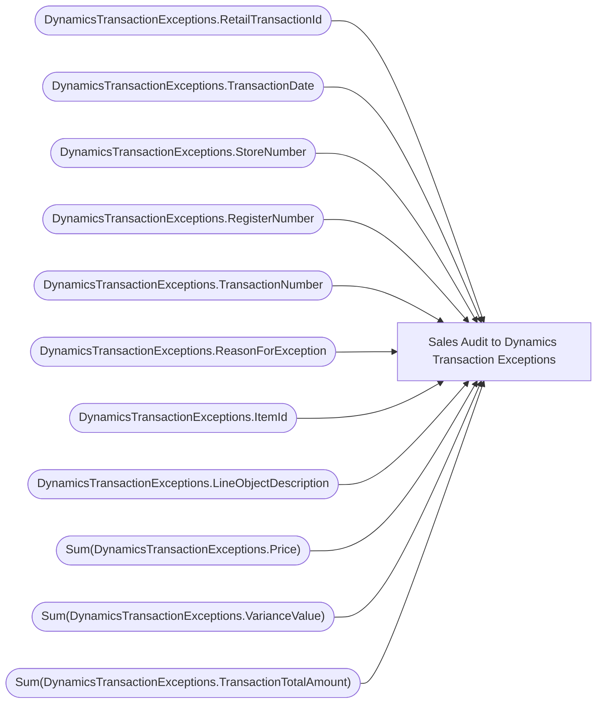

# Sales Audit to Dynamics Transaction Exceptions

**Workspace:** BI-Accounting  
**Report ID:** 252c0e69-5301-403a-9157-05eae0be30c2  
**Dataset ID:** cd0eac43-3dae-4ad7-8999-10da37f19290  
**Web URL:** https://app.powerbi.com/groups/e996caff-15ec-41d5-ae2b-cc9137531fb6/reports/252c0e69-5301-403a-9157-05eae0be30c2  

## Architecture Diagram

## Field Dependencies

| Referenced Field |
|---|
| DynamicsTransactionExceptions.RetailTransactionId |
| DynamicsTransactionExceptions.TransactionDate |
| DynamicsTransactionExceptions.StoreNumber |
| DynamicsTransactionExceptions.RegisterNumber |
| DynamicsTransactionExceptions.TransactionNumber |
| DynamicsTransactionExceptions.ReasonForException |
| DynamicsTransactionExceptions.ItemId |
| DynamicsTransactionExceptions.LineObjectDescription |
| Sum(DynamicsTransactionExceptions.Price) |
| Sum(DynamicsTransactionExceptions.VarianceValue) |
| Sum(DynamicsTransactionExceptions.TransactionTotalAmount) |

## Pages

| Page | Visuals |
|---|---|
| Page 1 | 4 |

## Visuals

### Page 1

| Visual | Type | Fields |
|---|---|---|
| dcb97ace569fa99ee13b | tableEx | DynamicsTransactionExceptions.RetailTransactionId, DynamicsTransactionExceptions.TransactionDate, DynamicsTransactionExceptions.StoreNumber, DynamicsTransactionExceptions.RegisterNumber, DynamicsTransactionExceptions.TransactionNumber, DynamicsTransactionExceptions.ReasonForException, DynamicsTransactionExceptions.ItemId, DynamicsTransactionExceptions.LineObjectDescription, Sum(DynamicsTransactionExceptions.Price), Sum(DynamicsTransactionExceptions.VarianceValue), Sum(DynamicsTransactionExceptions.TransactionTotalAmount) |
| 0577ceae3fa1795bc4e7 | slicer | DynamicsTransactionExceptions.TransactionDate |
| 042fb3fddcac63b948e7 | slicer | DynamicsTransactionExceptions.StoreNumber |
| cffe48934f3a0f6b0470 | slicer | DynamicsTransactionExceptions.ReasonForException |
