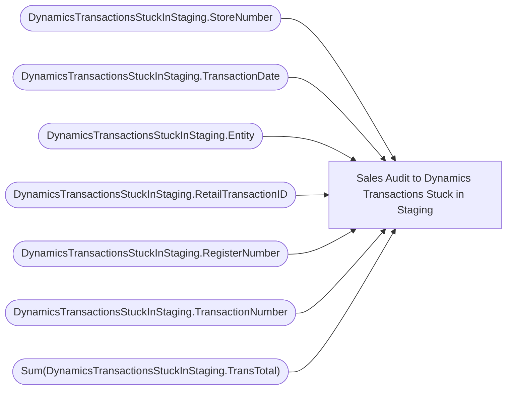

# Sales Audit to Dynamics Transactions Stuck in Staging

**Workspace:** BI-Accounting  
**Report ID:** 4b1751e9-4bed-4544-bb8c-227ade128134  
**Dataset ID:** cd0eac43-3dae-4ad7-8999-10da37f19290  
**Web URL:** https://app.powerbi.com/groups/e996caff-15ec-41d5-ae2b-cc9137531fb6/reports/4b1751e9-4bed-4544-bb8c-227ade128134  

## Architecture Diagram

## Field Dependencies

| Referenced Field |
|---|
| DynamicsTransactionsStuckInStaging.StoreNumber |
| DynamicsTransactionsStuckInStaging.TransactionDate |
| DynamicsTransactionsStuckInStaging.Entity |
| DynamicsTransactionsStuckInStaging.RetailTransactionID |
| DynamicsTransactionsStuckInStaging.RegisterNumber |
| DynamicsTransactionsStuckInStaging.TransactionNumber |
| Sum(DynamicsTransactionsStuckInStaging.TransTotal) |

## Pages

| Page | Visuals |
|---|---|
| Page 1 | 3 |

## Visuals

### Page 1

| Visual | Type | Fields |
|---|---|---|
| 02e57892bac602e2a94c | slicer | DynamicsTransactionsStuckInStaging.StoreNumber |
| d6826bf49caaa5cad85d | slicer | DynamicsTransactionsStuckInStaging.TransactionDate |
| 04bd42d871f76733f8e8 | tableEx | DynamicsTransactionsStuckInStaging.Entity, DynamicsTransactionsStuckInStaging.RetailTransactionID, DynamicsTransactionsStuckInStaging.TransactionDate, DynamicsTransactionsStuckInStaging.StoreNumber, DynamicsTransactionsStuckInStaging.RegisterNumber, DynamicsTransactionsStuckInStaging.TransactionNumber, Sum(DynamicsTransactionsStuckInStaging.TransTotal) |
