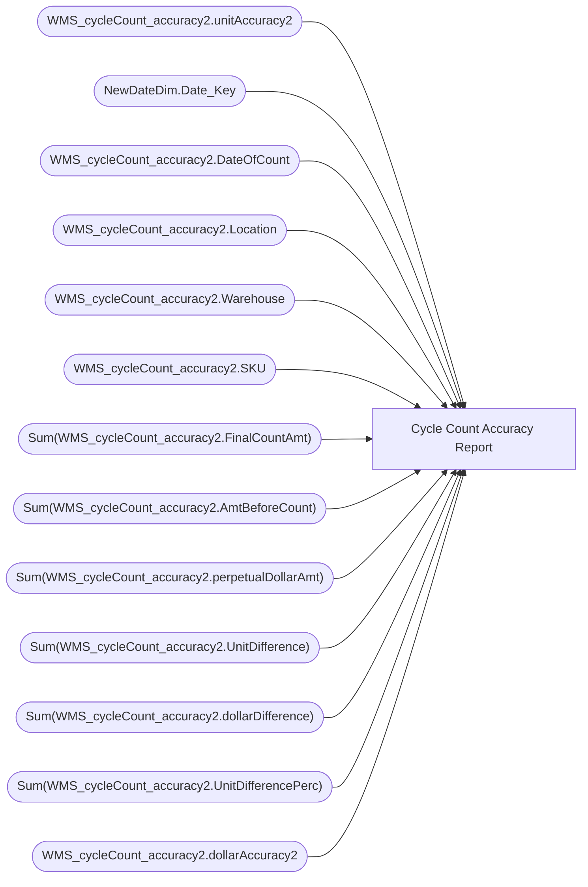

# Cycle Count Accuracy Report

**Workspace:** BI-Bearhouse  
**Report ID:** 57b71cfa-dbda-4ef1-8b2e-837492615aff  
**Dataset ID:** a815b99c-1d7b-4627-a701-96f056d666e0  
**Web URL:** https://app.powerbi.com/groups/4c62ba70-b045-47d1-adeb-778e3488d8b1/reports/57b71cfa-dbda-4ef1-8b2e-837492615aff  

## Architecture Diagram

## Field Dependencies

| Referenced Field |
|---|
| WMS_cycleCount_accuracy2.unitAccuracy2 |
| NewDateDim.Date_Key |
| WMS_cycleCount_accuracy2.DateOfCount |
| WMS_cycleCount_accuracy2.Location |
| WMS_cycleCount_accuracy2.Warehouse |
| WMS_cycleCount_accuracy2.SKU |
| Sum(WMS_cycleCount_accuracy2.FinalCountAmt) |
| Sum(WMS_cycleCount_accuracy2.AmtBeforeCount) |
| Sum(WMS_cycleCount_accuracy2.perpetualDollarAmt) |
| Sum(WMS_cycleCount_accuracy2.UnitDifference) |
| Sum(WMS_cycleCount_accuracy2.dollarDifference) |
| Sum(WMS_cycleCount_accuracy2.UnitDifferencePerc) |
| WMS_cycleCount_accuracy2.dollarAccuracy2 |

## Pages

| Page | Visuals |
|---|---|
| Page 1 | 7 |

## Visuals

### Page 1

| Visual | Type | Fields |
|---|---|---|
| 1c0c165542e7b03d3b6f | tableEx | WMS_cycleCount_accuracy2.unitAccuracy2 |
| e78a4eadc5a79079a577 | textbox |  |
| cbdf26ed487642101805 | slicer | NewDateDim.Date_Key |
| 18f54028e130626c86e6 | textbox |  |
| ecefa24f9e744a564e92 | textbox |  |
| 6b9a6a0b53bb510af179 | tableEx | WMS_cycleCount_accuracy2.DateOfCount, WMS_cycleCount_accuracy2.Location, WMS_cycleCount_accuracy2.Warehouse, WMS_cycleCount_accuracy2.SKU, Sum(WMS_cycleCount_accuracy2.FinalCountAmt), Sum(WMS_cycleCount_accuracy2.AmtBeforeCount), Sum(WMS_cycleCount_accuracy2.perpetualDollarAmt), Sum(WMS_cycleCount_accuracy2.UnitDifference), Sum(WMS_cycleCount_accuracy2.dollarDifference), Sum(WMS_cycleCount_accuracy2.UnitDifferencePerc) |
| fb8e8aada65d8e7f5f4e | tableEx | WMS_cycleCount_accuracy2.dollarAccuracy2 |
