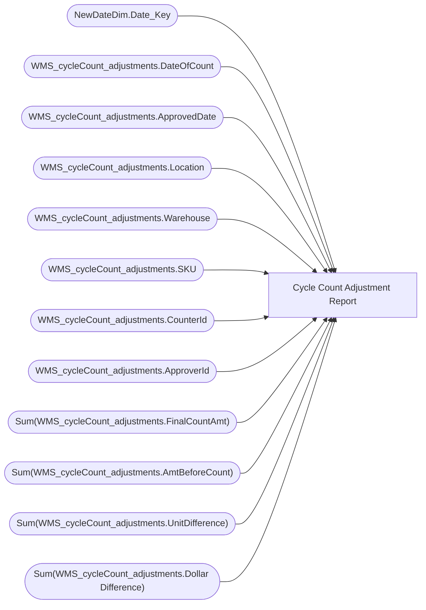

# Cycle Count Adjustment Report

**Workspace:** BI-Bearhouse  
**Report ID:** 9db1c7b5-7703-44b2-9dd6-7b85ab0988bf  
**Dataset ID:** a815b99c-1d7b-4627-a701-96f056d666e0  
**Web URL:** https://app.powerbi.com/groups/4c62ba70-b045-47d1-adeb-778e3488d8b1/reports/9db1c7b5-7703-44b2-9dd6-7b85ab0988bf  

## Architecture Diagram

## Field Dependencies

| Referenced Field |
|---|
| NewDateDim.Date_Key |
| WMS_cycleCount_adjustments.DateOfCount |
| WMS_cycleCount_adjustments.ApprovedDate |
| WMS_cycleCount_adjustments.Location |
| WMS_cycleCount_adjustments.Warehouse |
| WMS_cycleCount_adjustments.SKU |
| WMS_cycleCount_adjustments.CounterId |
| WMS_cycleCount_adjustments.ApproverId |
| Sum(WMS_cycleCount_adjustments.FinalCountAmt) |
| Sum(WMS_cycleCount_adjustments.AmtBeforeCount) |
| Sum(WMS_cycleCount_adjustments.UnitDifference) |
| Sum(WMS_cycleCount_adjustments.Dollar Difference) |

## Pages

| Page | Visuals |
|---|---|
| Page 1 | 3 |

## Visuals

### Page 1

| Visual | Type | Fields |
|---|---|---|
| bd74adc2427b8c80c829 | slicer | NewDateDim.Date_Key |
| 60e63122a5e28a11d029 | textbox |  |
| 7cf8ccedcdd310d03e1c | tableEx | WMS_cycleCount_adjustments.DateOfCount, WMS_cycleCount_adjustments.ApprovedDate, WMS_cycleCount_adjustments.Location, WMS_cycleCount_adjustments.Warehouse, WMS_cycleCount_adjustments.SKU, WMS_cycleCount_adjustments.CounterId, WMS_cycleCount_adjustments.ApproverId, Sum(WMS_cycleCount_adjustments.FinalCountAmt), Sum(WMS_cycleCount_adjustments.AmtBeforeCount), Sum(WMS_cycleCount_adjustments.UnitDifference), Sum(WMS_cycleCount_adjustments.Dollar Difference) |
