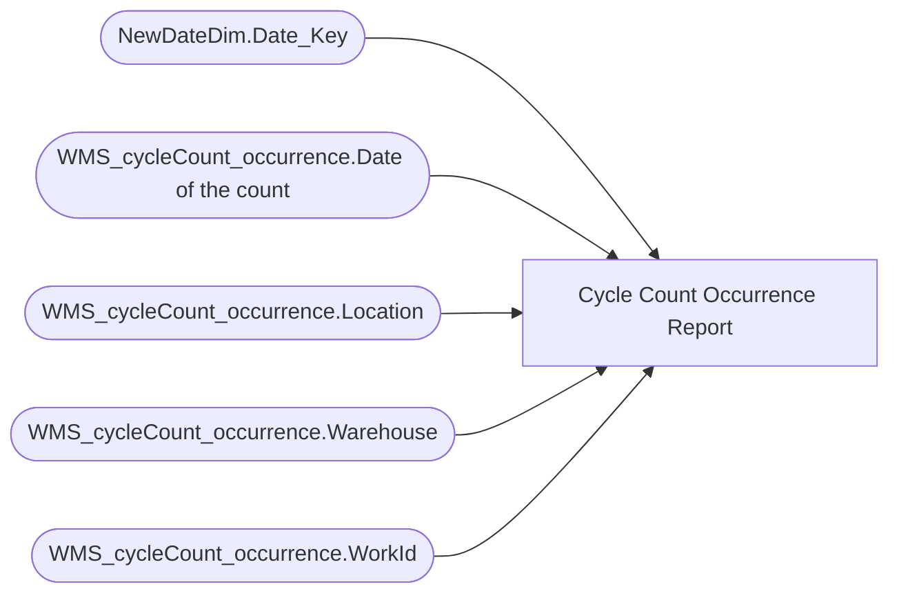

# Cycle Count Occurrence Report

**Workspace:** BI-Bearhouse  
**Report ID:** 07ef01c6-8f06-4f51-89fa-4d01a0f06ecb  
**Dataset ID:** a815b99c-1d7b-4627-a701-96f056d666e0  
**Web URL:** https://app.powerbi.com/groups/4c62ba70-b045-47d1-adeb-778e3488d8b1/reports/07ef01c6-8f06-4f51-89fa-4d01a0f06ecb  

## Architecture Diagram

## Field Dependencies

| Referenced Field |
|---|
| NewDateDim.Date_Key |
| WMS_cycleCount_occurrence.Date of the count |
| WMS_cycleCount_occurrence.Location |
| WMS_cycleCount_occurrence.Warehouse |
| WMS_cycleCount_occurrence.WorkId |

## Pages

| Page | Visuals |
|---|---|
| Page 1 | 3 |

## Visuals

### Page 1

| Visual | Type | Fields |
|---|---|---|
| c9be515f703c1a6bc190 | slicer | NewDateDim.Date_Key |
| 1ddc7ce7d0e305115879 | tableEx | WMS_cycleCount_occurrence.Date of the count, WMS_cycleCount_occurrence.Location, WMS_cycleCount_occurrence.Warehouse, WMS_cycleCount_occurrence.WorkId |
| f9ba2111d57c43b5dc8c | textbox |  |
