# AzureCostMgmt

**Workspace:** BI-Information Technology  
**Report ID:** 9e71f824-3c15-46b4-8128-b9c4cdf4ca95  
**Dataset ID:** 22b15e53-0f15-442c-ab5f-5119949a339b  
**Web URL:** https://app.powerbi.com/groups/064e5d9a-9ef2-4ac2-9f6d-f0be736f3b1d/reports/9e71f824-3c15-46b4-8128-b9c4cdf4ca95  
**Semantic Model:** [AzureCostMgmt](../../SemanticModels/BI-Information Technology/AzureCostMgmt.md)  

## Architecture Diagram

```mermaid
flowchart LR
    REPORT["AzureCostMgmt"]
    Subscriptions_SubscriptionName(["Subscriptions.SubscriptionName"]) --> REPORT
    AHBUsage_OS_Type(["AHBUsage.OS Type"]) --> REPORT
    Sum_AHBUsage_AHB_Cores_(["Sum(AHBUsage.AHB Cores)"]) --> REPORT
    Sum_AHBUsage_VMCores_(["Sum(AHBUsage.VMCores)"]) --> REPORT
    Sum_AHBUsage_Instances_(["Sum(AHBUsage.Instances)"]) --> REPORT
    AHBUsage_IsAHB(["AHBUsage.IsAHB"]) --> REPORT
    Resources_ResourceGroup(["Resources.ResourceGroup"]) --> REPORT
    Calendar_Date(["Calendar.Date"]) --> REPORT
    Resources_ResourceName(["Resources.ResourceName"]) --> REPORT
    AHBUsage_VMSSFlag(["AHBUsage.VMSSFlag"]) --> REPORT
    Calendar_Month(["Calendar.Month"]) --> REPORT
    Sum_Usage_Details_Cost_(["Sum(Usage Details.Cost)"]) --> REPORT
    Usage_Details_ChargeType(["Usage Details.ChargeType"]) --> REPORT
    Sum_Usage_Details_Amortized_Cost_(["Sum(Usage Details Amortized.Cost)"]) --> REPORT
    Usage_Meters_Meter_Hierarchy_MeterCategory(["Usage Meters.Meter Hierarchy.MeterCategory"]) --> REPORT
    Usage_Meters_Meter_Hierarchy_MeterSubCategory(["Usage Meters.Meter Hierarchy.MeterSubCategory"]) --> REPORT
    Usage_Meters_Meter_Hierarchy_MeterName(["Usage Meters.Meter Hierarchy.MeterName"]) --> REPORT
    Min_RI_Transactions_amount_(["Min(RI Transactions.amount)"]) --> REPORT
    Min_VMUsage_ResourceId_(["Min(VMUsage.ResourceId)"]) --> REPORT
    Min_AHBUsage_ResourceId_(["Min(AHBUsage.ResourceId)"]) --> REPORT
    Min_Calendar_Date_(["Min(Calendar.Date)"]) --> REPORT
    RI_Transactions_eventDate(["RI Transactions.eventDate"]) --> REPORT
    RI_Transactions_purchasingSubscriptionName(["RI Transactions.purchasingSubscriptionName"]) --> REPORT
    Sum_RI_Transactions_amount_(["Sum(RI Transactions.amount)"]) --> REPORT
    Calendar_Week(["Calendar.Week"]) --> REPORT
    Sum_Usage_Details_Amortized_CostNewThisMonth_(["Sum(Usage Details Amortized.CostNewThisMonth)"]) --> REPORT
    Resources_Tags_Application(["Resources.Tags.Application"]) --> REPORT
    Resources_Tags_CostCentre(["Resources.Tags.CostCentre"]) --> REPORT
    Sum_AHBUsage_WindowsCostPAYG_(["Sum(AHBUsage.WindowsCostPAYG)"]) --> REPORT
    VMUsage_24x7(["VMUsage.24x7"]) --> REPORT
    Sum_AHBUsage_Compute_Hours_(["Sum(AHBUsage.Compute Hours)"]) --> REPORT
    Sum_AHBUsage_AHB_Cores_Needed_(["Sum(AHBUsage.AHB Cores Needed)"]) --> REPORT
    AHBUsage_VMSize(["AHBUsage.VMSize"]) --> REPORT
    Subscriptions_SubscriptionGroup(["Subscriptions.SubscriptionGroup"]) --> REPORT
    RI_Recommendations__Shared__term(["RI Recommendations (Shared).term"]) --> REPORT
    RIUsageSummary_Utilisation(["RIUsageSummary.Utilisation"]) --> REPORT
    RI_Usage_Summary_usageDate(["RI Usage Summary.usageDate"]) --> REPORT
    RI_Transactions_eventType(["RI Transactions.eventType"]) --> REPORT
    RI_Transactions_reservationOrderName(["RI Transactions.reservationOrderName"]) --> REPORT
    RI_Transactions_armSkuName(["RI Transactions.armSkuName"]) --> REPORT
    RI_Transactions_region(["RI Transactions.region"]) --> REPORT
    RI_Transactions_term(["RI Transactions.term"]) --> REPORT
    Sum_RI_Transactions_quantity_(["Sum(RI Transactions.quantity)"]) --> REPORT
    Sum_RI_Recommendations__Shared__costWithNoReservedInstances_(["Sum(RI Recommendations (Shared).costWithNoReservedInstances)"]) --> REPORT
    Sum_RI_Recommendations__Shared__netSavings_(["Sum(RI Recommendations (Shared).netSavings)"]) --> REPORT
    Sum_RI_Recommendations__Shared__totalCostWithReservedInstances_(["Sum(RI Recommendations (Shared).totalCostWithReservedInstances)"]) --> REPORT
    Sum_RI_Recommendations__Shared__recommendedQuantity_(["Sum(RI Recommendations (Shared).recommendedQuantity)"]) --> REPORT
    RI_Recommendations__Shared__instanceFlexibilityGroup(["RI Recommendations (Shared).instanceFlexibilityGroup"]) --> REPORT
    Usage_Meters_MeterName(["Usage Meters.MeterName"]) --> REPORT
    Usage_Details_Amortized_IsRIUsage(["Usage Details Amortized.IsRIUsage"]) --> REPORT
    Divide_Sum_Usage_Details_Amortized_Cost___ScopedEval_Sum_Usage_Details_Amortized_Cost_______(["Divide(Sum(Usage Details Amortized.Cost), ScopedEval(Sum(Usage Details Amortized.Cost), []))"]) --> REPORT
    Usage_Meters_MeterCategory(["Usage Meters.MeterCategory"]) --> REPORT
    Usage_Meters_MeterSubCategory(["Usage Meters.MeterSubCategory"]) --> REPORT
    Usage_Details_ResourceId(["Usage Details.ResourceId"]) --> REPORT
    CountNonNull_Usage_Details_ResourceId_(["CountNonNull(Usage Details.ResourceId)"]) --> REPORT
    VMUsage_OS_Type(["VMUsage.OS Type"]) --> REPORT
    VMUsage_VMSize(["VMUsage.VMSize"]) --> REPORT
    Sum_VMUsage_30DaysQty_(["Sum(VMUsage.30DaysQty)"]) --> REPORT
    Sum_Usage_Details_StorageCapacity_(["Sum(Usage Details.StorageCapacity)"]) --> REPORT
    Sum_Usage_Details_StorageCapacityDaily_(["Sum(Usage Details.StorageCapacityDaily)"]) --> REPORT
    Sum_Usage_Details_Quantity_(["Sum(Usage Details.Quantity)"]) --> REPORT
    Pricesheet_Bandwidth_Groups(["Pricesheet.Bandwidth Groups"]) --> REPORT
    Usage_Details_UnitOfMeasure(["Usage Details.UnitOfMeasure"]) --> REPORT
    Pricesheet_Meter_Hierarchy_Meter_category(["Pricesheet.Meter Hierarchy.Meter category"]) --> REPORT
    Pricesheet_Meter_Hierarchy_Meter_name(["Pricesheet.Meter Hierarchy.Meter name"]) --> REPORT
    Sum_Usage_Details_Amortized_Quantity_(["Sum(Usage Details Amortized.Quantity)"]) --> REPORT
    Usage_Details_OS_Type(["Usage Details.OS Type"]) --> REPORT
    Min_Usage_Details_ResourceId_(["Min(Usage Details.ResourceId)"]) --> REPORT
    Pricesheet_Meter_sub_category(["Pricesheet.Meter sub-category"]) --> REPORT
    Pricesheet_Meter_name(["Pricesheet.Meter name"]) --> REPORT
    Pricesheet_Meter_region(["Pricesheet.Meter region"]) --> REPORT
    Usage_Details_Amortized_ResourceId(["Usage Details Amortized.ResourceId"]) --> REPORT
    Pricesheet_Meter_category(["Pricesheet.Meter category"]) --> REPORT
    Pricesheet_Currency_code(["Pricesheet.Currency code"]) --> REPORT
    Pricesheet_Part_number(["Pricesheet.Part number"]) --> REPORT
    Sum_Pricesheet_Unit_price_(["Sum(Pricesheet.Unit price)"]) --> REPORT
    Pricesheet_Offer_Id(["Pricesheet.Offer Id"]) --> REPORT
    Sum_Pricesheet_Per_Unit_price_(["Sum(Pricesheet.Per Unit price)"]) --> REPORT
    Sum_Pricesheet_Unit_(["Sum(Pricesheet.Unit)"]) --> REPORT
    Pricesheet_unitOfMeasure(["Pricesheet.unitOfMeasure"]) --> REPORT
    Usage_Details_ResourceName(["Usage Details.ResourceName"]) --> REPORT
    Usage_Details_PublisherName(["Usage Details.PublisherName"]) --> REPORT
    Usage_Details_ResourceGroup(["Usage Details.ResourceGroup"]) --> REPORT
    Usage_Details_Amortized_Tags(["Usage Details Amortized.Tags"]) --> REPORT
    Usage_Details_MeterCategory(["Usage Details.MeterCategory"]) --> REPORT
    Usage_Details_JsonTags_App(["Usage Details.JsonTags.App"]) --> REPORT
    Usage_Details_JsonTags_Env(["Usage Details.JsonTags.Env"]) --> REPORT
    Usage_Details_JsonTags_IT_Dept(["Usage Details.JsonTags.IT Dept"]) --> REPORT
    Usage_Details_JsonTags_Region(["Usage Details.JsonTags.Region"]) --> REPORT
    Usage_Details_Date(["Usage Details.Date"]) --> REPORT
    Usage_Details_SubscriptionName(["Usage Details.SubscriptionName"]) --> REPORT
    Usage_Details_MeterName(["Usage Details.MeterName"]) --> REPORT
    Usage_Details_MeterSubCategory(["Usage Details.MeterSubCategory"]) --> REPORT
```

## Field Dependencies

| Referenced Field |
|---|
| Subscriptions.SubscriptionName |
| AHBUsage.OS Type |
| Sum(AHBUsage.AHB Cores) |
| Sum(AHBUsage.VMCores) |
| Sum(AHBUsage.Instances) |
| AHBUsage.IsAHB |
| Resources.ResourceGroup |
| Calendar.Date |
| Resources.ResourceName |
| AHBUsage.VMSSFlag |
| Calendar.Month |
| Sum(Usage Details.Cost) |
| Usage Details.ChargeType |
| Sum(Usage Details Amortized.Cost) |
| Usage Meters.Meter Hierarchy.MeterCategory |
| Usage Meters.Meter Hierarchy.MeterSubCategory |
| Usage Meters.Meter Hierarchy.MeterName |
| Min(RI Transactions.amount) |
| Min(VMUsage.ResourceId) |
| Min(AHBUsage.ResourceId) |
| Min(Calendar.Date) |
| RI Transactions.eventDate |
| RI Transactions.purchasingSubscriptionName |
| Sum(RI Transactions.amount) |
| Calendar.Week |
| Sum(Usage Details Amortized.CostNewThisMonth) |
| Resources.Tags.Application |
| Resources.Tags.CostCentre |
| Sum(AHBUsage.WindowsCostPAYG) |
| VMUsage.24x7 |
| Sum(AHBUsage.Compute Hours) |
| Sum(AHBUsage.AHB Cores Needed) |
| AHBUsage.VMSize |
| Subscriptions.SubscriptionGroup |
| RI Recommendations (Shared).term |
| RIUsageSummary.Utilisation |
| RI Usage Summary.usageDate |
| RI Transactions.eventType |
| RI Transactions.reservationOrderName |
| RI Transactions.armSkuName |
| RI Transactions.region |
| RI Transactions.term |
| Sum(RI Transactions.quantity) |
| Sum(RI Recommendations (Shared).costWithNoReservedInstances) |
| Sum(RI Recommendations (Shared).netSavings) |
| Sum(RI Recommendations (Shared).totalCostWithReservedInstances) |
| Sum(RI Recommendations (Shared).recommendedQuantity) |
| RI Recommendations (Shared).instanceFlexibilityGroup |
| Usage Meters.MeterName |
| Usage Details Amortized.IsRIUsage |
| Divide(Sum(Usage Details Amortized.Cost), ScopedEval(Sum(Usage Details Amortized.Cost), [])) |
| Usage Meters.MeterCategory |
| Usage Meters.MeterSubCategory |
| Usage Details.ResourceId |
| CountNonNull(Usage Details.ResourceId) |
| VMUsage.OS Type |
| VMUsage.VMSize |
| Sum(VMUsage.30DaysQty) |
| Sum(Usage Details.StorageCapacity) |
| Sum(Usage Details.StorageCapacityDaily) |
| Sum(Usage Details.Quantity) |
| Pricesheet.Bandwidth Groups |
| Usage Details.UnitOfMeasure |
| Pricesheet.Meter Hierarchy.Meter category |
| Pricesheet.Meter Hierarchy.Meter name |
| Sum(Usage Details Amortized.Quantity) |
| Usage Details.OS Type |
| Min(Usage Details.ResourceId) |
| Pricesheet.Meter sub-category |
| Pricesheet.Meter name |
| Pricesheet.Meter region |
| Usage Details Amortized.ResourceId |
| Pricesheet.Meter category |
| Pricesheet.Currency code |
| Pricesheet.Part number |
| Sum(Pricesheet.Unit price) |
| Pricesheet.Offer Id |
| Sum(Pricesheet.Per Unit price) |
| Sum(Pricesheet.Unit) |
| Pricesheet.unitOfMeasure |
| Usage Details.ResourceName |
| Usage Details.PublisherName |
| Usage Details.ResourceGroup |
| Usage Details Amortized.Tags |
| Usage Details.MeterCategory |
| Usage Details.JsonTags.App |
| Usage Details.JsonTags.Env |
| Usage Details.JsonTags.IT Dept |
| Usage Details.JsonTags.Region |
| Usage Details.Date |
| Usage Details.SubscriptionName |
| Usage Details.MeterName |
| Usage Details.MeterSubCategory |

## Pages

| Page | Visuals |
|---|---|
| Hybrid Benefit | 10 |
| New Deployments | 13 |
| Readme | 3 |
| Summary | 15 |
| Cost Allocations | 8 |
| Windows AHB | 10 |
| Reserved Instances | 10 |
| Non-Prod 24x7 VMs | 8 |
| Storage | 9 |
| Network | 9 |
| Compute | 11 |
| Detail | 11 |
| Pricesheet | 6 |
| Logging | 9 |
| Marketplace Usage | 6 |
| Cost Per Service | 4 |
| Costs with Tags | 6 |
| Usage by Subscriptions & Resource Groups | 9 |
| Top 5 Usage Drivers | 5 |
| Usage by Services | 9 |
| Subscription Cost by Month | 2 |

## Visuals

### Hybrid Benefit

| Visual | Type | Fields |
|---|---|---|
| 1a8d3868315205d0677c | slicer | Subscriptions.SubscriptionName |
| 082273da9f5a35a8f95b | slicer | AHBUsage.OS Type |
| c3fa7abf8276c9787450 | tableEx | Sum(AHBUsage.AHB Cores), Sum(AHBUsage.VMCores), Sum(AHBUsage.Instances), AHBUsage.OS Type, AHBUsage.IsAHB |
| a32befb4029918448386 | card | Sum(AHBUsage.AHB Cores) |
| 701bc8f50a422510cba3 | slicer | AHBUsage.IsAHB |
| faa66c1fdc86291fa7f5 | slicer | Resources.ResourceGroup |
| abec1135581c4a83a93e | lineChart | Calendar.Date, AHBUsage.OS Type, Sum(AHBUsage.AHB Cores) |
| 31eb8734e9c51be214e1 | tableEx | Sum(AHBUsage.AHB Cores), Sum(AHBUsage.VMCores), Sum(AHBUsage.Instances), AHBUsage.OS Type, AHBUsage.IsAHB, Resources.ResourceGroup, Resources.ResourceName, AHBUsage.VMSSFlag, Subscriptions.SubscriptionName |
| 5131901c97b03b130874 | textbox |  |
| 832c12037e392dfee6b3 | image |  |

### New Deployments

| Visual | Type | Fields |
|---|---|---|
| e01953894cd3572f14dd | lineStackedColumnComboChart | Calendar.Month, Sum(Usage Details.Cost), Usage Details.ChargeType, Sum(Usage Details Amortized.Cost) |
| b7d1312d4e7bf272a999 | pivotTable | Calendar.Month, Sum(Usage Details Amortized.Cost), Resources.ResourceGroup, Resources.ResourceName, Usage Meters.Meter Hierarchy.MeterCategory, Usage Meters.Meter Hierarchy.MeterSubCategory, Usage Meters.Meter Hierarchy.MeterName |
| fa74e80325bf38d14e06 | treemap | Sum(Usage Details Amortized.Cost), Usage Meters.Meter Hierarchy.MeterCategory, Usage Meters.Meter Hierarchy.MeterSubCategory, Usage Meters.Meter Hierarchy.MeterName |
| 75ad6d8946f9c702dd21 | textbox |  |
| dc94bb65de0803d34c34 | image |  |
| 7b91dac635c8cb73c655 | areaChart | Sum(Usage Details Amortized.Cost), Calendar.Date |
| fbd0bef6506a690fa3a5 | card | Min(RI Transactions.amount) |
| fe5424843c235e949160 | pieChart | Subscriptions.SubscriptionName, Sum(Usage Details Amortized.Cost) |
| e35ea06436a42a6dea1d | card | Sum(AHBUsage.AHB Cores) |
| 1d78b131085c1dedd464 | card | Min(VMUsage.ResourceId) |
| 4a53732c08d21cdbc1c9 | card | Min(AHBUsage.ResourceId) |
| 0b880988b57297e0239e | card | Min(Calendar.Date) |
| bebc0ddbdbb925546130 | card | Sum(Usage Details Amortized.Cost) |

### Readme

| Visual | Type | Fields |
|---|---|---|
| 99b81f2548c24ae6a72c | image |  |
| 3272651c51d96d3dccfc | textbox |  |
| f5e84f768e4a23529d74 | textbox |  |

### Summary

| Visual | Type | Fields |
|---|---|---|
| 26e35121c2c1f32ead7e | image |  |
| c3b48ac465894d29740e | textbox |  |
| c28b6e9989405406ac5d | card | Sum(Usage Details Amortized.Cost) |
| d3de0c905295e4934643 | card | Min(Calendar.Date) |
| bd8c46e88c10daa26d55 | treemap | Sum(Usage Details Amortized.Cost), Usage Meters.Meter Hierarchy.MeterCategory, Usage Meters.Meter Hierarchy.MeterSubCategory, Usage Meters.Meter Hierarchy.MeterName |
| 43080f45cd4bd0b232a8 | areaChart | Sum(Usage Details Amortized.Cost), Calendar.Date |
| 319ba21e67136af6e04a | card | Min(RI Transactions.amount) |
| 606657e980a45a601193 | tableEx | RI Transactions.eventDate, RI Transactions.purchasingSubscriptionName, Sum(RI Transactions.amount) |
| 75c0d4210410eaed509e | pieChart | Subscriptions.SubscriptionName, Sum(Usage Details Amortized.Cost) |
| 9468ee10455c306ec00a | card | Sum(AHBUsage.AHB Cores) |
| b5d2845f416faf3133a9 | card | Min(VMUsage.ResourceId) |
| 7966a07e31e49bb27088 | card | Min(AHBUsage.ResourceId) |
| 0851de750b94232e3e30 | pivotTable | Calendar.Month, Sum(Usage Details Amortized.Cost), Resources.ResourceGroup, Resources.ResourceName, Usage Meters.Meter Hierarchy.MeterCategory, Usage Meters.Meter Hierarchy.MeterSubCategory, Usage Meters.Meter Hierarchy.MeterName |
| c2cb877118872cad9ad8 | lineStackedColumnComboChart | Sum(Usage Details Amortized.Cost), Calendar.Week, Calendar.Date, Sum(Usage Details Amortized.CostNewThisMonth) |
| 85c51d09597167c68632 | lineStackedColumnComboChart | Calendar.Month, Sum(Usage Details.Cost), Usage Details.ChargeType, Sum(Usage Details Amortized.Cost) |

### Cost Allocations

| Visual | Type | Fields |
|---|---|---|
| 50cda46fbc6b287d5cc3 | slicer | Resources.Tags.Application |
| c8a9bb39f35dadfb4d40 | slicer | Resources.Tags.CostCentre |
| be0d68138d8b852faebd | donutChart | Sum(Usage Details Amortized.Cost), Resources.Tags.Application |
| af4697296caceac31c16 | donutChart | Sum(Usage Details Amortized.Cost), Resources.Tags.CostCentre |
| 37633b4c5a1434facc39 | slicer | Calendar.Date |
| b045043487c1d1df9185 | tableEx | Calendar.Month, Resources.ResourceGroup, Subscriptions.SubscriptionName, Resources.Tags.CostCentre, Resources.Tags.Application, Sum(Usage Details Amortized.Cost) |
| 10f2b2d8da0f5ccd132f | image |  |
| 1e5f5765cd5ccb4d5629 | textbox |  |

### Windows AHB

| Visual | Type | Fields |
|---|---|---|
| 766a15bd8fa092506705 | tableEx | Sum(AHBUsage.WindowsCostPAYG), Resources.ResourceGroup, Subscriptions.SubscriptionName |
| 3af3ac5b45f0ef32c126 | tableEx | VMUsage.24x7, Sum(AHBUsage.VMCores), AHBUsage.VMSSFlag, Sum(AHBUsage.Compute Hours), Sum(AHBUsage.AHB Cores Needed), AHBUsage.VMSize, Resources.ResourceGroup, Resources.ResourceName, Subscriptions.SubscriptionName, Sum(AHBUsage.Instances) |
| 2e5f9b4557fe60825830 | tableEx | VMUsage.24x7, Sum(AHBUsage.AHB Cores), Sum(AHBUsage.VMCores), Sum(AHBUsage.Instances), AHBUsage.VMSSFlag, AHBUsage.VMSize, Subscriptions.SubscriptionName, Resources.ResourceGroup, Resources.ResourceName |
| 3266a88f669a6c126df8 | lineChart | Sum(AHBUsage.AHB Cores), Subscriptions.SubscriptionGroup, Calendar.Date |
| 04433807d950c2a46e39 | card | Sum(AHBUsage.WindowsCostPAYG) |
| 9c9d8d48afec6bb49a76 | textbox |  |
| 002b561783b5103692e6 | card | Sum(AHBUsage.AHB Cores) |
| 16c1a2387165c1a8402d | card | Min(AHBUsage.ResourceId) |
| da87707d758fbc5267ef | image |  |
| b7df3ccf4247a3d1adeb | textbox |  |

### Reserved Instances

| Visual | Type | Fields |
|---|---|---|
| 93ce48d935d02101ed26 | slicer | RI Recommendations (Shared).term |
| 1c1b8dfc6b6a5a83be9d | lineChart | RIUsageSummary.Utilisation, RI Usage Summary.usageDate |
| 28aa7dad83492eb0bb30 | card | RIUsageSummary.Utilisation |
| 9cb00aa42c33765e2175 | tableEx | RI Transactions.eventDate, RI Transactions.eventType, RI Transactions.reservationOrderName, RI Transactions.purchasingSubscriptionName, RI Transactions.armSkuName, RI Transactions.region, RI Transactions.term, Sum(RI Transactions.quantity), Sum(RI Transactions.amount) |
| e665fcd96180d5e8db99 | tableEx | Sum(RI Recommendations (Shared).costWithNoReservedInstances), Sum(RI Recommendations (Shared).netSavings), Sum(RI Recommendations (Shared).totalCostWithReservedInstances), Sum(RI Recommendations (Shared).recommendedQuantity), RI Recommendations (Shared).term, RI Recommendations (Shared).instanceFlexibilityGroup, Usage Meters.MeterName |
| 420202ea98c66704da94 | card | Sum(RI Transactions.amount) |
| a362372d49fc7b1e17fb | slicer | Subscriptions.SubscriptionName |
| 36f4e4d5e0e7df7575c7 | barChart | Subscriptions.SubscriptionName, Usage Details Amortized.IsRIUsage, Sum(Usage Details Amortized.Cost), Divide(Sum(Usage Details Amortized.Cost), ScopedEval(Sum(Usage Details Amortized.Cost), [])), Usage Meters.MeterCategory, Usage Meters.MeterSubCategory, Usage Meters.MeterName |
| 620a7ac71ccebe4546c0 | image |  |
| b4c18a2c6f63492fd613 | textbox |  |

### Non-Prod 24x7 VMs

| Visual | Type | Fields |
|---|---|---|
| d4de32f346d79e144c00 | tableEx | Subscriptions.SubscriptionGroup, Usage Details.ResourceId |
| e552b3b2e1eb0ddf0ab7 | lineChart | Calendar.Date, CountNonNull(Usage Details.ResourceId), Subscriptions.SubscriptionGroup |
| 8cb9e9250983bb944f4f | textbox |  |
| db03d438ad0fbe527649 | tableEx | Subscriptions.SubscriptionName, Resources.ResourceGroup, Resources.ResourceName, VMUsage.OS Type, VMUsage.VMSize, Sum(VMUsage.30DaysQty), Sum(Usage Details.Cost) |
| 1bf6cd84c2290586c7d9 | tableEx | Subscriptions.SubscriptionGroup, Resources.ResourceGroup, Usage Details.ResourceId |
| 98ffd3c4c34e05dc133d | card | Min(VMUsage.ResourceId) |
| d6d30c0129dbd4fbc071 | image |  |
| 2fb14d707040dae1b7c0 | textbox |  |

### Storage

| Visual | Type | Fields |
|---|---|---|
| ce132aad83bf2b7dcb01 | textbox |  |
| a78a6dff1a52a0898156 | tableEx | Sum(Usage Details.StorageCapacity), Sum(Usage Details.Cost), Usage Meters.Meter Hierarchy.MeterCategory, Usage Meters.Meter Hierarchy.MeterSubCategory |
| b41bd21d0b92b17f5bdd | textbox |  |
| 84124c9e793460100624 | slicer | Calendar.Date |
| 51138129717ae5638b17 | areaChart | Sum(Usage Details.StorageCapacityDaily), Calendar.Date |
| ec7da13d6fb2057e188f | slicer | Resources.ResourceGroup |
| 210eef369893ff305ee4 | slicer | Subscriptions.SubscriptionName |
| 9724c316ff574713b5d5 | tableEx | Subscriptions.SubscriptionName, Resources.ResourceGroup, Sum(Usage Details.StorageCapacity), Sum(Usage Details.Cost), Usage Meters.Meter Hierarchy.MeterCategory, Usage Meters.Meter Hierarchy.MeterSubCategory, Usage Meters.Meter Hierarchy.MeterName |
| 5195c7e57f5c442d4b82 | image |  |

### Network

| Visual | Type | Fields |
|---|---|---|
| 81b5238ab118b5edd6b7 | slicer | Resources.ResourceGroup |
| de553451a42939185ebe | areaChart | Sum(Usage Details.Quantity), Calendar.Date, Sum(Usage Details.Cost), Pricesheet.Bandwidth Groups |
| a18891bd938fbbb835d4 | tableEx | Subscriptions.SubscriptionName, Resources.ResourceGroup, Sum(Usage Details.Cost), Sum(Usage Details.Quantity), Usage Details.UnitOfMeasure, Usage Meters.Meter Hierarchy.MeterCategory, Usage Meters.Meter Hierarchy.MeterSubCategory, Usage Meters.Meter Hierarchy.MeterName |
| 040cfa87ba9f1218350a | tableEx | Pricesheet.Meter Hierarchy.Meter category, Pricesheet.Meter Hierarchy.Meter name, Sum(Usage Details.Quantity), Sum(Usage Details.Cost), Usage Details.UnitOfMeasure |
| 8a4f81570a5c61be0287 | textbox |  |
| f051512100a8d75d210d | slicer | Subscriptions.SubscriptionName |
| b79a7e1d660527293759 | slicer | Calendar.Date |
| 1c12bc79a9ffed5b27a4 | image |  |
| ece3b3992a0eccee2181 | textbox |  |

### Compute

| Visual | Type | Fields |
|---|---|---|
| 7f931a4cb8c2098bdc54 | slicer | Calendar.Date |
| 0be48bbfaa38ed5a2463 | slicer | Subscriptions.SubscriptionName |
| 3d0f0215b62ec6d5d6a0 | tableEx | Usage Details.ResourceId, Usage Meters.MeterSubCategory |
| e67037aeb810a06e007d | lineChart | Calendar.Date, Subscriptions.SubscriptionName, Sum(Usage Details Amortized.Quantity), Sum(Usage Details Amortized.Cost) |
| c17e51a1552101da9009 | lineChart | Calendar.Date, CountNonNull(Usage Details.ResourceId) |
| 33a8f00a92ac99ed0c93 | donutChart | Usage Details.OS Type, CountNonNull(Usage Details.ResourceId) |
| fe2c393a61a01791c082 | lineChart | Calendar.Date, Sum(Usage Details.Quantity), Min(Usage Details.ResourceId) |
| 3035404fd3d2551450de | textbox |  |
| f7968f898d482bdb05be | slicer | Resources.ResourceGroup |
| 477a7e13ec29acb8f95c | image |  |
| d5953965f237ebd01bed | textbox |  |

### Detail

| Visual | Type | Fields |
|---|---|---|
| f586c92806b4e28eb219 | slicer | Pricesheet.Meter sub-category |
| bd45ed8af793c28c1593 | textbox |  |
| 81547d7de21bd346ee7e | slicer | Pricesheet.Meter name |
| c35e1e098e2415190616 | slicer | Resources.ResourceGroup |
| 28d10070d30b3227011c | slicer | Pricesheet.Meter region |
| bb9f46bc7a9925dcb275 | slicer | Subscriptions.SubscriptionName |
| 1c391ac5471b50180153 | slicer | Calendar.Date |
| 2442019a2ea06c384d91 | tableEx | Calendar.Month, Subscriptions.SubscriptionName, Resources.ResourceGroup, Usage Details Amortized.ResourceId, Sum(Usage Details Amortized.Quantity), Sum(Usage Details Amortized.Cost), Usage Meters.Meter Hierarchy.MeterSubCategory, Usage Meters.Meter Hierarchy.MeterName |
| 47b95a07080c7b4167d6 | slicer | Pricesheet.Meter category |
| 624b977d20bdb6f610c8 | image |  |
| ce5d99016b6b9ba3f7fa | textbox |  |

### Pricesheet

| Visual | Type | Fields |
|---|---|---|
| be2b0001a9d4e1806d4c | tableEx | Pricesheet.Currency code, Pricesheet.Part number, Pricesheet.Meter category, Pricesheet.Meter sub-category, Pricesheet.Meter name, Pricesheet.Meter region, Sum(Pricesheet.Unit price), Pricesheet.Offer Id, Sum(Pricesheet.Per Unit price), Sum(Pricesheet.Unit), Pricesheet.unitOfMeasure |
| 83fb65beaee9795c1e59 | slicer | Pricesheet.Meter region |
| 98b3c04816b9d8890854 | slicer | Pricesheet.Meter category, Pricesheet.Meter sub-category |
| f40d55cf725205010734 | slicer | Pricesheet.Offer Id |
| 2e7d0298c06aaa631490 | image |  |
| c614935fa3db95f8928a | textbox |  |

### Logging

| Visual | Type | Fields |
|---|---|---|
| 932d1fbd957f7d1c38ff | textbox |  |
| cb1170119c488f11ae54 | image |  |
| f05550c4896a02605927 | areaChart | Sum(Usage Details.Quantity), Calendar.Date, Sum(Usage Details.Cost), Usage Meters.MeterCategory |
| 2aa71bc1c80eb01e68ec | powerKPIMatrixEB2381CC88A8425FBEB1B07FF57784E6 | Calendar.Date, Sum(Usage Details.Cost), Usage Details.ResourceName |
| 4e0799c0a2c209e04651 | tableEx | Resources.ResourceGroup, Subscriptions.SubscriptionName, Sum(Usage Details.Cost), Sum(Usage Details.Quantity), Usage Meters.Meter Hierarchy.MeterCategory, Usage Meters.Meter Hierarchy.MeterName |
| 1db7fd99d77714a0ca80 | slicer | Subscriptions.SubscriptionName |
| 93ff490001bb5cbe0e0e | slicer | Usage Meters.MeterCategory |
| fd1105e2b3dc0504d025 | slicer | Calendar.Date |
| 5721cb774321a30703d4 | textbox |  |

### Marketplace Usage

| Visual | Type | Fields |
|---|---|---|
| 6420ecff81c295d3aaae | tableEx | Calendar.Date, Usage Details.PublisherName, Subscriptions.SubscriptionName, Sum(Usage Details.Quantity), Sum(Usage Details.Cost), Usage Details.ResourceGroup, Usage Meters.MeterSubCategory, Usage Meters.MeterName |
| 41493ed493d8b72ac0d7 | slicer | Subscriptions.SubscriptionName |
| a7fba12d63d0e43adc75 | slicer | Resources.ResourceGroup |
| 258a1fe1b23e306949b0 | slicer | Calendar.Date |
| a418228468a91e604908 | image |  |
| a992a0ba4b3ab0161bc8 | textbox |  |

### Cost Per Service

| Visual | Type | Fields |
|---|---|---|
| 3594ab0d31060328b890 | lineStackedColumnComboChart | Calendar.Month, Sum(Usage Details Amortized.Cost), Usage Meters.MeterCategory |
| 4d1056a220088866e35c | slicer | Calendar.Month |
| b999031d69eba28e5383 | donutChart | Usage Meters.MeterCategory, Sum(Usage Details Amortized.Cost) |
| 3a8c0d86c35264d5cb08 | pivotTable | Calendar.Month, Sum(Usage Details Amortized.Cost), Usage Meters.Meter Hierarchy.MeterCategory, Usage Meters.Meter Hierarchy.MeterSubCategory, Usage Meters.Meter Hierarchy.MeterName, Resources.ResourceName, Usage Details Amortized.Tags |

### Costs with Tags

| Visual | Type | Fields |
|---|---|---|
| 1485bbcdfbf162b86d1a | pivotTable | Usage Details.MeterCategory, Usage Details.ResourceName, Sum(Usage Details.Cost), Usage Details.ResourceGroup, Calendar.Month |
| 922c5e6155045c8d68dc | slicer | Usage Details.JsonTags.App |
| 703396e9fce2f314dbd0 | slicer | Calendar.Month |
| 2c3ab7538ae1efa629cb | slicer | Usage Details.JsonTags.Env |
| e1f35f27a1fc0d57aa83 | slicer | Usage Details.JsonTags.IT Dept |
| 9db6064ad65c5a4ab428 | slicer | Usage Details.JsonTags.Region |

### Usage by Subscriptions & Resource Groups

| Visual | Type | Fields |
|---|---|---|
| 9d5602a391df78932433 | slicer | Usage Details.Date |
| 11a157149900667bd962 | shape |  |
| 5e9e98b2bc5e260b3262 | slicer | Usage Details.SubscriptionName |
| 1412c42f8b74435fb55f | slicer | Usage Details.ResourceGroup |
| 37cbd7e2584448a5ad4f | donutChart | Usage Details.SubscriptionName, Sum(Usage Details.Cost), Usage Details.ResourceGroup |
| 6413c09cc8b21faad049 | clusteredColumnChart | Usage Details.SubscriptionName, Sum(Usage Details.Cost) |
| 4dbf26e84c35666e5bbd | clusteredColumnChart | Usage Details.Date, Sum(Usage Details.Cost) |
| c48ff9071222bd126128 | slicer | Usage Details.JsonTags.App |
| f933c9265612454e4081 | slicer | Usage Details.JsonTags.IT Dept |

### Top 5 Usage Drivers

| Visual | Type | Fields |
|---|---|---|
| 4f2a8ac08ce99612b168 | columnChart | Usage Details.Date, Sum(Usage Details.Cost), Usage Details.MeterCategory |
| ddb552dd062e95b4d1a9 | shape |  |
| e11291667034c801d0a3 | slicer | Usage Details.Date |
| 987795e8d9a26ed26a99 | columnChart | Usage Details.Date, Sum(Usage Details.Cost), Usage Details.MeterName |
| 121f27336f43843aed43 | slicer | Usage Details.SubscriptionName |

### Usage by Services

| Visual | Type | Fields |
|---|---|---|
| a2bc71f2f79a374d5f99 | slicer | Usage Details.JsonTags.IT Dept |
| 18ed9a61b666ae61903b | slicer | Usage Details.JsonTags.App |
| 01b8fe254e9f8baf53da | slicer | Usage Details.Date |
| 759aa50db13f1f9245e4 | shape |  |
| 37de62ccddecbee00385 | slicer | Usage Details.MeterCategory |
| 19cee3ac88b739979359 | slicer | Usage Details.MeterSubCategory |
| 977932b2115ac77defcc | lineChart | Usage Details.Date, Sum(Usage Details.Cost), Usage Details.MeterCategory |
| f7aa8c1d3e34fbc0ad26 | tableEx | Usage Details.Date, Usage Details.SubscriptionName, Usage Details.ResourceGroup, Usage Details.MeterCategory, Usage Details.MeterSubCategory, Usage Details.ResourceName, Sum(Usage Details.Cost) |
| 81bc4c785201e2505081 | slicer | Usage Details.ResourceName |

### Subscription Cost by Month

| Visual | Type | Fields |
|---|---|---|
| 97717ed177e68f45c3f5 | pivotTable | Calendar.Month, Usage Details.SubscriptionName, Sum(Usage Details.Cost) |
| b5a668f9ebe435497e5b | lineChart | Sum(Usage Details.Cost), Calendar.Month, Usage Details.SubscriptionName |
