# Usage Metrics Report

**Workspace:** BI-International  
**Report ID:** 9f60188a-195a-4af3-aea5-213d9c6920f2  
**Dataset ID:** 05648c95-3804-4146-a744-c353e16586c2  
**Web URL:** https://app.powerbi.com/groups/cd6953dd-acad-4617-922c-fa7e54cb1566/reports/9f60188a-195a-4af3-aea5-213d9c6920f2  

## Architecture Diagram

```mermaid
flowchart LR
    REPORT["Usage Metrics Report"]
    Model_measures_Rank_string(["Model measures.Rank string"]) --> REPORT
    Model_measures_Page_views(["Model measures.Page views"]) --> REPORT
    Model_measures_Last_refresh_time_display_string(["Model measures.Last refresh time display string"]) --> REPORT
    Model_measures_Covered_time_display_string(["Model measures.Covered time display string"]) --> REPORT
    Model_measures_Report_Id(["Model measures.Report Id"]) --> REPORT
    Divide_Model_measures_Report_views__ScopedEval_Model_measures_Report_views______(["Divide(Model measures.Report views, ScopedEval(Model measures.Report views, []))"]) --> REPORT
    Report_views_ConsumptionMethod(["Report views.ConsumptionMethod"]) --> REPORT
    Model_measures_Embedding_for_your_organziation(["Model measures.Embedding for your organziation"]) --> REPORT
    Model_measures_Embedding_for_your_customers(["Model measures.Embedding for your customers"]) --> REPORT
    Model_measures_Simplified_embedding(["Model measures.Simplified embedding"]) --> REPORT
    Model_measures_Report_views(["Model measures.Report views"]) --> REPORT
    Model_measures_Total_page_views(["Model measures.Total page views"]) --> REPORT
    Users_UniqueUser(["Users.UniqueUser"]) --> REPORT
    ViewReport_DistributionMethod(["ViewReport.DistributionMethod"]) --> REPORT
    Model_measures_Report_title(["Model measures.Report title"]) --> REPORT
    Report_pages_SectionName(["Report pages.SectionName"]) --> REPORT
    Model_measures_Total_page_users(["Model measures.Total page users"]) --> REPORT
    Model_measures_Page_view_share(["Model measures.Page view share"]) --> REPORT
    Users_UserId(["Users.UserId"]) --> REPORT
    Dates_Date(["Dates.Date"]) --> REPORT
    Model_measures_Weekly_Views(["Model measures.Weekly Views"]) --> REPORT
    Model_measures_Report_viewers(["Model measures.Report viewers"]) --> REPORT
    Model_measures_Weekly_Active_Viewers(["Model measures.Weekly Active Viewers"]) --> REPORT
    Model_measures_View_trend(["Model measures.View trend"]) --> REPORT
    Model_measures_P_25_7d(["Model measures.P-25 7d"]) --> REPORT
    Model_measures_P_50_7d(["Model measures.P-50 7d"]) --> REPORT
    Model_measures_P_75_7d(["Model measures.P-75 7d"]) --> REPORT
    Model_measures_Covered_perf_time_display_string(["Model measures.Covered perf time display string"]) --> REPORT
    Model_measures_P_50(["Model measures.P-50"]) --> REPORT
    Report_load_times_Browser(["Report load times.Browser"]) --> REPORT
    Report_load_times_Client(["Report load times.Client"]) --> REPORT
    Report_load_times_LocationCountry(["Report load times.LocationCountry"]) --> REPORT
    Model_measures_Typical_report_opening_interval(["Model measures.Typical report opening interval"]) --> REPORT
    Model_measures_Performance_trend(["Model measures.Performance trend"]) --> REPORT
    Model_measures_Typical_report_openeing_time(["Model measures.Typical report openeing time"]) --> REPORT
    Model_measures_P_25(["Model measures.P-25"]) --> REPORT
    Model_measures_P_75(["Model measures.P-75"]) --> REPORT
    Model_measures_Workspace_view_trend(["Model measures.Workspace view trend"]) --> REPORT
    Model_measures_Workspace_views(["Model measures.Workspace views"]) --> REPORT
    Workspace_views_ConsumptionMethod(["Workspace views.ConsumptionMethod"]) --> REPORT
    Workspace_views_DistributionMethod(["Workspace views.DistributionMethod"]) --> REPORT
    Workspace_reports_ReportName(["Workspace reports.ReportName"]) --> REPORT
    Workspace_reports_active_days(["Workspace reports.active days"]) --> REPORT
    Workspace_reports_trend(["Workspace reports.trend"]) --> REPORT
    Model_measures_Workspace_report_viewers(["Model measures.Workspace report viewers"]) --> REPORT
    Model_measures_Workspace_report_view__(["Model measures.Workspace report view %"]) --> REPORT
    Workspace_views_ReportId(["Workspace views.ReportId"]) --> REPORT
    Sum_Workspace_views_Views_(["Sum(Workspace views.Views)"]) --> REPORT
    Workspace_views_UniqueUser(["Workspace views.UniqueUser"]) --> REPORT
    Model_measures_Workspace_inactive_reports(["Model measures.Workspace inactive reports"]) --> REPORT
    Model_measures_Workspace_active_reports(["Model measures.Workspace active reports"]) --> REPORT
```

## Field Dependencies

| Referenced Field |
|---|
| Model measures.Rank string |
| Model measures.Page views |
| Model measures.Last refresh time display string |
| Model measures.Covered time display string |
| Model measures.Report Id |
| Divide(Model measures.Report views, ScopedEval(Model measures.Report views, [])) |
| Report views.ConsumptionMethod |
| Model measures.Embedding for your organziation |
| Model measures.Embedding for your customers |
| Model measures.Simplified embedding |
| Model measures.Report views |
| Model measures.Total page views |
| Users.UniqueUser |
| ViewReport.DistributionMethod |
| Model measures.Report title |
| Report pages.SectionName |
| Model measures.Total page users |
| Model measures.Page view share |
| Users.UserId |
| Dates.Date |
| Model measures.Weekly Views |
| Model measures.Report viewers |
| Model measures.Weekly Active Viewers |
| Model measures.View trend |
| Model measures.P-25 7d |
| Model measures.P-50 7d |
| Model measures.P-75 7d |
| Model measures.Covered perf time display string |
| Model measures.P-50 |
| Report load times.Browser |
| Report load times.Client |
| Report load times.LocationCountry |
| Model measures.Typical report opening interval |
| Model measures.Performance trend |
| Model measures.Typical report openeing time |
| Model measures.P-25 |
| Model measures.P-75 |
| Model measures.Workspace view trend |
| Model measures.Workspace views |
| Workspace views.ConsumptionMethod |
| Workspace views.DistributionMethod |
| Workspace reports.ReportName |
| Workspace reports.active days |
| Workspace reports.trend |
| Model measures.Workspace report viewers |
| Model measures.Workspace report view % |
| Workspace views.ReportId |
| Sum(Workspace views.Views) |
| Workspace views.UniqueUser |
| Model measures.Workspace inactive reports |
| Model measures.Workspace active reports |

## Pages

| Page | Visuals |
|---|---|
| Report usage | 30 |
| Report performance | 29 |
| Report list | 22 |
| FAQ | 8 |

## Visuals

### Report usage

| Visual | Type | Fields |
|---|---|---|
| 1f653546c1fb4bb0d15d | textbox |  |
| ca5854ab8e5060194bdc | card | Model measures.Rank string |
| a6798d9928d5dbb87bb3 | card | Model measures.Page views |
| 377beead0cc2e75d9df6 | textbox |  |
| 4ae22556de0148e40f6e | multiRowCard | Model measures.Last refresh time display string |
| 4853841e3d70754b0cd6 | multiRowCard | Model measures.Covered time display string |
| 96e3c39bba89c153294e | card | Model measures.Report Id |
| 8f375eb1154e0b6f0e66 | basicShape |  |
| fe2f8bc544cf58fbff0f | basicShape |  |
| 5782ff5e3dd5dea4fb80 | basicShape |  |
| 5a246e27de71e1b40d93 | basicShape |  |
| 827fe508592cf9c85dd3 | textbox |  |
| 4ab41c9ac8541637373d | textbox |  |
| 82c01ed11ef5457103a8 | textbox |  |
| 5aaad604501d5da544c4 | textbox |  |
| b37f9779d500a768223c | barChart | Divide(Model measures.Report views, ScopedEval(Model measures.Report views, [])), Report views.ConsumptionMethod, Model measures.Embedding for your organziation, Model measures.Embedding for your customers, Model measures.Simplified embedding |
| fc037c76e52b7ece3b12 | actionButton |  |
| a22420b98009446a6ce0 | actionButton |  |
| 75802630199d84260b83 | tableEx | Model measures.Report views, Model measures.Total page views, Users.UniqueUser |
| 5efea26020a922237131 | barChart | Divide(Model measures.Report views, ScopedEval(Model measures.Report views, [])), ViewReport.DistributionMethod |
| d7b7f4321cd4baee7038 | multiRowCard | Model measures.Report title |
| 3ac0bfe95404301902c0 | actionButton |  |
| 72d2af90b6a7c44c4bdd | actionButton |  |
| dfa78a3dc611b05d3316 | pivotTable | Report pages.SectionName, Model measures.Total page users, Model measures.Total page views, Model measures.Page view share, Users.UserId |
| 654fe36fb54d7e871550 | lineClusteredColumnComboChart | Dates.Date, Model measures.Report views, Model measures.Weekly Views |
| b0c4064800d732c409ca | lineClusteredColumnComboChart | Dates.Date, Model measures.Report viewers, Model measures.Weekly Active Viewers |
| a69614e1cd37ce04eeab | slicer | Dates.Date |
| 300a7a7e1798007d167c | card | Model measures.View trend |
| 2a33dd50012064344ca8 | card | Model measures.Report viewers |
| 61495b14ee031511bd04 | card | Model measures.Report views |

### Report performance

| Visual | Type | Fields |
|---|---|---|
| 107823b971e4490ba1db | basicShape |  |
| c0b02a9b11842ba40cc2 | basicShape |  |
| f438bcdda198e05b8f3a | lineChart | Dates.Date, Model measures.P-25 7d, Model measures.P-50 7d, Model measures.P-75 7d |
| 2cadde455eb8860e8336 | basicShape |  |
| a0cdda1046973884dfb4 | textbox |  |
| 325d075936d0031e0bee | textbox |  |
| 67d68f20e48dcd4f1dc1 | card | Model measures.Rank string |
| d2dd9b53a23264388f04 | multiRowCard | Model measures.Report title |
| 6e7e2d1d8f190e597957 | card | Model measures.Report Id |
| e7a71aa43dc425da2756 | multiRowCard | Model measures.Last refresh time display string |
| 40f0797e671110cd41a9 | multiRowCard | Model measures.Covered perf time display string |
| b5132700a845eebf40de | basicShape |  |
| 2aa3dc8262b8bc69d28d | barChart | Model measures.P-50, Report load times.Browser |
| 3f81c57fa2ba994fa482 | textbox |  |
| d7c80c053f212a652f25 | basicShape |  |
| e760ce2164a684ebb016 | basicShape |  |
| f373245fe3b1ff8ec939 | actionButton |  |
| 58758aec309a61bcfbac | actionButton |  |
| 932091c504b008b509da | actionButton |  |
| 3bf1badd6295d062c482 | barChart | Report load times.Client, Model measures.P-50 |
| d4707b966d95104d7591 | actionButton |  |
| 273701b5603699d82388 | actionButton |  |
| 077cf75811da08c0c8e3 | barChart | Report load times.LocationCountry, Model measures.P-50 |
| 1bc2f1a2e35a5a89008b | textbox |  |
| fbb03cbf6b19b9014890 | slicer | Dates.Date |
| 97a3180f3ac4a867d7b7 | card | Model measures.Typical report opening interval |
| ea543d573b5e3c886c95 | card | Model measures.Performance trend |
| b4b6c544d8008038d480 | card | Model measures.Typical report openeing time |
| d99f72352ec64105017e | lineChart | Dates.Date, Model measures.P-25, Model measures.P-50, Model measures.P-75 |

### Report list

| Visual | Type | Fields |
|---|---|---|
| 3585ea0ec9a473553b23 | textbox |  |
| 2d4114718c7b3c00545b | textbox |  |
| 59e29e3e1c167a1059a1 | textbox |  |
| 98ae809e97a7187bf7dd | textbox |  |
| a6b472b6bfe600ecd074 | textbox |  |
| 9549bb7ea9ca5fbd5cfc | textbox |  |
| 918877c5672a76dd0759 | multiRowCard | Model measures.Last refresh time display string |
| 50d85bcbcd42034e8ab8 | multiRowCard | Model measures.Covered time display string |
| af17168706d502c679c7 | card | Model measures.Workspace view trend |
| c6369a30d9903bba650c | barChart | Model measures.Embedding for your customers, Model measures.Embedding for your organziation, Model measures.Simplified embedding, Model measures.Workspace views, Workspace views.ConsumptionMethod |
| 6325cc7832e4661ee2a0 | basicShape |  |
| 10f5a21e982463b7abb0 | actionButton |  |
| edff0df02110288a9028 | actionButton |  |
| 3bb756b7b2713b05adad | basicShape |  |
| 108ad42dd1dea6905839 | barChart | Model measures.Workspace views, Workspace views.DistributionMethod |
| c1202884578a7a600390 | textbox |  |
| 33ba8d936891bae0b90e | tableEx | Workspace reports.ReportName, Workspace reports.active days, Workspace reports.trend, Model measures.Workspace views, Model measures.Workspace report viewers, Model measures.Workspace report view % |
| a1fb3e0f220862200e99 | tableEx | Workspace views.ReportId, Sum(Workspace views.Views), Workspace views.UniqueUser |
| 0c213d000310b829262c | card | Model measures.Workspace inactive reports |
| b9785bff72dd0070a4a9 | card | Model measures.Workspace report viewers |
| 04489a843a7b4d693d95 | card | Model measures.Workspace views |
| 6933d3590774c09b49cb | card | Model measures.Workspace active reports |

### FAQ

| Visual | Type | Fields |
|---|---|---|
| b692d0366bc6177ec41f | textbox |  |
| f0c69a8c9f91d2915c98 | basicShape |  |
| f59a5efeeef660863c4e | basicShape |  |
| 9cc017e9ec2587bb6307 | basicShape |  |
| 26e4564734982bda1e52 | textbox |  |
| 944586b66977d6aa21bd | textbox |  |
| 11ccf680caccb2954d40 | textbox |  |
| 49b9bfab76495c7ea840 | textbox |  |
