# (SW)Shrink_style post 2023PI_V2

**Workspace:** Enterprise Analytics Dev  
**Report ID:** 9e8a5390-0b1f-4d65-b33d-bab883e03aba  
**Dataset ID:** fba3b349-79e8-41c0-9703-c90e9ddeef23  
**Web URL:** https://app.powerbi.com/groups/109bd275-5f44-4366-b343-9b41b5cfb040/reports/9e8a5390-0b1f-4d65-b33d-bab883e03aba  
**Semantic Model:** [Merchandise Aggregate Semantic Model](../../SemanticModels/Enterprise Analytics Dev/Merchandise Aggregate Semantic Model.md)  

## Architecture Diagram

```mermaid
flowchart LR
    REPORT["(SW)Shrink_style post 2023PI_V2"]
    product_dim_le_Department_Label(["product_dim_le.Department Label"]) --> REPORT
    productattributesummaryview_MSTAT(["productattributesummaryview.MSTAT"]) --> REPORT
    product_dim_le_style_code(["product_dim_le.style_code"]) --> REPORT
    productattributesummaryview_KEYSTY(["productattributesummaryview.KEYSTY"]) --> REPORT
    date_dim_actual_date_Variation_Date_Hierarchy_Year(["date_dim.actual_date.Variation.Date Hierarchy.Year"]) --> REPORT
    date_dim_actual_date_Variation_Date_Hierarchy_Quarter(["date_dim.actual_date.Variation.Date Hierarchy.Quarter"]) --> REPORT
    date_dim_actual_date_Variation_Date_Hierarchy_Month(["date_dim.actual_date.Variation.Date Hierarchy.Month"]) --> REPORT
    date_dim_actual_date_Variation_Date_Hierarchy_Day(["date_dim.actual_date.Variation.Date Hierarchy.Day"]) --> REPORT
    product_dim_le_subclass_code(["product_dim_le.subclass_code"]) --> REPORT
    d365LocationMapping_View_inventlocationid(["d365LocationMapping_View.inventlocationid"]) --> REPORT
    date_dim_actual_date(["date_dim.actual_date"]) --> REPORT
    date_dim_fiscal_year(["date_dim.fiscal_year"]) --> REPORT
    date_dim_fiscalQtr(["date_dim.fiscalQtr"]) --> REPORT
    date_dim_fiscalPer(["date_dim.fiscalPer"]) --> REPORT
    date_dim_fiscalWk(["date_dim.fiscalWk"]) --> REPORT
    d365LocationMapping_View_dc_source(["d365LocationMapping_View.dc_source"]) --> REPORT
    d365LocationMapping_View_name(["d365LocationMapping_View.name"]) --> REPORT
    product_dim_le_chain(["product_dim_le.chain"]) --> REPORT
    product_dim_le_department(["product_dim_le.department"]) --> REPORT
    product_dim_le_style_desc(["product_dim_le.style_desc"]) --> REPORT
    Sum_weeklyOnHandView_on_hand_units_(["Sum(weeklyOnHandView.on_hand_units)"]) --> REPORT
    weeklyOnHandView_EOP_OH_Units_Inv_StatusAvailable___Current__(["weeklyOnHandView.EOP OH Units:Inv StatusAvailable ( Current )"]) --> REPORT
    weeklyOnHandView_EOP_OH_Units_Inv_StatusUnavail__in_transit___Current__(["weeklyOnHandView.EOP OH Units:Inv StatusUnavail: in transit ( Current )"]) --> REPORT
    Sum_weeklyOnHandView_allocation_units_(["Sum(weeklyOnHandView.allocation_units)"]) --> REPORT
    WeeklySalesView_Shrink_Actual_Units___Period___8__(["WeeklySalesView.Shrink Actual Units ( Period - 8 )"]) --> REPORT
    WeeklySalesView_Shrink_Actual_Units___Period___7__(["WeeklySalesView.Shrink Actual Units ( Period - 7 )"]) --> REPORT
    WeeklySalesView_Shrink_Actual_Units___Period___6__(["WeeklySalesView.Shrink Actual Units ( Period - 6 )"]) --> REPORT
    WeeklySalesView_Shrink_Actual_Units___Period___5__(["WeeklySalesView.Shrink Actual Units ( Period - 5 )"]) --> REPORT
    WeeklySalesView_Shrink_Actual_Units___Period___4__(["WeeklySalesView.Shrink Actual Units ( Period - 4 )"]) --> REPORT
    WeeklySalesView_Shrink_Actual_Units___Period___3__(["WeeklySalesView.Shrink Actual Units ( Period - 3 )"]) --> REPORT
    WeeklySalesView_Shrink_Actual_Units___Period___2__(["WeeklySalesView.Shrink Actual Units ( Period - 2 )"]) --> REPORT
    WeeklySalesView_Shrink_Actual_Units___Period___1__(["WeeklySalesView.Shrink Actual Units ( Period - 1 )"]) --> REPORT
    WeeklySalesView_Shrink_Actual_Units___From_Period_8_to_1_(["WeeklySalesView.Shrink Actual Units ( From Period 8 to 1)"]) --> REPORT
    WeeklySalesView_Net_Sales_Units___Form_Periods_1_to_8_(["WeeklySalesView.Net Sales Units ( Form Periods 1 to 8)"]) --> REPORT
```

## Field Dependencies

| Referenced Field |
|---|
| product_dim_le.Department Label |
| productattributesummaryview.MSTAT |
| product_dim_le.style_code |
| productattributesummaryview.KEYSTY |
| date_dim.actual_date.Variation.Date Hierarchy.Year |
| date_dim.actual_date.Variation.Date Hierarchy.Quarter |
| date_dim.actual_date.Variation.Date Hierarchy.Month |
| date_dim.actual_date.Variation.Date Hierarchy.Day |
| product_dim_le.subclass_code |
| d365LocationMapping_View.inventlocationid |
| date_dim.actual_date |
| date_dim.fiscal_year |
| date_dim.fiscalQtr |
| date_dim.fiscalPer |
| date_dim.fiscalWk |
| d365LocationMapping_View.dc_source |
| d365LocationMapping_View.name |
| product_dim_le.chain |
| product_dim_le.department |
| product_dim_le.style_desc |
| Sum(weeklyOnHandView.on_hand_units) |
| weeklyOnHandView.EOP OH Units:Inv StatusAvailable ( Current ) |
| weeklyOnHandView.EOP OH Units:Inv StatusUnavail: in transit ( Current ) |
| Sum(weeklyOnHandView.allocation_units) |
| WeeklySalesView.Shrink Actual Units ( Period - 8 ) |
| WeeklySalesView.Shrink Actual Units ( Period - 7 ) |
| WeeklySalesView.Shrink Actual Units ( Period - 6 ) |
| WeeklySalesView.Shrink Actual Units ( Period - 5 ) |
| WeeklySalesView.Shrink Actual Units ( Period - 4 ) |
| WeeklySalesView.Shrink Actual Units ( Period - 3 ) |
| WeeklySalesView.Shrink Actual Units ( Period - 2 ) |
| WeeklySalesView.Shrink Actual Units ( Period - 1 ) |
| WeeklySalesView.Shrink Actual Units ( From Period 8 to 1) |
| WeeklySalesView.Net Sales Units ( Form Periods 1 to 8) |

## Pages

| Page | Visuals |
|---|---|
| (SW)Shrink_style post 2023PI_V2 | 25 |

## Visuals

### (SW)Shrink_style post 2023PI_V2

| Visual | Type | Fields |
|---|---|---|
| 0990f82a5dbf1a44dadb | slicer | product_dim_le.Department Label |
| 0b2093608127704ad689 | actionButton |  |
| 0b4140222c5f6ce0edbe | unknown |  |
| 0bcd43cda8b8c9272764 | textbox |  |
| 122ea31d98d5e46b728a | bookmarkNavigator |  |
| 22da671c0667f2a982ae | slicer | productattributesummaryview.MSTAT |
| 2c050ec017a6225d6f41 | slicer | product_dim_le.style_code |
| 3edf860c41bfa20e56ed | slicer | productattributesummaryview.KEYSTY |
| 44b856414f1a82fa1972 | unknown |  |
| 4df0d921ab0b5d077f2c | slicer | date_dim.actual_date.Variation.Date Hierarchy.Year, date_dim.actual_date.Variation.Date Hierarchy.Quarter, date_dim.actual_date.Variation.Date Hierarchy.Month, date_dim.actual_date.Variation.Date Hierarchy.Day |
| 6f0031da695b744bd74a | textbox |  |
| 7869095a179dc31dae86 | slicer | product_dim_le.subclass_code |
| 826e14c9840c3793285e | unknown |  |
| 97f4637b9433dd67029c | textFilter25A4896A83E0487089E2B90C9AE57C8A | d365LocationMapping_View.inventlocationid |
| 97f4659a5a12bc988c51 | image |  |
| 9a7956cae86f44783ec2 | slicer | date_dim.actual_date |
| 9ea736d49b75db93980e | textbox |  |
| cc9c621b0f8156219228 | slicer | date_dim.fiscal_year, date_dim.actual_date, date_dim.fiscalQtr, date_dim.fiscalPer, date_dim.fiscalWk |
| cca8d761cff72ee6b8d5 | bookmarkNavigator |  |
| d986b5ee6dd8555a4031 | slicer | d365LocationMapping_View.inventlocationid |
| e0290b3bdcd982dcae6f | tableEx | d365LocationMapping_View.dc_source, d365LocationMapping_View.name, product_dim_le.chain, product_dim_le.department, product_dim_le.style_code, product_dim_le.style_desc, productattributesummaryview.MSTAT, productattributesummaryview.KEYSTY, Sum(weeklyOnHandView.on_hand_units), weeklyOnHandView.EOP OH Units:Inv StatusAvailable ( Current ), weeklyOnHandView.EOP OH Units:Inv StatusUnavail: in transit ( Current ), Sum(weeklyOnHandView.allocation_units), WeeklySalesView.Shrink Actual Units ( Period - 8 ), WeeklySalesView.Shrink Actual Units ( Period - 7 ), WeeklySalesView.Shrink Actual Units ( Period - 6 ), WeeklySalesView.Shrink Actual Units ( Period - 5 ), WeeklySalesView.Shrink Actual Units ( Period - 4 ), WeeklySalesView.Shrink Actual Units ( Period - 3 ), WeeklySalesView.Shrink Actual Units ( Period - 2 ), WeeklySalesView.Shrink Actual Units ( Period - 1 ), WeeklySalesView.Shrink Actual Units ( From Period 8 to 1), WeeklySalesView.Net Sales Units ( Form Periods 1 to 8), d365LocationMapping_View.inventlocationid |
| e8e740717323d0200f7a | slicer | product_dim_le.chain |
| ebf4a2dc4872072b777f | unknown |  |
| ec739d70b14b7c06805a | actionButton |  |
| f920f4a3989b72fd51af | textbox |  |
