# 2025LadderData

**Workspace:** Enterprise Analytics Dev  
**Report ID:** e2af95cc-dc55-460f-ba06-3c3e76311d0e  
**Dataset ID:** fba3b349-79e8-41c0-9703-c90e9ddeef23  
**Web URL:** https://app.powerbi.com/groups/109bd275-5f44-4366-b343-9b41b5cfb040/reports/e2af95cc-dc55-460f-ba06-3c3e76311d0e  
**Semantic Model:** [Merchandise Aggregate Semantic Model](../../SemanticModels/Enterprise Analytics Dev/Merchandise Aggregate Semantic Model.md)  

## Architecture Diagram

```mermaid
flowchart LR
    REPORT["2025LadderData"]
    product_dim_le_department(["product_dim_le.department"]) --> REPORT
    product_dim_le_UK_Style_Code(["product_dim_le.UK Style Code"]) --> REPORT
    product_dim_le_LicensedCollection(["product_dim_le.LicensedCollection"]) --> REPORT
    product_dim_le_style_code(["product_dim_le.style_code"]) --> REPORT
    productattributesummaryview_KEYSTY(["productattributesummaryview.KEYSTY"]) --> REPORT
    date_dim_actual_date_Variation_Date_Hierarchy_Year(["date_dim.actual_date.Variation.Date Hierarchy.Year"]) --> REPORT
    date_dim_actual_date_Variation_Date_Hierarchy_Quarter(["date_dim.actual_date.Variation.Date Hierarchy.Quarter"]) --> REPORT
    date_dim_actual_date_Variation_Date_Hierarchy_Month(["date_dim.actual_date.Variation.Date Hierarchy.Month"]) --> REPORT
    date_dim_actual_date_Variation_Date_Hierarchy_Day(["date_dim.actual_date.Variation.Date Hierarchy.Day"]) --> REPORT
    PurchasingTransView_ASN_(["PurchasingTransView.ASN#"]) --> REPORT
    date_dim_actual_date(["date_dim.actual_date"]) --> REPORT
    date_dim_fiscal_year(["date_dim.fiscal_year"]) --> REPORT
    date_dim_fiscalQtr(["date_dim.fiscalQtr"]) --> REPORT
    date_dim_fiscalPer(["date_dim.fiscalPer"]) --> REPORT
    date_dim_fiscalWk(["date_dim.fiscalWk"]) --> REPORT
    productattributesummaryview_MSTAT(["productattributesummaryview.MSTAT"]) --> REPORT
    PurchasingTransView_LOC(["PurchasingTransView.LOC"]) --> REPORT
    product_dim_le_style_desc(["product_dim_le.style_desc"]) --> REPORT
    productattributesummaryview_WEBBUF(["productattributesummaryview.WEBBUF"]) --> REPORT
    product_dim_le_UK_Web_Buffer(["product_dim_le.UK Web Buffer"]) --> REPORT
    Sum_product_dim_le_original_retail_(["Sum(product_dim_le.original_retail)"]) --> REPORT
    Sum_product_dim_le_Web_Original_Price_UK_(["Sum(product_dim_le.Web Original Price UK)"]) --> REPORT
    Sum_product_dim_le_current_retail_(["Sum(product_dim_le.current_retail)"]) --> REPORT
    Sum_product_dim_le_Web_Non_Promo_Price_UK_(["Sum(product_dim_le.Web Non-Promo Price UK)"]) --> REPORT
    WeeklySalesView_US_Web_LW_U_SLS(["WeeklySalesView.US Web LW U SLS"]) --> REPORT
    WeeklySalesView_UK_Web_LW_U_SLS(["WeeklySalesView.UK Web LW U SLS"]) --> REPORT
    weeklyOnHandView_US_Web_LW_Ttl_EOP_OH_U(["weeklyOnHandView.US Web LW Ttl EOP OH U"]) --> REPORT
    weeklyOnHandView_UK_Web_LW_Ttl_EOP_OH_U(["weeklyOnHandView.UK Web LW Ttl EOP OH U"]) --> REPORT
    select(["select"]) --> REPORT
    select1(["select1"]) --> REPORT
    weeklyOnHandView_DC_OH_US(["weeklyOnHandView.DC OH US"]) --> REPORT
    weeklyOnHandView_DC_OH_UK(["weeklyOnHandView.DC OH UK"]) --> REPORT
    weeklyOnHandView_Store_OH_US(["weeklyOnHandView.Store OH US"]) --> REPORT
    weeklyOnHandView_Store_OH_UK(["weeklyOnHandView.Store OH UK"]) --> REPORT
    WeeklySalesView_AUR_US(["WeeklySalesView.AUR US"]) --> REPORT
    WeeklySalesView_AUR_UK(["WeeklySalesView.AUR UK"]) --> REPORT
```

## Field Dependencies

| Referenced Field |
|---|
| product_dim_le.department |
| product_dim_le.UK Style Code |
| product_dim_le.LicensedCollection |
| product_dim_le.style_code |
| productattributesummaryview.KEYSTY |
| date_dim.actual_date.Variation.Date Hierarchy.Year |
| date_dim.actual_date.Variation.Date Hierarchy.Quarter |
| date_dim.actual_date.Variation.Date Hierarchy.Month |
| date_dim.actual_date.Variation.Date Hierarchy.Day |
| PurchasingTransView.ASN# |
| date_dim.actual_date |
| date_dim.fiscal_year |
| date_dim.fiscalQtr |
| date_dim.fiscalPer |
| date_dim.fiscalWk |
| productattributesummaryview.MSTAT |
| PurchasingTransView.LOC |
| product_dim_le.style_desc |
| productattributesummaryview.WEBBUF |
| product_dim_le.UK Web Buffer |
| Sum(product_dim_le.original_retail) |
| Sum(product_dim_le.Web Original Price UK) |
| Sum(product_dim_le.current_retail) |
| Sum(product_dim_le.Web Non-Promo Price UK) |
| WeeklySalesView.US Web LW U SLS |
| WeeklySalesView.UK Web LW U SLS |
| weeklyOnHandView.US Web LW Ttl EOP OH U |
| weeklyOnHandView.UK Web LW Ttl EOP OH U |
| select |
| select1 |
| weeklyOnHandView.DC OH US |
| weeklyOnHandView.DC OH UK |
| weeklyOnHandView.Store OH US |
| weeklyOnHandView.Store OH UK |
| WeeklySalesView.AUR US |
| WeeklySalesView.AUR UK |

## Pages

| Page | Visuals |
|---|---|
| 2025LadderData | 27 |

## Visuals

### 2025LadderData

| Visual | Type | Fields |
|---|---|---|
| 0990f82a5dbf1a44dadb | slicer | product_dim_le.department |
| 09f03c7c03f90f7edc6d | slicer | product_dim_le.UK Style Code |
| 0b4140222c5f6ce0edbe | unknown |  |
| 0bcd43cda8b8c9272764 | textbox |  |
| 122ea31d98d5e46b728a | bookmarkNavigator |  |
| 22da671c0667f2a982ae | slicer | product_dim_le.LicensedCollection |
| 2c050ec017a6225d6f41 | slicer | product_dim_le.style_code |
| 2fe53e4e73dbaecc0854 | textFilter25A4896A83E0487089E2B90C9AE57C8A | product_dim_le.style_code |
| 3edf860c41bfa20e56ed | slicer | productattributesummaryview.KEYSTY |
| 44b856414f1a82fa1972 | unknown |  |
| 4df0d921ab0b5d077f2c | slicer | date_dim.actual_date.Variation.Date Hierarchy.Year, date_dim.actual_date.Variation.Date Hierarchy.Quarter, date_dim.actual_date.Variation.Date Hierarchy.Month, date_dim.actual_date.Variation.Date Hierarchy.Day |
| 6f0031da695b744bd74a | textbox |  |
| 7869095a179dc31dae86 | slicer | productattributesummaryview.KEYSTY |
| 826e14c9840c3793285e | unknown |  |
| 8c625018213a68a7c8ed | slicer | PurchasingTransView.ASN# |
| 97f4659a5a12bc988c51 | image |  |
| 9a7956cae86f44783ec2 | slicer | date_dim.actual_date |
| 9ea736d49b75db93980e | textbox |  |
| cc9c621b0f8156219228 | slicer | date_dim.fiscal_year, date_dim.actual_date, date_dim.fiscalQtr, date_dim.fiscalPer, date_dim.fiscalWk |
| cca534870a339e0a3de8 | slicer | productattributesummaryview.MSTAT |
| cca8d761cff72ee6b8d5 | bookmarkNavigator |  |
| d986b5ee6dd8555a4031 | textSlicer | PurchasingTransView.LOC |
| e0290b3bdcd982dcae6f | tableEx | product_dim_le.style_code, product_dim_le.UK Style Code, productattributesummaryview.KEYSTY, product_dim_le.department, product_dim_le.style_desc, productattributesummaryview.MSTAT, productattributesummaryview.WEBBUF, product_dim_le.UK Web Buffer, Sum(product_dim_le.original_retail), Sum(product_dim_le.Web Original Price UK), Sum(product_dim_le.current_retail), Sum(product_dim_le.Web Non-Promo Price UK), WeeklySalesView.US Web LW U SLS, WeeklySalesView.UK Web LW U SLS, weeklyOnHandView.US Web LW Ttl EOP OH U, weeklyOnHandView.UK Web LW Ttl EOP OH U, select, select1, weeklyOnHandView.DC OH US, weeklyOnHandView.DC OH UK, weeklyOnHandView.Store OH US, weeklyOnHandView.Store OH UK, WeeklySalesView.AUR US, WeeklySalesView.AUR UK |
| e8e740717323d0200f7a | slicer | productattributesummaryview.WEBBUF |
| ebf4a2dc4872072b777f | unknown |  |
| ec739d70b14b7c06805a | actionButton |  |
| f920f4a3989b72fd51af | textbox |  |
