# BAB_EmailRevenueMetrics

**Workspace:** Enterprise Analytics Dev  
**Report ID:** 6da6aa54-dc97-40a8-ba7e-319d6260e4d8  
**Dataset ID:** f31b33f8-d8ca-4b13-8f65-f0750f63b206  
**Web URL:** https://app.powerbi.com/groups/109bd275-5f44-4366-b343-9b41b5cfb040/reports/6da6aa54-dc97-40a8-ba7e-319d6260e4d8  
**Semantic Model:** [BAB_EmailRevenueMetrics](../../SemanticModels/Enterprise Analytics Dev/BAB_EmailRevenueMetrics.md)  

## Architecture Diagram

```mermaid
flowchart LR
    REPORT["BAB_EmailRevenueMetrics"]
    emailrevmetrics_daily_Country(["emailrevmetrics_daily.Country"]) --> REPORT
    emailrevmetrics_daily_Journey_Name(["emailrevmetrics_daily.Journey Name"]) --> REPORT
    emailrevmetrics_daily_Send_Date(["emailrevmetrics_daily.Send Date"]) --> REPORT
    emailrevmetrics_daily_Send_Type(["emailrevmetrics_daily.Send Type"]) --> REPORT
    Sum_emailrevmetrics_daily_Click_Rate_(["Sum(emailrevmetrics_daily.Click Rate)"]) --> REPORT
    Sum_emailrevmetrics_daily_Open_Rate_(["Sum(emailrevmetrics_daily.Open Rate)"]) --> REPORT
    emailrevmetrics_daily_Segment_Count_M(["emailrevmetrics_daily.Segment Count_M"]) --> REPORT
    Sum_emailrevmetrics_daily_ret_Rev_(["Sum(emailrevmetrics_daily.ret Rev)"]) --> REPORT
    Sum_emailrevmetrics_daily_web_Rev_(["Sum(emailrevmetrics_daily.web Rev)"]) --> REPORT
    Sum_emailrevmetrics_daily_Total_Rev_(["Sum(emailrevmetrics_daily.Total Rev)"]) --> REPORT
    Sum_emailrevmetrics_daily_Traffic_Volume_(["Sum(emailrevmetrics_daily.Traffic Volume)"]) --> REPORT
    emailrevmetrics_daily_RetRev_daily_Measure(["emailrevmetrics_daily.RetRev_daily_Measure"]) --> REPORT
    Daily_Metrics_selector_Daily_Metrics_selector(["Daily Metrics selector.Daily Metrics selector"]) --> REPORT
    emailrevmetrics_daily_Year(["emailrevmetrics_daily.Year"]) --> REPORT
    emailrevmetrics_daily_Month(["emailrevmetrics_daily.Month"]) --> REPORT
    emailrevmetrics_daily_Total_Journeys(["emailrevmetrics_daily.Total Journeys"]) --> REPORT
    emailrevmetrics_monthly_Date(["emailrevmetrics_monthly.Date"]) --> REPORT
    emailrevmetrics_monthly_Email_Type(["emailrevmetrics_monthly.Email Type"]) --> REPORT
    Sum_emailrevmetrics_monthly_Avg_Click_Through_Rate_(["Sum(emailrevmetrics_monthly.Avg Click Through Rate)"]) --> REPORT
    Sum_emailrevmetrics_monthly_Avg_Open_Rate_(["Sum(emailrevmetrics_monthly.Avg Open Rate)"]) --> REPORT
    Sum_emailrevmetrics_monthly_Avg_Segment_Count_(["Sum(emailrevmetrics_monthly.Avg Segment Count)"]) --> REPORT
    Sum_emailrevmetrics_monthly_Avg_Send_Per_Day_(["Sum(emailrevmetrics_monthly.Avg Send Per Day)"]) --> REPORT
    Sum_emailrevmetrics_monthly_Avg_Traffic_Volumne_(["Sum(emailrevmetrics_monthly.Avg Traffic Volumne)"]) --> REPORT
    Sum_emailrevmetrics_monthly_Total_Guests_Marketed_(["Sum(emailrevmetrics_monthly.Total Guests Marketed)"]) --> REPORT
    Sum_emailrevmetrics_monthly_Ret_Revenue_(["Sum(emailrevmetrics_monthly.Ret Revenue)"]) --> REPORT
    Sum_emailrevmetrics_monthly_Total_Revenue_(["Sum(emailrevmetrics_monthly.Total Revenue)"]) --> REPORT
    Sum_emailrevmetrics_monthly_Web_Revenue_(["Sum(emailrevmetrics_monthly.Web Revenue)"]) --> REPORT
    emailrevmetrics_monthly_YearMonth(["emailrevmetrics_monthly.YearMonth"]) --> REPORT
    emailrevmetrics_monthly_segmentcount_monthly_Measure(["emailrevmetrics_monthly.segmentcount_monthly_Measure"]) --> REPORT
    Monthly_Metrics_selector_Monthly_Metrics_selector(["Monthly Metrics selector.Monthly Metrics selector"]) --> REPORT
    emailrevmetrics_monthly_Year(["emailrevmetrics_monthly.Year"]) --> REPORT
    emailrevmetrics_monthly_Month(["emailrevmetrics_monthly.Month"]) --> REPORT
```

## Field Dependencies

| Referenced Field |
|---|
| emailrevmetrics_daily.Country |
| emailrevmetrics_daily.Journey Name |
| emailrevmetrics_daily.Send Date |
| emailrevmetrics_daily.Send Type |
| Sum(emailrevmetrics_daily.Click Rate) |
| Sum(emailrevmetrics_daily.Open Rate) |
| emailrevmetrics_daily.Segment Count_M |
| Sum(emailrevmetrics_daily.ret Rev) |
| Sum(emailrevmetrics_daily.web Rev) |
| Sum(emailrevmetrics_daily.Total Rev) |
| Sum(emailrevmetrics_daily.Traffic Volume) |
| emailrevmetrics_daily.RetRev_daily_Measure |
| Daily Metrics selector.Daily Metrics selector |
| emailrevmetrics_daily.Year |
| emailrevmetrics_daily.Month |
| emailrevmetrics_daily.Total Journeys |
| emailrevmetrics_monthly.Date |
| emailrevmetrics_monthly.Email Type |
| Sum(emailrevmetrics_monthly.Avg Click Through Rate) |
| Sum(emailrevmetrics_monthly.Avg Open Rate) |
| Sum(emailrevmetrics_monthly.Avg Segment Count) |
| Sum(emailrevmetrics_monthly.Avg Send Per Day) |
| Sum(emailrevmetrics_monthly.Avg Traffic Volumne) |
| Sum(emailrevmetrics_monthly.Total Guests Marketed) |
| Sum(emailrevmetrics_monthly.Ret Revenue) |
| Sum(emailrevmetrics_monthly.Total Revenue) |
| Sum(emailrevmetrics_monthly.Web Revenue) |
| emailrevmetrics_monthly.YearMonth |
| emailrevmetrics_monthly.segmentcount_monthly_Measure |
| Monthly Metrics selector.Monthly Metrics selector |
| emailrevmetrics_monthly.Year |
| emailrevmetrics_monthly.Month |

## Pages

| Page | Visuals |
|---|---|
| EmailRevmetrics_Daily | 13 |
| EmailRevmetrics_Monthly | 9 |

## Visuals

### EmailRevmetrics_Daily

| Visual | Type | Fields |
|---|---|---|
| 89800fde640270ca509d | image |  |
| efc86b46f11b77e2096b | tableEx | emailrevmetrics_daily.Country, emailrevmetrics_daily.Journey Name, emailrevmetrics_daily.Send Date, emailrevmetrics_daily.Send Type, Sum(emailrevmetrics_daily.Click Rate), Sum(emailrevmetrics_daily.Open Rate), emailrevmetrics_daily.Segment Count_M, Sum(emailrevmetrics_daily.ret Rev), Sum(emailrevmetrics_daily.web Rev), Sum(emailrevmetrics_daily.Total Rev), Sum(emailrevmetrics_daily.Traffic Volume) |
| 156f6d39bbec231adff1 | slicer | emailrevmetrics_daily.Journey Name |
| b0d298fe9ff0ca5e141b | lineChart | emailrevmetrics_daily.RetRev_daily_Measure, emailrevmetrics_daily.Send Date, emailrevmetrics_daily.Send Type |
| 0b5840843f65492ed889 | slicer | Daily Metrics selector.Daily Metrics selector |
| 62cfbaee4fbb1eb3cf78 | slicer | emailrevmetrics_daily.Year |
| 8c38c5efb619311451ab | slicer | emailrevmetrics_daily.Month |
| abb0a62b4240c4f970f5 | cardVisual | emailrevmetrics_daily.Segment Count_M |
| 7e2875c2a04a68a95253 | textbox |  |
| 450acd209d42ad99c003 | cardVisual | Sum(emailrevmetrics_daily.ret Rev) |
| 1d6ec81cc29ad4c3eb10 | cardVisual | Sum(emailrevmetrics_daily.Total Rev) |
| 3a259b06fee949f26335 | cardVisual | emailrevmetrics_daily.Total Journeys |
| 52d5bec64772f0bd3588 | cardVisual | Sum(emailrevmetrics_daily.web Rev) |

### EmailRevmetrics_Monthly

| Visual | Type | Fields |
|---|---|---|
| 0c93ad1833d62639ad8b | image |  |
| ffffc16f8a356bc1b632 | tableEx | emailrevmetrics_monthly.Date, emailrevmetrics_monthly.Email Type, Sum(emailrevmetrics_monthly.Avg Click Through Rate), Sum(emailrevmetrics_monthly.Avg Open Rate), Sum(emailrevmetrics_monthly.Avg Segment Count), Sum(emailrevmetrics_monthly.Avg Send Per Day), Sum(emailrevmetrics_monthly.Avg Traffic Volumne), Sum(emailrevmetrics_monthly.Total Guests Marketed), Sum(emailrevmetrics_monthly.Ret Revenue), Sum(emailrevmetrics_monthly.Total Revenue), Sum(emailrevmetrics_monthly.Web Revenue) |
| 89f12c834bcaa15d13b7 | slicer | emailrevmetrics_monthly.Email Type |
| d161d4cf62e826ae2090 | lineChart | emailrevmetrics_monthly.YearMonth, emailrevmetrics_monthly.segmentcount_monthly_Measure |
| 9be7f881a8bf8a305870 | slicer | Monthly Metrics selector.Monthly Metrics selector |
| eeb3fc3b5eeaa73c2523 | slicer | emailrevmetrics_monthly.Year |
| d8b32076e85b650dfd7e | slicer | emailrevmetrics_monthly.Month |
| dac766236eb0c7883e4b | pieChart | Sum(emailrevmetrics_monthly.Ret Revenue), Sum(emailrevmetrics_monthly.Web Revenue), Sum(emailrevmetrics_monthly.Total Revenue) |
| 3491e0589dd5002dde64 | textbox |  |
