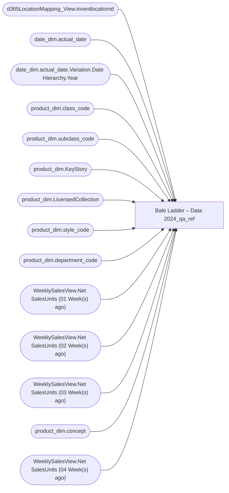

# Bale Ladder – Data 2024_qa_ref

**Workspace:** Enterprise Analytics Dev  
**Report ID:** 4f61ee23-6bcb-40e7-af5a-ed9c9b4587c2  
**Dataset ID:** f2c3e4c5-7356-4b05-a20e-d6ad2c510919  
**Web URL:** https://app.powerbi.com/groups/109bd275-5f44-4366-b343-9b41b5cfb040/reports/4f61ee23-6bcb-40e7-af5a-ed9c9b4587c2  
**Semantic Model:** [Bale Ladder – Data 2024_QA_ref](../../SemanticModels/Enterprise Analytics Dev/Bale Ladder – Data 2024_QA_ref.md)  

## Architecture Diagram

## Field Dependencies

| Referenced Field |
|---|
| d365LocationMapping_View.inventlocationid |
| date_dim.actual_date |
| date_dim.actual_date.Variation.Date Hierarchy.Year |
| product_dim.class_code |
| product_dim.subclass_code |
| product_dim.KeyStory |
| product_dim.LicensedCollection |
| product_dim.style_code |
| product_dim.department_code |
| WeeklySalesView.Net SalesUnits (01 Week(s) ago) |
| WeeklySalesView.Net SalesUnits (02 Week(s) ago) |
| WeeklySalesView.Net SalesUnits (03 Week(s) ago) |
| product_dim.concept |
| WeeklySalesView.Net SalesUnits (04 Week(s) ago) |

## Pages

| Page | Visuals |
|---|---|
| Bale Ladder – Data 2024 | 25 |

## Visuals

### Bale Ladder – Data 2024

| Visual | Type | Fields |
|---|---|---|
| 0b4140222c5f6ce0edbe | unknown |  |
| f920f4a3989b72fd51af | textbox |  |
| 0bcd43cda8b8c9272764 | textbox |  |
| 97f4659a5a12bc988c51 | image |  |
| 9ea736d49b75db93980e | textbox |  |
| ec739d70b14b7c06805a | actionButton |  |
| 44b856414f1a82fa1972 | unknown |  |
| d986b5ee6dd8555a4031 | textSlicer | d365LocationMapping_View.inventlocationid |
| 122ea31d98d5e46b728a | bookmarkNavigator |  |
| 97f4637b9433dd67029c | textFilter25A4896A83E0487089E2B90C9AE57C8A | d365LocationMapping_View.inventlocationid |
| ebf4a2dc4872072b777f | unknown |  |
| 9a7956cae86f44783ec2 | slicer | date_dim.actual_date |
| cc9c621b0f8156219228 | slicer | date_dim.actual_date.Variation.Date Hierarchy.Year |
| 4df0d921ab0b5d077f2c | slicer | date_dim.actual_date.Variation.Date Hierarchy.Year |
| cca8d761cff72ee6b8d5 | bookmarkNavigator |  |
| 826e14c9840c3793285e | unknown |  |
| e8e740717323d0200f7a | slicer | product_dim.class_code |
| 7869095a179dc31dae86 | slicer | product_dim.subclass_code |
| 3edf860c41bfa20e56ed | slicer | product_dim.KeyStory |
| 22da671c0667f2a982ae | slicer | product_dim.LicensedCollection |
| 2c050ec017a6225d6f41 | textSlicer | product_dim.style_code |
| 0990f82a5dbf1a44dadb | slicer | product_dim.department_code |
| 6f0031da695b744bd74a | textbox |  |
| e0290b3bdcd982dcae6f | tableEx | WeeklySalesView.Net SalesUnits (01 Week(s) ago), WeeklySalesView.Net SalesUnits (02 Week(s) ago), WeeklySalesView.Net SalesUnits (03 Week(s) ago), product_dim.concept, WeeklySalesView.Net SalesUnits (04 Week(s) ago) |
| 0b2093608127704ad689 | actionButton |  |
