# CRM Top Line Metrics - Validated

**Workspace:** Enterprise Analytics Dev  
**Report ID:** ebef565c-9eec-451b-b479-19179b426c58  
**Dataset ID:** 0d354f73-5a32-4d1d-9be1-e2681297b656  
**Web URL:** https://app.powerbi.com/groups/109bd275-5f44-4366-b343-9b41b5cfb040/reports/ebef565c-9eec-451b-b479-19179b426c58  
**Semantic Model:** [SM_AZAS_V2](../../SemanticModels/Enterprise Analytics Dev/SM_AZAS_V2.md)  

## Architecture Diagram

```mermaid
flowchart LR
    REPORT["CRM Top Line Metrics - Validated"]
    CRMcustomerMasterData_bonusClubActive2YearsTY(["CRMcustomerMasterData.bonusClubActive2YearsTY"]) --> REPORT
    CRMcustomerMasterData_bonusClubActive2YearsLY(["CRMcustomerMasterData.bonusClubActive2YearsLY"]) --> REPORT
    CRMcustomerMasterData_bonusClubActive2YearsYoY(["CRMcustomerMasterData.bonusClubActive2YearsYoY"]) --> REPORT
    CRMcustomerMasterData_bonusClubActive2YearsTyPerTtl(["CRMcustomerMasterData.bonusClubActive2YearsTyPerTtl"]) --> REPORT
    CRMcustomerMasterData_bonusClubActive2YearsLyPerTtl(["CRMcustomerMasterData.bonusClubActive2YearsLyPerTtl"]) --> REPORT
    CRMcustomerMasterData_bonusClubActive1YearsTY(["CRMcustomerMasterData.bonusClubActive1YearsTY"]) --> REPORT
    CRMcustomerMasterData_bonusClubActive1YearsLY(["CRMcustomerMasterData.bonusClubActive1YearsLY"]) --> REPORT
    CRMcustomerMasterData_bonusClubActive1YearsYoY(["CRMcustomerMasterData.bonusClubActive1YearsYoY"]) --> REPORT
    CRMcustomerMasterData_bonusClubActive1YearsTyPerTtl(["CRMcustomerMasterData.bonusClubActive1YearsTyPerTtl"]) --> REPORT
    CRMcustomerMasterData_bonusClubActive1YearsLyPerTtl(["CRMcustomerMasterData.bonusClubActive1YearsLyPerTtl"]) --> REPORT
    CRMcustomerMasterData_Country(["CRMcustomerMasterData.Country"]) --> REPORT
    CRMcustomerMasterData_bonusClubTy(["CRMcustomerMasterData.bonusClubTy"]) --> REPORT
    CRMcustomerMasterData_bonusClubLy(["CRMcustomerMasterData.bonusClubLy"]) --> REPORT
    CRMcustomerMasterData_bonusClubYoY(["CRMcustomerMasterData.bonusClubYoY"]) --> REPORT
    CRMcustomerMasterData_bonusClubTyPercTtl(["CRMcustomerMasterData.bonusClubTyPercTtl"]) --> REPORT
    CRMcustomerMasterData_bonusClubLyPercTtl(["CRMcustomerMasterData.bonusClubLyPercTtl"]) --> REPORT
    CRMcustomerMasterData_bonusClubActive5YearsTY(["CRMcustomerMasterData.bonusClubActive5YearsTY"]) --> REPORT
    CRMcustomerMasterData_bonusClubActive5YearsLY(["CRMcustomerMasterData.bonusClubActive5YearsLY"]) --> REPORT
    CRMcustomerMasterData_bonusClubActive5YearsYoY(["CRMcustomerMasterData.bonusClubActive5YearsYoY"]) --> REPORT
    CRMcustomerMasterData_bonusClubActive5YearsTyPerTtl(["CRMcustomerMasterData.bonusClubActive5YearsTyPerTtl"]) --> REPORT
    CRMcustomerMasterData_bonusClubActive5YearsLyPerTtl(["CRMcustomerMasterData.bonusClubActive5YearsLyPerTtl"]) --> REPORT
    CRMcustomerMasterData_bonusClubActive3YearsTY(["CRMcustomerMasterData.bonusClubActive3YearsTY"]) --> REPORT
    CRMcustomerMasterData_bonusClubActive3YearsLY(["CRMcustomerMasterData.bonusClubActive3YearsLY"]) --> REPORT
    CRMcustomerMasterData_bonusClubActive3YearsYoY(["CRMcustomerMasterData.bonusClubActive3YearsYoY"]) --> REPORT
    CRMcustomerMasterData_bonusClubActive3YearsTyPerTtl(["CRMcustomerMasterData.bonusClubActive3YearsTyPerTtl"]) --> REPORT
    CRMcustomerMasterData_bonusClubActive3YearsLyPerTtl(["CRMcustomerMasterData.bonusClubActive3YearsLyPerTtl"]) --> REPORT
    CRMcustomerMasterData_bonusClubEmailLast365(["CRMcustomerMasterData.bonusClubEmailLast365"]) --> REPORT
    CRMcustomerMasterData_bonusCLubSmsOpted(["CRMcustomerMasterData.bonusCLubSmsOpted"]) --> REPORT
    CRMcustomerMasterData_totalCustomerCount(["CRMcustomerMasterData.totalCustomerCount"]) --> REPORT
    Sum_CRMemailFactRollupSummary_distinctEmailSentLast365_(["Sum(CRMemailFactRollupSummary.distinctEmailSentLast365)"]) --> REPORT
```

## Field Dependencies

| Referenced Field |
|---|
| CRMcustomerMasterData.bonusClubActive2YearsTY |
| CRMcustomerMasterData.bonusClubActive2YearsLY |
| CRMcustomerMasterData.bonusClubActive2YearsYoY |
| CRMcustomerMasterData.bonusClubActive2YearsTyPerTtl |
| CRMcustomerMasterData.bonusClubActive2YearsLyPerTtl |
| CRMcustomerMasterData.bonusClubActive1YearsTY |
| CRMcustomerMasterData.bonusClubActive1YearsLY |
| CRMcustomerMasterData.bonusClubActive1YearsYoY |
| CRMcustomerMasterData.bonusClubActive1YearsTyPerTtl |
| CRMcustomerMasterData.bonusClubActive1YearsLyPerTtl |
| CRMcustomerMasterData.Country |
| CRMcustomerMasterData.bonusClubTy |
| CRMcustomerMasterData.bonusClubLy |
| CRMcustomerMasterData.bonusClubYoY |
| CRMcustomerMasterData.bonusClubTyPercTtl |
| CRMcustomerMasterData.bonusClubLyPercTtl |
| CRMcustomerMasterData.bonusClubActive5YearsTY |
| CRMcustomerMasterData.bonusClubActive5YearsLY |
| CRMcustomerMasterData.bonusClubActive5YearsYoY |
| CRMcustomerMasterData.bonusClubActive5YearsTyPerTtl |
| CRMcustomerMasterData.bonusClubActive5YearsLyPerTtl |
| CRMcustomerMasterData.bonusClubActive3YearsTY |
| CRMcustomerMasterData.bonusClubActive3YearsLY |
| CRMcustomerMasterData.bonusClubActive3YearsYoY |
| CRMcustomerMasterData.bonusClubActive3YearsTyPerTtl |
| CRMcustomerMasterData.bonusClubActive3YearsLyPerTtl |
| CRMcustomerMasterData.bonusClubEmailLast365 |
| CRMcustomerMasterData.bonusCLubSmsOpted |
| CRMcustomerMasterData.totalCustomerCount |
| Sum(CRMemailFactRollupSummary.distinctEmailSentLast365) |

## Pages

| Page | Visuals |
|---|---|
| CRM Database Stats | 24 |

## Visuals

### CRM Database Stats

| Visual | Type | Fields |
|---|---|---|
| 99f5d9f975a3fb080601 | tableEx | CRMcustomerMasterData.bonusClubActive2YearsTY, CRMcustomerMasterData.bonusClubActive2YearsLY, CRMcustomerMasterData.bonusClubActive2YearsYoY, CRMcustomerMasterData.bonusClubActive2YearsTyPerTtl, CRMcustomerMasterData.bonusClubActive2YearsLyPerTtl |
| 4a7f5513a70b8b05b0d0 | tableEx | CRMcustomerMasterData.bonusClubActive1YearsTY, CRMcustomerMasterData.bonusClubActive1YearsLY, CRMcustomerMasterData.bonusClubActive1YearsYoY, CRMcustomerMasterData.bonusClubActive1YearsTyPerTtl, CRMcustomerMasterData.bonusClubActive1YearsLyPerTtl |
| 9e48be402a8a57dd6ed1 | slicer | CRMcustomerMasterData.Country |
| 9539a7ec4d6efe83143b | shape |  |
| 1981ec46f99eb9808eed | tableEx | CRMcustomerMasterData.bonusClubTy, CRMcustomerMasterData.bonusClubLy, CRMcustomerMasterData.bonusClubYoY, CRMcustomerMasterData.bonusClubTyPercTtl, CRMcustomerMasterData.bonusClubLyPercTtl |
| 34a8c75e5203313d5661 | tableEx | CRMcustomerMasterData.bonusClubActive5YearsTY, CRMcustomerMasterData.bonusClubActive5YearsLY, CRMcustomerMasterData.bonusClubActive5YearsYoY, CRMcustomerMasterData.bonusClubActive5YearsTyPerTtl, CRMcustomerMasterData.bonusClubActive5YearsLyPerTtl |
| 880f6c04475ca0eacd35 | tableEx | CRMcustomerMasterData.bonusClubActive3YearsTY, CRMcustomerMasterData.bonusClubActive3YearsLY, CRMcustomerMasterData.bonusClubActive3YearsYoY, CRMcustomerMasterData.bonusClubActive3YearsTyPerTtl, CRMcustomerMasterData.bonusClubActive3YearsLyPerTtl |
| 339a320310a4afc35a10 | card | CRMcustomerMasterData.bonusClubEmailLast365 |
| 42810159ceb094995a24 | textbox |  |
| 343067369d3f78869115 | shape |  |
| f15c9940790a00ab8832 | card | CRMcustomerMasterData.bonusCLubSmsOpted |
| 07f3da81c936959d720c | shape |  |
| d60a33ef70d78ad2e01d | textbox |  |
| 3ab5abf1948d84280666 | textbox |  |
| 33ea4d1a20ed055a6d4d | textbox |  |
| de86778453dc9e274c35 | textbox |  |
| 6f952bb09607cbb67023 | textbox |  |
| 5e012a72bd76638d27e5 | textbox |  |
| a0adfe4bddd30bdca7c8 | textbox |  |
| 2d48e06b41e0d6aa10d0 | textbox |  |
| 75597b4652e094954dd3 | textbox |  |
| e5c1b6edb28c094e494b | textbox |  |
| 7df6ddf18a65c008e67b | card | CRMcustomerMasterData.totalCustomerCount |
| d061eb21eaf3d0438e36 | card | Sum(CRMemailFactRollupSummary.distinctEmailSentLast365) |
