# DEI Charity Report

**Workspace:** Enterprise Analytics Dev  
**Report ID:** 527ceb9b-6b19-4da0-9f5f-fe86bb95befd  
**Dataset ID:** fba3b349-79e8-41c0-9703-c90e9ddeef23  
**Web URL:** https://app.powerbi.com/groups/109bd275-5f44-4366-b343-9b41b5cfb040/reports/527ceb9b-6b19-4da0-9f5f-fe86bb95befd  
**Semantic Model:** [Merchandise Aggregate Semantic Model](../../SemanticModels/Enterprise Analytics Dev/Merchandise Aggregate Semantic Model.md)  

## Architecture Diagram

```mermaid
flowchart LR
    REPORT["DEI Charity Report"]
    d365LocationMapping_View_inventlocationid(["d365LocationMapping_View.inventlocationid"]) --> REPORT
    product_dim_le_style_code(["product_dim_le.style_code"]) --> REPORT
    date_dim_actual_date(["date_dim.actual_date"]) --> REPORT
    date_dim_fiscal_year(["date_dim.fiscal_year"]) --> REPORT
    date_dim_fiscalQtr(["date_dim.fiscalQtr"]) --> REPORT
    date_dim_fiscalPer(["date_dim.fiscalPer"]) --> REPORT
    date_dim_fiscalWk(["date_dim.fiscalWk"]) --> REPORT
    date_dim_actual_date_Variation_Date_Hierarchy_Year(["date_dim.actual_date.Variation.Date Hierarchy.Year"]) --> REPORT
    date_dim_actual_date_Variation_Date_Hierarchy_Quarter(["date_dim.actual_date.Variation.Date Hierarchy.Quarter"]) --> REPORT
    date_dim_actual_date_Variation_Date_Hierarchy_Month(["date_dim.actual_date.Variation.Date Hierarchy.Month"]) --> REPORT
    date_dim_actual_date_Variation_Date_Hierarchy_Day(["date_dim.actual_date.Variation.Date Hierarchy.Day"]) --> REPORT
    productattributesummaryview_KEYSTY(["productattributesummaryview.KEYSTY"]) --> REPORT
    product_dim_le_merch_status(["product_dim_le.merch_status"]) --> REPORT
    product_dim_le_department(["product_dim_le.department"]) --> REPORT
    product_dim_le_style_desc(["product_dim_le.style_desc"]) --> REPORT
    WeeklySalesView_Net_Sales_Units___Periods_01_(["WeeklySalesView.Net Sales Units ( Periods 01)"]) --> REPORT
    WeeklySalesView_Net_Sales_Units___Periods_02_(["WeeklySalesView.Net Sales Units ( Periods 02)"]) --> REPORT
    WeeklySalesView_Net_Sales_Units___Periods_03_(["WeeklySalesView.Net Sales Units ( Periods 03)"]) --> REPORT
    WeeklySalesView_Net_Sales_Units___Periods_04_(["WeeklySalesView.Net Sales Units ( Periods 04)"]) --> REPORT
    WeeklySalesView_Net_Sales_Units___Periods_05_(["WeeklySalesView.Net Sales Units ( Periods 05)"]) --> REPORT
    WeeklySalesView_Net_Sales_Units___Periods_06_(["WeeklySalesView.Net Sales Units ( Periods 06)"]) --> REPORT
    WeeklySalesView_Net_Sales_Units___Periods_07_(["WeeklySalesView.Net Sales Units ( Periods 07)"]) --> REPORT
    WeeklySalesView_Net_Sales_Units___Periods_08_(["WeeklySalesView.Net Sales Units ( Periods 08)"]) --> REPORT
    WeeklySalesView_Net_Sales_Units___Periods_09_(["WeeklySalesView.Net Sales Units ( Periods 09)"]) --> REPORT
    WeeklySalesView_Net_Sales_Units___Periods_01_to_Periods_12_(["WeeklySalesView.Net Sales Units ( Periods 01 to Periods 12)"]) --> REPORT
    WeeklySalesView_Net_Sales_Retail_TE___Periods_01_(["WeeklySalesView.Net Sales Retail TE ( Periods 01)"]) --> REPORT
    WeeklySalesView_Net_Sales_Retail_TE___Periods_02_(["WeeklySalesView.Net Sales Retail TE ( Periods 02)"]) --> REPORT
    WeeklySalesView_Net_Sales_Retail_TE___Periods_03_(["WeeklySalesView.Net Sales Retail TE ( Periods 03)"]) --> REPORT
    WeeklySalesView_Net_Sales_Retail_TE___Periods_04_(["WeeklySalesView.Net Sales Retail TE ( Periods 04)"]) --> REPORT
    WeeklySalesView_Net_Sales_Retail_TE___Periods_05_(["WeeklySalesView.Net Sales Retail TE ( Periods 05)"]) --> REPORT
    WeeklySalesView_Net_Sales_Retail_TE___Periods_06_(["WeeklySalesView.Net Sales Retail TE ( Periods 06)"]) --> REPORT
    WeeklySalesView_Net_Sales_Retail_TE___Periods_07_(["WeeklySalesView.Net Sales Retail TE ( Periods 07)"]) --> REPORT
    WeeklySalesView_Net_Sales_Retail_TE___Periods_08_(["WeeklySalesView.Net Sales Retail TE ( Periods 08)"]) --> REPORT
    WeeklySalesView_Net_Sales_Retail_TE___Periods_09_(["WeeklySalesView.Net Sales Retail TE ( Periods 09)"]) --> REPORT
    WeeklySalesView_Net_Sales_Retail_TE___Periods_01_to_Periods_12_(["WeeklySalesView.Net Sales Retail TE ( Periods 01 to Periods 12)"]) --> REPORT
    WeeklySalesView_Net_Sales_Cost___Periods_01_to_Periods_12_(["WeeklySalesView.Net Sales Cost ( Periods 01 to Periods 12)"]) --> REPORT
    WeeklySalesView_Net_Sales_Cost___Periods_01_(["WeeklySalesView.Net Sales Cost ( Periods 01)"]) --> REPORT
    WeeklySalesView_Net_Sales_Cost___Periods_010_(["WeeklySalesView.Net Sales Cost ( Periods 010)"]) --> REPORT
    WeeklySalesView_Net_Sales_Cost___Periods_011_(["WeeklySalesView.Net Sales Cost ( Periods 011)"]) --> REPORT
    WeeklySalesView_Net_Sales_Cost___Periods_012_(["WeeklySalesView.Net Sales Cost ( Periods 012)"]) --> REPORT
    WeeklySalesView_Net_Sales_Cost___Periods_02_(["WeeklySalesView.Net Sales Cost ( Periods 02)"]) --> REPORT
    WeeklySalesView_Net_Sales_Cost___Periods_03_(["WeeklySalesView.Net Sales Cost ( Periods 03)"]) --> REPORT
    WeeklySalesView_Net_Sales_Cost___Periods_04_(["WeeklySalesView.Net Sales Cost ( Periods 04)"]) --> REPORT
    WeeklySalesView_Net_Sales_Cost___Periods_05_(["WeeklySalesView.Net Sales Cost ( Periods 05)"]) --> REPORT
    WeeklySalesView_Net_Sales_Cost___Periods_06_(["WeeklySalesView.Net Sales Cost ( Periods 06)"]) --> REPORT
    WeeklySalesView_Net_Sales_Cost___Periods_07_(["WeeklySalesView.Net Sales Cost ( Periods 07)"]) --> REPORT
    WeeklySalesView_Net_Sales_Cost___Periods_08_(["WeeklySalesView.Net Sales Cost ( Periods 08)"]) --> REPORT
    WeeklySalesView_Net_Sales_Cost___Periods_09_(["WeeklySalesView.Net Sales Cost ( Periods 09)"]) --> REPORT
    WeeklySalesView_Net_Sales_Units___Periods_10_(["WeeklySalesView.Net Sales Units ( Periods 10)"]) --> REPORT
    WeeklySalesView_Net_Sales_Units___Periods_11_(["WeeklySalesView.Net Sales Units ( Periods 11)"]) --> REPORT
    WeeklySalesView_Net_Sales_Units___Periods_12_(["WeeklySalesView.Net Sales Units ( Periods 12)"]) --> REPORT
    WeeklySalesView_Net_Sales_Retail_TE___Periods_10_(["WeeklySalesView.Net Sales Retail TE ( Periods 10)"]) --> REPORT
    WeeklySalesView_Net_Sales_Retail_TE___Periods_11_(["WeeklySalesView.Net Sales Retail TE ( Periods 11)"]) --> REPORT
    WeeklySalesView_Net_Sales_Retail_TE___Periods_12_(["WeeklySalesView.Net Sales Retail TE ( Periods 12)"]) --> REPORT
```

## Field Dependencies

| Referenced Field |
|---|
| d365LocationMapping_View.inventlocationid |
| product_dim_le.style_code |
| date_dim.actual_date |
| date_dim.fiscal_year |
| date_dim.fiscalQtr |
| date_dim.fiscalPer |
| date_dim.fiscalWk |
| date_dim.actual_date.Variation.Date Hierarchy.Year |
| date_dim.actual_date.Variation.Date Hierarchy.Quarter |
| date_dim.actual_date.Variation.Date Hierarchy.Month |
| date_dim.actual_date.Variation.Date Hierarchy.Day |
| productattributesummaryview.KEYSTY |
| product_dim_le.merch_status |
| product_dim_le.department |
| product_dim_le.style_desc |
| WeeklySalesView.Net Sales Units ( Periods 01) |
| WeeklySalesView.Net Sales Units ( Periods 02) |
| WeeklySalesView.Net Sales Units ( Periods 03) |
| WeeklySalesView.Net Sales Units ( Periods 04) |
| WeeklySalesView.Net Sales Units ( Periods 05) |
| WeeklySalesView.Net Sales Units ( Periods 06) |
| WeeklySalesView.Net Sales Units ( Periods 07) |
| WeeklySalesView.Net Sales Units ( Periods 08) |
| WeeklySalesView.Net Sales Units ( Periods 09) |
| WeeklySalesView.Net Sales Units ( Periods 01 to Periods 12) |
| WeeklySalesView.Net Sales Retail TE ( Periods 01) |
| WeeklySalesView.Net Sales Retail TE ( Periods 02) |
| WeeklySalesView.Net Sales Retail TE ( Periods 03) |
| WeeklySalesView.Net Sales Retail TE ( Periods 04) |
| WeeklySalesView.Net Sales Retail TE ( Periods 05) |
| WeeklySalesView.Net Sales Retail TE ( Periods 06) |
| WeeklySalesView.Net Sales Retail TE ( Periods 07) |
| WeeklySalesView.Net Sales Retail TE ( Periods 08) |
| WeeklySalesView.Net Sales Retail TE ( Periods 09) |
| WeeklySalesView.Net Sales Retail TE ( Periods 01 to Periods 12) |
| WeeklySalesView.Net Sales Cost ( Periods 01 to Periods 12) |
| WeeklySalesView.Net Sales Cost ( Periods 01) |
| WeeklySalesView.Net Sales Cost ( Periods 010) |
| WeeklySalesView.Net Sales Cost ( Periods 011) |
| WeeklySalesView.Net Sales Cost ( Periods 012) |
| WeeklySalesView.Net Sales Cost ( Periods 02) |
| WeeklySalesView.Net Sales Cost ( Periods 03) |
| WeeklySalesView.Net Sales Cost ( Periods 04) |
| WeeklySalesView.Net Sales Cost ( Periods 05) |
| WeeklySalesView.Net Sales Cost ( Periods 06) |
| WeeklySalesView.Net Sales Cost ( Periods 07) |
| WeeklySalesView.Net Sales Cost ( Periods 08) |
| WeeklySalesView.Net Sales Cost ( Periods 09) |
| WeeklySalesView.Net Sales Units ( Periods 10) |
| WeeklySalesView.Net Sales Units ( Periods 11) |
| WeeklySalesView.Net Sales Units ( Periods 12) |
| WeeklySalesView.Net Sales Retail TE ( Periods 10) |
| WeeklySalesView.Net Sales Retail TE ( Periods 11) |
| WeeklySalesView.Net Sales Retail TE ( Periods 12) |

## Pages

| Page | Visuals |
|---|---|
| DEI Charity Report | 22 |

## Visuals

### DEI Charity Report

| Visual | Type | Fields |
|---|---|---|
| 0b4140222c5f6ce0edbe | unknown |  |
| f920f4a3989b72fd51af | textbox |  |
| 0bcd43cda8b8c9272764 | textbox |  |
| 97f4659a5a12bc988c51 | image |  |
| 9ea736d49b75db93980e | textbox |  |
| ec739d70b14b7c06805a | actionButton |  |
| 44b856414f1a82fa1972 | unknown |  |
| d986b5ee6dd8555a4031 | textSlicer | d365LocationMapping_View.inventlocationid |
| 122ea31d98d5e46b728a | bookmarkNavigator |  |
| 97f4637b9433dd67029c | textFilter25A4896A83E0487089E2B90C9AE57C8A | product_dim_le.style_code |
| ebf4a2dc4872072b777f | unknown |  |
| 9a7956cae86f44783ec2 | slicer | date_dim.actual_date |
| cc9c621b0f8156219228 | slicer | date_dim.fiscal_year, date_dim.actual_date, date_dim.fiscalQtr, date_dim.fiscalPer, date_dim.fiscalWk |
| 4df0d921ab0b5d077f2c | slicer | date_dim.actual_date.Variation.Date Hierarchy.Year, date_dim.actual_date.Variation.Date Hierarchy.Quarter, date_dim.actual_date.Variation.Date Hierarchy.Month, date_dim.actual_date.Variation.Date Hierarchy.Day |
| cca8d761cff72ee6b8d5 | bookmarkNavigator |  |
| 826e14c9840c3793285e | unknown |  |
| de4eeea282f945c29e77 | slicer | productattributesummaryview.KEYSTY |
| 2c050ec017a6225d6f41 | slicer | product_dim_le.style_code |
| 4869bfd2041566e924b2 | slicer | product_dim_le.merch_status |
| 0990f82a5dbf1a44dadb | slicer | product_dim_le.department |
| 6f0031da695b744bd74a | textbox |  |
| e0290b3bdcd982dcae6f | tableEx | product_dim_le.style_desc, product_dim_le.department, product_dim_le.merch_status, product_dim_le.style_code, productattributesummaryview.KEYSTY, WeeklySalesView.Net Sales Units ( Periods 01), WeeklySalesView.Net Sales Units ( Periods 02), WeeklySalesView.Net Sales Units ( Periods 03), WeeklySalesView.Net Sales Units ( Periods 04), WeeklySalesView.Net Sales Units ( Periods 05), WeeklySalesView.Net Sales Units ( Periods 06), WeeklySalesView.Net Sales Units ( Periods 07), WeeklySalesView.Net Sales Units ( Periods 08), WeeklySalesView.Net Sales Units ( Periods 09), WeeklySalesView.Net Sales Units ( Periods 01 to Periods 12), WeeklySalesView.Net Sales Retail TE ( Periods 01), WeeklySalesView.Net Sales Retail TE ( Periods 02), WeeklySalesView.Net Sales Retail TE ( Periods 03), WeeklySalesView.Net Sales Retail TE ( Periods 04), WeeklySalesView.Net Sales Retail TE ( Periods 05), WeeklySalesView.Net Sales Retail TE ( Periods 06), WeeklySalesView.Net Sales Retail TE ( Periods 07), WeeklySalesView.Net Sales Retail TE ( Periods 08), WeeklySalesView.Net Sales Retail TE ( Periods 09), WeeklySalesView.Net Sales Retail TE ( Periods 01 to Periods 12), WeeklySalesView.Net Sales Cost ( Periods 01 to Periods 12), WeeklySalesView.Net Sales Cost ( Periods 01), WeeklySalesView.Net Sales Cost ( Periods 010), WeeklySalesView.Net Sales Cost ( Periods 011), WeeklySalesView.Net Sales Cost ( Periods 012), WeeklySalesView.Net Sales Cost ( Periods 02), WeeklySalesView.Net Sales Cost ( Periods 03), WeeklySalesView.Net Sales Cost ( Periods 04), WeeklySalesView.Net Sales Cost ( Periods 05), WeeklySalesView.Net Sales Cost ( Periods 06), WeeklySalesView.Net Sales Cost ( Periods 07), WeeklySalesView.Net Sales Cost ( Periods 08), WeeklySalesView.Net Sales Cost ( Periods 09), WeeklySalesView.Net Sales Units ( Periods 10), WeeklySalesView.Net Sales Units ( Periods 11), WeeklySalesView.Net Sales Units ( Periods 12), WeeklySalesView.Net Sales Retail TE ( Periods 10), WeeklySalesView.Net Sales Retail TE ( Periods 11), WeeklySalesView.Net Sales Retail TE ( Periods 12) |
