# DJR IB Dump Date

**Workspace:** Enterprise Analytics Dev  
**Report ID:** e64c93e2-0e27-46a1-a26a-e6bbf91aa5de  
**Dataset ID:** 05daff4b-5e80-4cd4-94ba-90a3110d5e14  
**Web URL:** https://app.powerbi.com/groups/109bd275-5f44-4366-b343-9b41b5cfb040/reports/e64c93e2-0e27-46a1-a26a-e6bbf91aa5de  
**Semantic Model:** [Merchandise Transactional Model](../../SemanticModels/Enterprise Analytics Dev/Merchandise Transactional Model.md)  

## Architecture Diagram

```mermaid
flowchart LR
    REPORT["DJR IB Dump Date"]
    product_dim_le_department_code(["product_dim_le.department_code"]) --> REPORT
    InventJourTransView_Inventory_Trans_Type_Code(["InventJourTransView.Inventory Trans Type Code"]) --> REPORT
    product_dim_le_style_code(["product_dim_le.style_code"]) --> REPORT
    product_dim_le_style_desc(["product_dim_le.style_desc"]) --> REPORT
    product_dim_le_color_code(["product_dim_le.color_code"]) --> REPORT
    InventJourTransView_Inventory_Document_Number(["InventJourTransView.Inventory Document Number"]) --> REPORT
    InventJourTransView_IB_Inventory_ID(["InventJourTransView.IB Inventory ID"]) --> REPORT
    InventJourTransView_Inventory_Trans_Date(["InventJourTransView.Inventory Trans Date"]) --> REPORT
    InventJourTransView_Inventory_Trans_Type_Desc(["InventJourTransView.Inventory Trans Type Desc"]) --> REPORT
    Sum_InventJourTransView_InventoryTrans_Units_(["Sum(InventJourTransView.InventoryTrans Units)"]) --> REPORT
    Sum_InventJourTransView_Inventory_Trans_Cost_(["Sum(InventJourTransView.Inventory Trans Cost)"]) --> REPORT
    Sum_InventJourTransView_Inventory_Trans_Retail_(["Sum(InventJourTransView.Inventory Trans Retail)"]) --> REPORT
    select(["select"]) --> REPORT
    InventJourTransView_Inventory_Status_Description(["InventJourTransView.Inventory Status Description"]) --> REPORT
    product_dim_le_subclass_code(["product_dim_le.subclass_code"]) --> REPORT
    InventJourTransView_Inventory_Status_Code(["InventJourTransView.Inventory Status Code"]) --> REPORT
    d365LocationMapping_View_inventlocationid(["d365LocationMapping_View.inventlocationid"]) --> REPORT
    date_dim_actual_date_Variation_Date_Hierarchy_Year(["date_dim.actual_date.Variation.Date Hierarchy.Year"]) --> REPORT
    date_dim_actual_date_Variation_Date_Hierarchy_Quarter(["date_dim.actual_date.Variation.Date Hierarchy.Quarter"]) --> REPORT
    date_dim_actual_date_Variation_Date_Hierarchy_Month(["date_dim.actual_date.Variation.Date Hierarchy.Month"]) --> REPORT
    date_dim_actual_date_Variation_Date_Hierarchy_Day(["date_dim.actual_date.Variation.Date Hierarchy.Day"]) --> REPORT
    date_dim_actual_date(["date_dim.actual_date"]) --> REPORT
    date_dim_fiscal_year(["date_dim.fiscal_year"]) --> REPORT
    date_dim_fiscalQtr(["date_dim.fiscalQtr"]) --> REPORT
    date_dim_fiscalPer(["date_dim.fiscalPer"]) --> REPORT
    date_dim_fiscalWk(["date_dim.fiscalWk"]) --> REPORT
```

## Field Dependencies

| Referenced Field |
|---|
| product_dim_le.department_code |
| InventJourTransView.Inventory Trans Type Code |
| product_dim_le.style_code |
| product_dim_le.style_desc |
| product_dim_le.color_code |
| InventJourTransView.Inventory Document Number |
| InventJourTransView.IB Inventory ID |
| InventJourTransView.Inventory Trans Date |
| InventJourTransView.Inventory Trans Type Desc |
| Sum(InventJourTransView.InventoryTrans Units) |
| Sum(InventJourTransView.Inventory Trans Cost) |
| Sum(InventJourTransView.Inventory Trans Retail) |
| select |
| InventJourTransView.Inventory Status Description |
| product_dim_le.subclass_code |
| InventJourTransView.Inventory Status Code |
| d365LocationMapping_View.inventlocationid |
| date_dim.actual_date.Variation.Date Hierarchy.Year |
| date_dim.actual_date.Variation.Date Hierarchy.Quarter |
| date_dim.actual_date.Variation.Date Hierarchy.Month |
| date_dim.actual_date.Variation.Date Hierarchy.Day |
| date_dim.actual_date |
| date_dim.fiscal_year |
| date_dim.fiscalQtr |
| date_dim.fiscalPer |
| date_dim.fiscalWk |

## Pages

| Page | Visuals |
|---|---|
| DJR IB Dump Date | 27 |

## Visuals

### DJR IB Dump Date

| Visual | Type | Fields |
|---|---|---|
| 0990f82a5dbf1a44dadb | slicer | product_dim_le.department_code |
| 0b2093608127704ad689 | actionButton |  |
| 0b4140222c5f6ce0edbe | unknown |  |
| 0bcd43cda8b8c9272764 | textbox |  |
| 11e1b503902ece0f5946 | slicer | InventJourTransView.Inventory Trans Type Code |
| 122ea31d98d5e46b728a | bookmarkNavigator |  |
| 2c050ec017a6225d6f41 | slicer | product_dim_le.style_code |
| 44b856414f1a82fa1972 | unknown |  |
| 45a73095a294cc7e5ad2 | pivotTable | product_dim_le.style_code, product_dim_le.style_desc, product_dim_le.color_code, InventJourTransView.Inventory Trans Type Code, InventJourTransView.Inventory Document Number, InventJourTransView.IB Inventory ID, InventJourTransView.Inventory Trans Date, InventJourTransView.Inventory Trans Type Desc, Sum(InventJourTransView.InventoryTrans Units), Sum(InventJourTransView.Inventory Trans Cost), Sum(InventJourTransView.Inventory Trans Retail), select, InventJourTransView.Inventory Status Description, product_dim_le.department_code, product_dim_le.subclass_code, InventJourTransView.Inventory Status Code, d365LocationMapping_View.inventlocationid |
| 4df0d921ab0b5d077f2c | slicer | date_dim.actual_date.Variation.Date Hierarchy.Year, date_dim.actual_date.Variation.Date Hierarchy.Quarter, date_dim.actual_date.Variation.Date Hierarchy.Month, date_dim.actual_date.Variation.Date Hierarchy.Day |
| 51ef4d4d4b5ebc66d739 | slicer | InventJourTransView.IB Inventory ID |
| 6f0031da695b744bd74a | textbox |  |
| 7869095a179dc31dae86 | slicer | product_dim_le.subclass_code |
| 826e14c9840c3793285e | unknown |  |
| 97f4637b9433dd67029c | textFilter25A4896A83E0487089E2B90C9AE57C8A | InventJourTransView.Inventory Status Description |
| 97f4659a5a12bc988c51 | image |  |
| 99597b3e010bd2d26d0a | slicer | InventJourTransView.Inventory Status Code |
| 9a7956cae86f44783ec2 | slicer | date_dim.actual_date |
| 9ea736d49b75db93980e | textbox |  |
| cc9c621b0f8156219228 | slicer | date_dim.fiscal_year, date_dim.actual_date, date_dim.fiscalQtr, date_dim.fiscalPer, date_dim.fiscalWk |
| cca8d761cff72ee6b8d5 | bookmarkNavigator |  |
| d986b5ee6dd8555a4031 | slicer | d365LocationMapping_View.inventlocationid |
| e8e740717323d0200f7a | slicer | product_dim_le.color_code |
| ebf4a2dc4872072b777f | unknown |  |
| ec739d70b14b7c06805a | actionButton |  |
| f210d2ce1ed56005e188 | slicer | InventJourTransView.Inventory Document Number |
| f920f4a3989b72fd51af | textbox |  |
