# DJR Inv Trans Type Code

**Workspace:** Enterprise Analytics Dev  
**Report ID:** 091b6303-bd10-4022-8429-f3c35d240bba  
**Dataset ID:** 05daff4b-5e80-4cd4-94ba-90a3110d5e14  
**Web URL:** https://app.powerbi.com/groups/109bd275-5f44-4366-b343-9b41b5cfb040/reports/091b6303-bd10-4022-8429-f3c35d240bba  
**Semantic Model:** [Merchandise Transactional Model](../../SemanticModels/Enterprise Analytics Dev/Merchandise Transactional Model.md)  

## Architecture Diagram

```mermaid
flowchart LR
    REPORT["DJR Inv Trans Type Code"]
    InventJourTransView_Department(["InventJourTransView.Department"]) --> REPORT
    InventJourTransView_Style_Code(["InventJourTransView.Style Code"]) --> REPORT
    InventJourTransView_IB_Inventory_ID(["InventJourTransView.IB Inventory ID"]) --> REPORT
    date_dim_actual_date_Variation_Date_Hierarchy_Year(["date_dim.actual_date.Variation.Date Hierarchy.Year"]) --> REPORT
    date_dim_actual_date_Variation_Date_Hierarchy_Quarter(["date_dim.actual_date.Variation.Date Hierarchy.Quarter"]) --> REPORT
    date_dim_actual_date_Variation_Date_Hierarchy_Month(["date_dim.actual_date.Variation.Date Hierarchy.Month"]) --> REPORT
    date_dim_actual_date_Variation_Date_Hierarchy_Day(["date_dim.actual_date.Variation.Date Hierarchy.Day"]) --> REPORT
    InventJourTransView_Inventory_Document_Number(["InventJourTransView.Inventory Document Number"]) --> REPORT
    InventJourTransView_Subclass(["InventJourTransView.Subclass"]) --> REPORT
    InventJourTransView_Inventory_Trans_Type_Desc(["InventJourTransView.Inventory Trans Type Desc"]) --> REPORT
    date_dim_actual_date(["date_dim.actual_date"]) --> REPORT
    InventJourTransView_Jurisdiction_Code(["InventJourTransView.Jurisdiction Code"]) --> REPORT
    InventJourTransView_Trans_Reason_Code__outer_(["InventJourTransView.Trans Reason Code (outer)"]) --> REPORT
    date_dim_fiscal_year(["date_dim.fiscal_year"]) --> REPORT
    date_dim_fiscalQtr(["date_dim.fiscalQtr"]) --> REPORT
    date_dim_fiscalPer(["date_dim.fiscalPer"]) --> REPORT
    date_dim_fiscalWk(["date_dim.fiscalWk"]) --> REPORT
    d365LocationMapping_View_inventlocationid(["d365LocationMapping_View.inventlocationid"]) --> REPORT
    CountNonNull_InventJourTransView_Other_Location_Code_(["CountNonNull(InventJourTransView.Other Location Code)"]) --> REPORT
    InventJourTransView_Style_Short_Description(["InventJourTransView.Style Short Description"]) --> REPORT
    InventJourTransView_Inventory_Trans_Date(["InventJourTransView.Inventory Trans Date"]) --> REPORT
    Sum_InventJourTransView_InventoryTrans_Units_(["Sum(InventJourTransView.InventoryTrans Units)"]) --> REPORT
    Sum_InventJourTransView_Inventory_Trans_Cost_(["Sum(InventJourTransView.Inventory Trans Cost)"]) --> REPORT
    Sum_InventJourTransView_Inventory_Trans_Selling_Retail_(["Sum(InventJourTransView.Inventory Trans Selling Retail)"]) --> REPORT
    Sum_InventJourTransView_Inventory_Trans_Retail_(["Sum(InventJourTransView.Inventory Trans Retail)"]) --> REPORT
    InventJourTransView_Inventory_Status_Description(["InventJourTransView.Inventory Status Description"]) --> REPORT
    CountNonNull_InventJourTransView_IB_Inventory_ID_(["CountNonNull(InventJourTransView.IB Inventory ID)"]) --> REPORT
```

## Field Dependencies

| Referenced Field |
|---|
| InventJourTransView.Department |
| InventJourTransView.Style Code |
| InventJourTransView.IB Inventory ID |
| date_dim.actual_date.Variation.Date Hierarchy.Year |
| date_dim.actual_date.Variation.Date Hierarchy.Quarter |
| date_dim.actual_date.Variation.Date Hierarchy.Month |
| date_dim.actual_date.Variation.Date Hierarchy.Day |
| InventJourTransView.Inventory Document Number |
| InventJourTransView.Subclass |
| InventJourTransView.Inventory Trans Type Desc |
| date_dim.actual_date |
| InventJourTransView.Jurisdiction Code |
| InventJourTransView.Trans Reason Code (outer) |
| date_dim.fiscal_year |
| date_dim.fiscalQtr |
| date_dim.fiscalPer |
| date_dim.fiscalWk |
| d365LocationMapping_View.inventlocationid |
| CountNonNull(InventJourTransView.Other Location Code) |
| InventJourTransView.Style Short Description |
| InventJourTransView.Inventory Trans Date |
| Sum(InventJourTransView.InventoryTrans Units) |
| Sum(InventJourTransView.Inventory Trans Cost) |
| Sum(InventJourTransView.Inventory Trans Selling Retail) |
| Sum(InventJourTransView.Inventory Trans Retail) |
| InventJourTransView.Inventory Status Description |
| CountNonNull(InventJourTransView.IB Inventory ID) |

## Pages

| Page | Visuals |
|---|---|
| DJR Inv Trans Type Code | 25 |

## Visuals

### DJR Inv Trans Type Code

| Visual | Type | Fields |
|---|---|---|
| 0990f82a5dbf1a44dadb | slicer | InventJourTransView.Department |
| 0b4140222c5f6ce0edbe | unknown |  |
| 0bcd43cda8b8c9272764 | textbox |  |
| 122ea31d98d5e46b728a | bookmarkNavigator |  |
| 2c050ec017a6225d6f41 | slicer | InventJourTransView.Style Code |
| 4390f8a8894a8037e0e8 | slicer | InventJourTransView.IB Inventory ID |
| 44b856414f1a82fa1972 | unknown |  |
| 4df0d921ab0b5d077f2c | slicer | date_dim.actual_date.Variation.Date Hierarchy.Year, date_dim.actual_date.Variation.Date Hierarchy.Quarter, date_dim.actual_date.Variation.Date Hierarchy.Month, date_dim.actual_date.Variation.Date Hierarchy.Day |
| 5bc919dd04c6edc906a1 | textFilter25A4896A83E0487089E2B90C9AE57C8A | InventJourTransView.Inventory Document Number |
| 6f0031da695b744bd74a | textbox |  |
| 7869095a179dc31dae86 | slicer | InventJourTransView.Subclass |
| 826e14c9840c3793285e | unknown |  |
| 97f4637b9433dd67029c | textFilter25A4896A83E0487089E2B90C9AE57C8A | InventJourTransView.Inventory Trans Type Desc |
| 97f4659a5a12bc988c51 | image |  |
| 9a7956cae86f44783ec2 | slicer | date_dim.actual_date |
| 9ea736d49b75db93980e | textbox |  |
| a5094d32cbb61133847c | slicer | InventJourTransView.Jurisdiction Code |
| b254c83d9af7b171bfc9 | slicer | InventJourTransView.Trans Reason Code (outer) |
| cc9c621b0f8156219228 | slicer | date_dim.fiscal_year, date_dim.actual_date, date_dim.fiscalQtr, date_dim.fiscalPer, date_dim.fiscalWk |
| cca8d761cff72ee6b8d5 | bookmarkNavigator |  |
| d986b5ee6dd8555a4031 | slicer | d365LocationMapping_View.inventlocationid |
| ebf4a2dc4872072b777f | unknown |  |
| ec739d70b14b7c06805a | actionButton |  |
| f920f4a3989b72fd51af | textbox |  |
| f23d5b55029a0991e0da | tableEx | InventJourTransView.Jurisdiction Code, CountNonNull(InventJourTransView.Other Location Code), InventJourTransView.Style Code, InventJourTransView.Style Short Description, InventJourTransView.Inventory Document Number, InventJourTransView.Inventory Trans Date, InventJourTransView.Inventory Trans Type Desc, Sum(InventJourTransView.InventoryTrans Units), Sum(InventJourTransView.Inventory Trans Cost), InventJourTransView.Department, InventJourTransView.Trans Reason Code (outer), Sum(InventJourTransView.Inventory Trans Selling Retail), Sum(InventJourTransView.Inventory Trans Retail), InventJourTransView.Inventory Status Description, CountNonNull(InventJourTransView.IB Inventory ID), InventJourTransView.Subclass, d365LocationMapping_View.inventlocationid |
