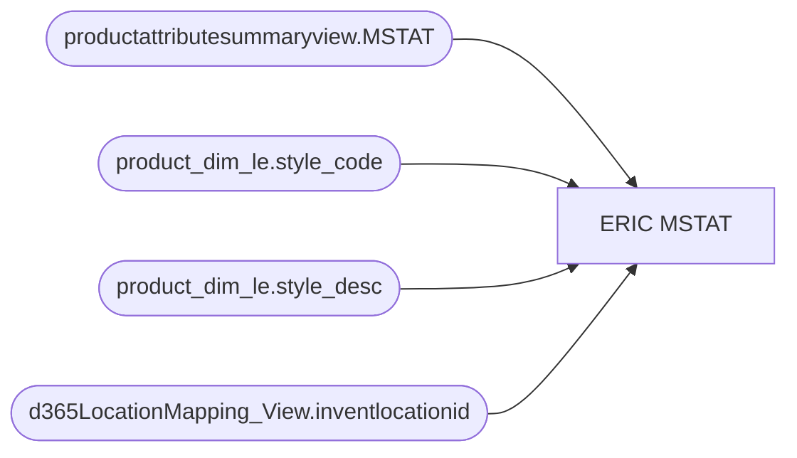

# ERIC MSTAT

**Workspace:** Enterprise Analytics Dev  
**Report ID:** 6af5754b-0b0b-4b0b-a087-c332929f0c55  
**Dataset ID:** 05daff4b-5e80-4cd4-94ba-90a3110d5e14  
**Web URL:** https://app.powerbi.com/groups/109bd275-5f44-4366-b343-9b41b5cfb040/reports/6af5754b-0b0b-4b0b-a087-c332929f0c55  
**Semantic Model:** [Merchandise Transactional Model](../../SemanticModels/Enterprise Analytics Dev/Merchandise Transactional Model.md)  

## Architecture Diagram

## Field Dependencies

| Referenced Field |
|---|
| productattributesummaryview.MSTAT |
| product_dim_le.style_code |
| product_dim_le.style_desc |
| d365LocationMapping_View.inventlocationid |

## Pages

| Page | Visuals |
|---|---|
| ERIC MSTAT | 20 |

## Visuals

### ERIC MSTAT

| Visual | Type | Fields |
|---|---|---|
| 0990f82a5dbf1a44dadb | slicer | productattributesummaryview.MSTAT |
| 0b4140222c5f6ce0edbe | unknown |  |
| 0bcd43cda8b8c9272764 | textbox |  |
| 122ea31d98d5e46b728a | bookmarkNavigator |  |
| 1ad4818aef48d767298a | slicer | product_dim_le.style_code |
| 1e29fafeb02ed6a0d5a7 | listSlicer |  |
| 2c050ec017a6225d6f41 | textSlicer | product_dim_le.style_code |
| 4208ea34da7220012a41 | listSlicer |  |
| 44b856414f1a82fa1972 | unknown |  |
| 6f0031da695b744bd74a | textbox |  |
| 7b08f35dfe529f0e373c | tableEx | product_dim_le.style_code, product_dim_le.style_desc, productattributesummaryview.MSTAT |
| 826e14c9840c3793285e | unknown |  |
| 935ad66e647dc1d4521a | listSlicer |  |
| 97f4637b9433dd67029c | textFilter25A4896A83E0487089E2B90C9AE57C8A | product_dim_le.style_code |
| 97f4659a5a12bc988c51 | image |  |
| 9ea736d49b75db93980e | textbox |  |
| d986b5ee6dd8555a4031 | textSlicer | d365LocationMapping_View.inventlocationid |
| ec739d70b14b7c06805a | actionButton |  |
| f4c8e9301c5086b05e81 | listSlicer |  |
| f920f4a3989b72fd51af | textbox |  |
