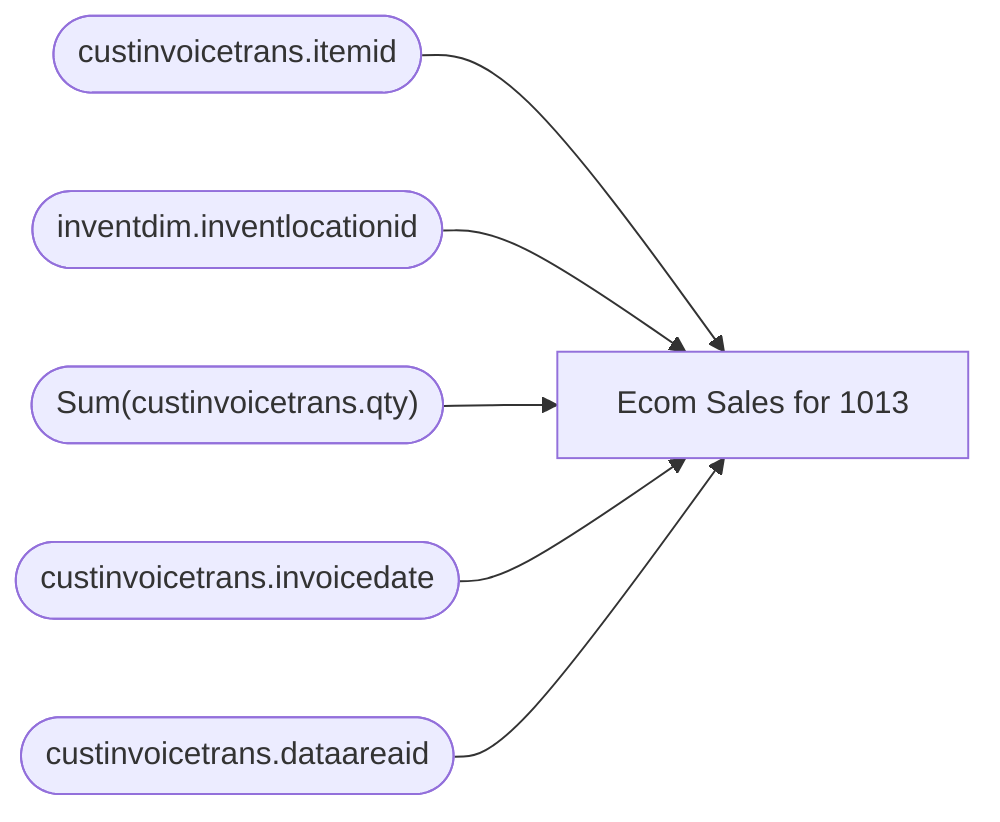

# Ecom Sales for 1013

**Workspace:** Enterprise Analytics Dev  
**Report ID:** 5a4cdbba-fed5-475c-a757-eabb5ba53706  
**Dataset ID:** 926061a6-85b5-424f-9c76-f7b0a59fa269  
**Web URL:** https://app.powerbi.com/groups/109bd275-5f44-4366-b343-9b41b5cfb040/reports/5a4cdbba-fed5-475c-a757-eabb5ba53706  
**Semantic Model:** [Merch OneLake Semantic Model](../../SemanticModels/Enterprise Analytics Dev/Merch OneLake Semantic Model.md)  

## Architecture Diagram

## Field Dependencies

| Referenced Field |
|---|
| custinvoicetrans.itemid |
| inventdim.inventlocationid |
| Sum(custinvoicetrans.qty) |
| custinvoicetrans.invoicedate |
| custinvoicetrans.dataareaid |

## Pages

| Page | Visuals |
|---|---|
| Page 1 | 1 |

## Visuals

### Page 1

| Visual | Type | Fields |
|---|---|---|
| f8495d7ab9abee98ead7 | tableEx | custinvoicetrans.itemid, inventdim.inventlocationid, Sum(custinvoicetrans.qty), custinvoicetrans.invoicedate, custinvoicetrans.dataareaid |
