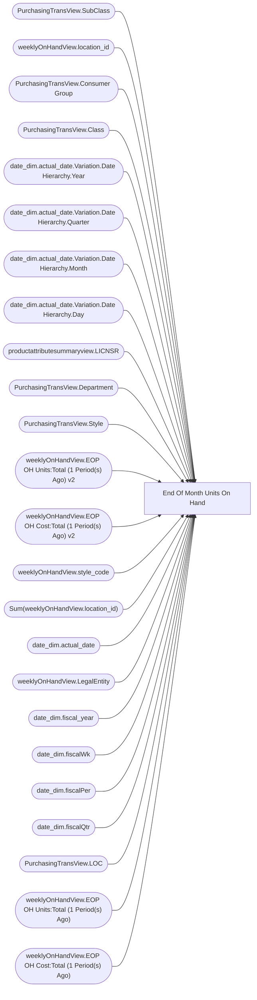

# End Of Month Units On Hand

**Workspace:** Enterprise Analytics Dev  
**Report ID:** c5f2f326-f74a-4ca0-942a-14632cb555f3  
**Dataset ID:** fba3b349-79e8-41c0-9703-c90e9ddeef23  
**Web URL:** https://app.powerbi.com/groups/109bd275-5f44-4366-b343-9b41b5cfb040/reports/c5f2f326-f74a-4ca0-942a-14632cb555f3  
**Semantic Model:** [Merchandise Aggregate Semantic Model](../../SemanticModels/Enterprise Analytics Dev/Merchandise Aggregate Semantic Model.md)  

## Architecture Diagram

## Field Dependencies

| Referenced Field |
|---|
| PurchasingTransView.SubClass |
| weeklyOnHandView.location_id |
| PurchasingTransView.Consumer Group |
| PurchasingTransView.Class |
| date_dim.actual_date.Variation.Date Hierarchy.Year |
| date_dim.actual_date.Variation.Date Hierarchy.Quarter |
| date_dim.actual_date.Variation.Date Hierarchy.Month |
| date_dim.actual_date.Variation.Date Hierarchy.Day |
| productattributesummaryview.LICNSR |
| PurchasingTransView.Department |
| PurchasingTransView.Style |
| weeklyOnHandView.EOP OH Units:Total (1 Period(s) Ago) v2 |
| weeklyOnHandView.EOP OH Cost:Total (1 Period(s) Ago) v2 |
| weeklyOnHandView.style_code |
| Sum(weeklyOnHandView.location_id) |
| date_dim.actual_date |
| weeklyOnHandView.LegalEntity |
| date_dim.fiscal_year |
| date_dim.fiscalWk |
| date_dim.fiscalPer |
| date_dim.fiscalQtr |
| PurchasingTransView.LOC |
| weeklyOnHandView.EOP OH Units:Total (1 Period(s) Ago) |
| weeklyOnHandView.EOP OH Cost:Total (1 Period(s) Ago) |

## Pages

| Page | Visuals |
|---|---|
| Details SBC EOM Units OH | 26 |
| SBC EOM Units OH | 24 |

## Visuals

### Details SBC EOM Units OH

| Visual | Type | Fields |
|---|---|---|
| 044d8316bdb74cb1c6ec | slicer | PurchasingTransView.SubClass |
| 0b7e6911e563872d28b1 | slicer | weeklyOnHandView.location_id |
| 2c92bc29365745073151 | slicer | PurchasingTransView.Consumer Group |
| 3e388ccb053d5d12acb9 | slicer | PurchasingTransView.Class |
| 4a6aa4d2bafdf7cdbd9e | slicer | date_dim.actual_date.Variation.Date Hierarchy.Year, date_dim.actual_date.Variation.Date Hierarchy.Quarter, date_dim.actual_date.Variation.Date Hierarchy.Month, date_dim.actual_date.Variation.Date Hierarchy.Day |
| 4c82b30bdf5203d5cde4 | slicer | productattributesummaryview.LICNSR |
| 59ca6d0333b2c52d9fe6 | bookmarkNavigator |  |
| 672767cf1138fdb8f462 | unknown |  |
| 6c7bbe816e87c77658a1 | unknown |  |
| 6c8b8d3a0211746897e9 | unknown |  |
| 6ddf65096205f044a4cf | textbox |  |
| 86f65a89d0ffd5f2d586 | slicer | PurchasingTransView.Department |
| 9723bdd75d76156d93ec | textSlicer | PurchasingTransView.Style |
| 98f2fa5ec1b6586b1be2 | textbox |  |
| 9b78d795c58f200d286d | tableEx | weeklyOnHandView.EOP OH Units:Total (1 Period(s) Ago) v2, weeklyOnHandView.EOP OH Cost:Total (1 Period(s) Ago) v2, weeklyOnHandView.style_code, Sum(weeklyOnHandView.location_id) |
| 9cb294d28771d0ca628b | slicer | date_dim.actual_date |
| 9f435467c143a380bfc2 | slicer | weeklyOnHandView.LegalEntity |
| a1b27c2e7c7c791385f7 | image |  |
| a8fa7e0e9eb5e2202d3b | unknown |  |
| bfb5a92b43ac5149fa8b | bookmarkNavigator |  |
| c33c8dc009abc1e9dbd9 | slicer | weeklyOnHandView.style_code |
| c45f3e29445241b6b921 | actionButton |  |
| db181599e564cf8e8f90 | slicer | date_dim.fiscal_year, date_dim.actual_date, date_dim.fiscalWk, date_dim.fiscalPer, date_dim.fiscalQtr |
| ddf82b1dd4e12980211d | textbox |  |
| e3e41feff918fe8dd38f | textSlicer | PurchasingTransView.LOC |
| f58b97acd74c6f24a209 | textbox |  |

### SBC EOM Units OH

| Visual | Type | Fields |
|---|---|---|
| 0990f82a5dbf1a44dadb | slicer | PurchasingTransView.Department |
| 0b4140222c5f6ce0edbe | unknown |  |
| 0bcd43cda8b8c9272764 | textbox |  |
| 122ea31d98d5e46b728a | bookmarkNavigator |  |
| 2c050ec017a6225d6f41 | textSlicer | PurchasingTransView.Style |
| 3edf860c41bfa20e56ed | slicer | productattributesummaryview.LICNSR |
| 44b856414f1a82fa1972 | unknown |  |
| 4df0d921ab0b5d077f2c | slicer | date_dim.actual_date.Variation.Date Hierarchy.Year, date_dim.actual_date.Variation.Date Hierarchy.Quarter, date_dim.actual_date.Variation.Date Hierarchy.Month, date_dim.actual_date.Variation.Date Hierarchy.Day |
| 6f0031da695b744bd74a | textbox |  |
| 7869095a179dc31dae86 | slicer | PurchasingTransView.SubClass |
| 826e14c9840c3793285e | unknown |  |
| cc9c621b0f8156219228 | slicer | date_dim.fiscal_year, date_dim.actual_date, date_dim.fiscalWk, date_dim.fiscalPer, date_dim.fiscalQtr |
| d34453e797800b99c203 | slicer | weeklyOnHandView.LegalEntity |
| ebf4a2dc4872072b777f | unknown |  |
| ec739d70b14b7c06805a | actionButton |  |
| e8e740717323d0200f7a | slicer | PurchasingTransView.Class |
| d986b5ee6dd8555a4031 | textSlicer | PurchasingTransView.LOC |
| cca8d761cff72ee6b8d5 | bookmarkNavigator |  |
| c5bb2e2d468b021899e9 | slicer | PurchasingTransView.Consumer Group |
| 9ea736d49b75db93980e | textbox |  |
| 9a7956cae86f44783ec2 | slicer | date_dim.actual_date |
| 97f4659a5a12bc988c51 | image |  |
| f920f4a3989b72fd51af | textbox |  |
| f23d5b55029a0991e0da | tableEx | weeklyOnHandView.EOP OH Units:Total (1 Period(s) Ago), weeklyOnHandView.EOP OH Cost:Total (1 Period(s) Ago), weeklyOnHandView.EOP OH Units:Total (1 Period(s) Ago) v2, weeklyOnHandView.EOP OH Cost:Total (1 Period(s) Ago) v2 |
