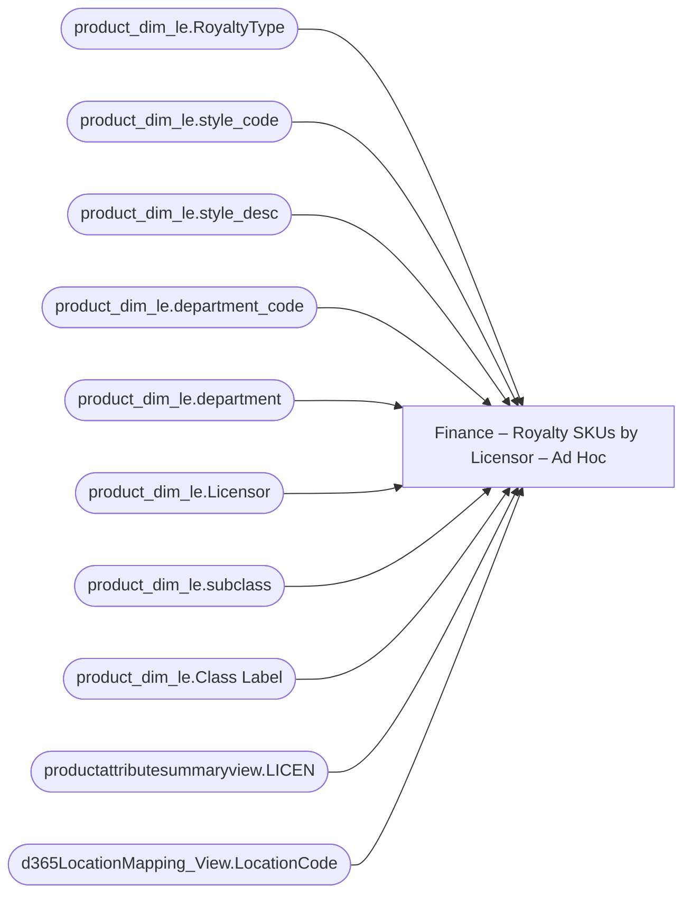

# Finance – Royalty SKUs by Licensor – Ad Hoc

**Workspace:** Enterprise Analytics Dev  
**Report ID:** b51aed91-e4c1-4c2f-a467-7c31e89abcc3  
**Dataset ID:** 05daff4b-5e80-4cd4-94ba-90a3110d5e14  
**Web URL:** https://app.powerbi.com/groups/109bd275-5f44-4366-b343-9b41b5cfb040/reports/b51aed91-e4c1-4c2f-a467-7c31e89abcc3  
**Semantic Model:** [Merchandise Transactional Model](../../SemanticModels/Enterprise Analytics Dev/Merchandise Transactional Model.md)  

## Architecture Diagram

## Field Dependencies

| Referenced Field |
|---|
| product_dim_le.RoyaltyType |
| product_dim_le.style_code |
| product_dim_le.style_desc |
| product_dim_le.department_code |
| product_dim_le.department |
| product_dim_le.Licensor |
| product_dim_le.subclass |
| product_dim_le.Class Label |
| productattributesummaryview.LICEN |
| d365LocationMapping_View.LocationCode |

## Pages

| Page | Visuals |
|---|---|
| Royalty SKUs by Licensor | 16 |

## Visuals

### Royalty SKUs by Licensor

| Visual | Type | Fields |
|---|---|---|
| 0b1053c20545f54fb176 | slicer | product_dim_le.RoyaltyType |
| 0b4140222c5f6ce0edbe | unknown |  |
| 0bcd43cda8b8c9272764 | textbox |  |
| 122ea31d98d5e46b728a | bookmarkNavigator |  |
| 2c050ec017a6225d6f41 | textSlicer | product_dim_le.style_code |
| 44b856414f1a82fa1972 | unknown |  |
| 597e26005ae09ed7d96a | tableEx | product_dim_le.style_code, product_dim_le.style_desc, product_dim_le.department_code, product_dim_le.department, product_dim_le.Licensor, product_dim_le.RoyaltyType, product_dim_le.subclass, product_dim_le.Class Label, productattributesummaryview.LICEN |
| 6f0031da695b744bd74a | textbox |  |
| 826e14c9840c3793285e | unknown |  |
| 97f4637b9433dd67029c | textFilter25A4896A83E0487089E2B90C9AE57C8A | product_dim_le.style_code |
| 97f4659a5a12bc988c51 | image |  |
| 9ea736d49b75db93980e | textbox |  |
| d986b5ee6dd8555a4031 | textSlicer | d365LocationMapping_View.LocationCode |
| e8e740717323d0200f7a | slicer | product_dim_le.Licensor |
| ec739d70b14b7c06805a | actionButton |  |
| f920f4a3989b72fd51af | textbox |  |
