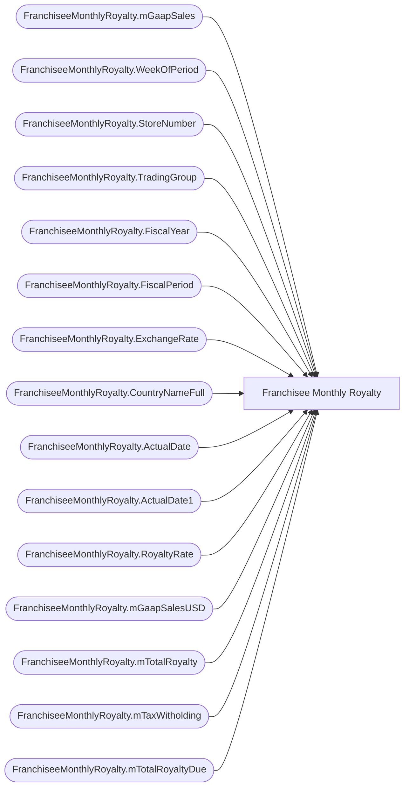

# Franchisee Monthly Royalty

**Workspace:** Enterprise Analytics Dev  
**Report ID:** 847a88c2-bdbc-4943-bbc7-65b216a54dd4  
**Dataset ID:** 0d354f73-5a32-4d1d-9be1-e2681297b656  
**Web URL:** https://app.powerbi.com/groups/109bd275-5f44-4366-b343-9b41b5cfb040/reports/847a88c2-bdbc-4943-bbc7-65b216a54dd4  
**Semantic Model:** [SM_AZAS_V2](../../SemanticModels/Enterprise Analytics Dev/SM_AZAS_V2.md)  

## Architecture Diagram

## Field Dependencies

| Referenced Field |
|---|
| FranchiseeMonthlyRoyalty.mGaapSales |
| FranchiseeMonthlyRoyalty.WeekOfPeriod |
| FranchiseeMonthlyRoyalty.StoreNumber |
| FranchiseeMonthlyRoyalty.TradingGroup |
| FranchiseeMonthlyRoyalty.FiscalYear |
| FranchiseeMonthlyRoyalty.FiscalPeriod |
| FranchiseeMonthlyRoyalty.ExchangeRate |
| FranchiseeMonthlyRoyalty.CountryNameFull |
| FranchiseeMonthlyRoyalty.ActualDate |
| FranchiseeMonthlyRoyalty.ActualDate1 |
| FranchiseeMonthlyRoyalty.RoyaltyRate |
| FranchiseeMonthlyRoyalty.mGaapSalesUSD |
| FranchiseeMonthlyRoyalty.mTotalRoyalty |
| FranchiseeMonthlyRoyalty.mTaxWitholding |
| FranchiseeMonthlyRoyalty.mTotalRoyaltyDue |

## Pages

| Page | Visuals |
|---|---|
| Monthly Royalty Report | 14 |

## Visuals

### Monthly Royalty Report

| Visual | Type | Fields |
|---|---|---|
| 3ccc94b95c52a20ec001 | textbox |  |
| a952165430ce359320d8 | textbox |  |
| e6de54a872703864d83d | textbox |  |
| 1672ce573d9ee204475e | pivotTable | FranchiseeMonthlyRoyalty.mGaapSales, FranchiseeMonthlyRoyalty.WeekOfPeriod, FranchiseeMonthlyRoyalty.StoreNumber |
| d08926e120c2451c0d42 | tableEx | FranchiseeMonthlyRoyalty.TradingGroup, FranchiseeMonthlyRoyalty.FiscalYear, FranchiseeMonthlyRoyalty.FiscalPeriod, FranchiseeMonthlyRoyalty.ExchangeRate |
| 0c5579c5944611667e00 | pivotTable | FranchiseeMonthlyRoyalty.mGaapSales, FranchiseeMonthlyRoyalty.WeekOfPeriod |
| 50a7322eec704ea140b2 | slicer | FranchiseeMonthlyRoyalty.CountryNameFull |
| 585535054673880940d5 | tableEx | FranchiseeMonthlyRoyalty.ActualDate, FranchiseeMonthlyRoyalty.ActualDate1 |
| 307a98e3635d55400aba | textbox |  |
| 2f37600bc289d525c90e | tableEx | FranchiseeMonthlyRoyalty.StoreNumber, FranchiseeMonthlyRoyalty.RoyaltyRate, FranchiseeMonthlyRoyalty.mGaapSalesUSD, FranchiseeMonthlyRoyalty.mTotalRoyalty, FranchiseeMonthlyRoyalty.mTaxWitholding, FranchiseeMonthlyRoyalty.mTotalRoyaltyDue, FranchiseeMonthlyRoyalty.StoreNumber, FranchiseeMonthlyRoyalty.RoyaltyRate, FranchiseeMonthlyRoyalty.mGaapSalesUSD, FranchiseeMonthlyRoyalty.mTotalRoyalty, FranchiseeMonthlyRoyalty.mTaxWitholding, FranchiseeMonthlyRoyalty.mTotalRoyaltyDue |
| 63822bbe314ee6500c34 | slicer | FranchiseeMonthlyRoyalty.FiscalYear |
| 241d6dea13a86c916323 | slicer | FranchiseeMonthlyRoyalty.FiscalPeriod |
| 38ce0bea00ea0a1b2219 | slicer | FranchiseeMonthlyRoyalty.TradingGroup |
