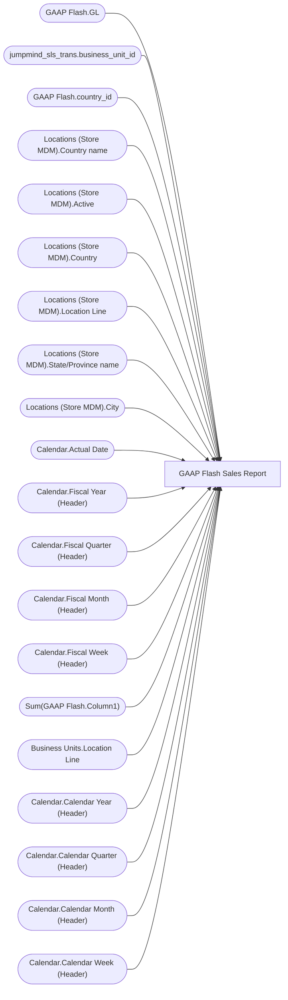

# GAAP Flash Sales Report

**Workspace:** Enterprise Analytics Dev  
**Report ID:** dc818058-9f7d-4025-9787-0d19b0a1869e  
**Dataset ID:** 954533dd-375c-40ed-ac34-02055f02ef93  
**Web URL:** https://app.powerbi.com/groups/109bd275-5f44-4366-b343-9b41b5cfb040/reports/dc818058-9f7d-4025-9787-0d19b0a1869e  
**Semantic Model:** [GAAP Flash Sales Report](../../SemanticModels/Enterprise Analytics Dev/GAAP Flash Sales Report.md)  

## Architecture Diagram

## Field Dependencies

| Referenced Field |
|---|
| GAAP Flash.GL |
| jumpmind_sls_trans.business_unit_id |
| GAAP Flash.country_id |
| Locations (Store MDM).Country name |
| Locations (Store MDM).Active |
| Locations (Store MDM).Country |
| Locations (Store MDM).Location Line |
| Locations (Store MDM).State/Province name |
| Locations (Store MDM).City |
| Calendar.Actual Date |
| Calendar.Fiscal Year (Header) |
| Calendar.Fiscal Quarter (Header) |
| Calendar.Fiscal Month (Header) |
| Calendar.Fiscal Week (Header) |
| Sum(GAAP Flash.Column1) |
| Business Units.Location Line |
| Calendar.Calendar Year (Header) |
| Calendar.Calendar Quarter (Header) |
| Calendar.Calendar Month (Header) |
| Calendar.Calendar Week (Header) |

## Pages

| Page | Visuals |
|---|---|
| GAAP Flash Sales | 24 |

## Visuals

### GAAP Flash Sales

| Visual | Type | Fields |
|---|---|---|
| 71c70564945a73708031 | textbox |  |
| 0699cb74edb71bd982e1 | textbox |  |
| 1660fea6ad7501caee39 | unknown |  |
| 031b0aface88bdedaba1 | slicer | GAAP Flash.GL |
| 9ebd176ce46499e67ca5 | slicer | jumpmind_sls_trans.business_unit_id |
| 111288c2936569613100 | slicer | GAAP Flash.country_id |
| 56fea3c4b5378e43a24d | slicer | Locations (Store MDM).Country name |
| 22498c90147440aa8000 | actionButton |  |
| 368dfb50228ba2e774bd | bookmarkNavigator |  |
| 61052d5f93d2d12da0eb | unknown |  |
| a1a9d89079d30700609a | textbox |  |
| 614c5246aed304a2d22a | textbox |  |
| 024bccd04609ea3d9ca1 | image |  |
| 67da8d71a96be408479e | unknown |  |
| fa0867037cc54a05a38d | slicer | Locations (Store MDM).Active |
| 8940f1289e6bae3c9d65 | slicer | Locations (Store MDM).Country |
| c533c706888aea396139 | slicer | Locations (Store MDM).Location Line |
| 10a3e58755367ad1a479 | slicer | Locations (Store MDM).Country name, Locations (Store MDM).State/Province name, Locations (Store MDM).City |
| 66b00a1c411ca14ca023 | unknown |  |
| d30f19fcb0a7d015e6e6 | slicer | Calendar.Actual Date |
| 5672b817616005d1e114 | slicer | Calendar.Fiscal Year (Header), Calendar.Fiscal Quarter (Header), Calendar.Fiscal Month (Header), Calendar.Fiscal Week (Header), Calendar.Actual Date |
| e13ad77c08690099460b | pivotTable | Sum(GAAP Flash.Column1), Locations (Store MDM).Country name, Business Units.Location Line, GAAP Flash.country_id, GAAP Flash.GL |
| b49b357ad677c019c21c | bookmarkNavigator |  |
| c85df35470a91c751700 | slicer | Calendar.Calendar Year (Header), Calendar.Calendar Quarter (Header), Calendar.Calendar Month (Header), Calendar.Calendar Week (Header) |
