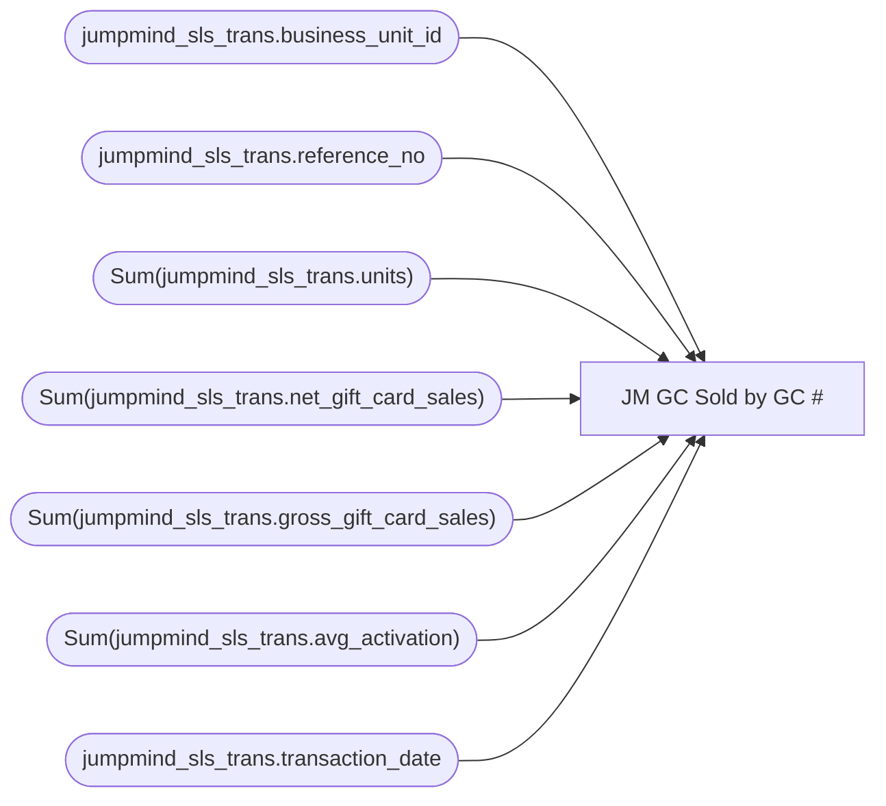

# JM GC Sold by GC #

**Workspace:** Enterprise Analytics Dev  
**Report ID:** 0ba7ca3d-644e-4584-b4c0-bdde06b4dfc3  
**Dataset ID:** a8eb92f5-ab46-4174-ba03-31395dc2f224  
**Web URL:** https://app.powerbi.com/groups/109bd275-5f44-4366-b343-9b41b5cfb040/reports/0ba7ca3d-644e-4584-b4c0-bdde06b4dfc3  
**Semantic Model:** [JM GC Sold by GC #](../../SemanticModels/Enterprise Analytics Dev/JM GC Sold by GC #.md)  

## Architecture Diagram

## Field Dependencies

| Referenced Field |
|---|
| jumpmind_sls_trans.business_unit_id |
| jumpmind_sls_trans.reference_no |
| Sum(jumpmind_sls_trans.units) |
| Sum(jumpmind_sls_trans.net_gift_card_sales) |
| Sum(jumpmind_sls_trans.gross_gift_card_sales) |
| Sum(jumpmind_sls_trans.avg_activation) |
| jumpmind_sls_trans.transaction_date |

## Pages

| Page | Visuals |
|---|---|
| Page 1 | 1 |

## Visuals

### Page 1

| Visual | Type | Fields |
|---|---|---|
| b90221b3d3164a9e8583 | tableEx | jumpmind_sls_trans.business_unit_id, jumpmind_sls_trans.reference_no, Sum(jumpmind_sls_trans.units), Sum(jumpmind_sls_trans.net_gift_card_sales), Sum(jumpmind_sls_trans.gross_gift_card_sales), Sum(jumpmind_sls_trans.avg_activation), jumpmind_sls_trans.transaction_date |
