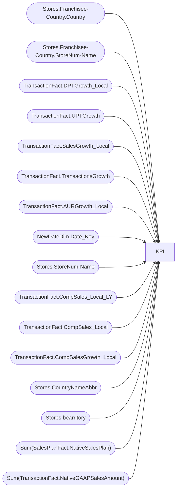

# KPI

**Workspace:** Enterprise Analytics Dev  
**Report ID:** 625fe303-f351-44ff-ae41-461224e746c9  
**Dataset ID:** 0d354f73-5a32-4d1d-9be1-e2681297b656  
**Web URL:** https://app.powerbi.com/groups/109bd275-5f44-4366-b343-9b41b5cfb040/reports/625fe303-f351-44ff-ae41-461224e746c9  
**Semantic Model:** [SM_AZAS_V2](../../SemanticModels/Enterprise Analytics Dev/SM_AZAS_V2.md)  

## Architecture Diagram

## Field Dependencies

| Referenced Field |
|---|
| Stores.Franchisee-Country.Country |
| Stores.Franchisee-Country.StoreNum-Name |
| TransactionFact.DPTGrowth_Local |
| TransactionFact.UPTGrowth |
| TransactionFact.SalesGrowth_Local |
| TransactionFact.TransactionsGrowth |
| TransactionFact.AURGrowth_Local |
| NewDateDim.Date_Key |
| Stores.StoreNum-Name |
| TransactionFact.CompSales_Local_LY |
| TransactionFact.CompSales_Local |
| TransactionFact.CompSalesGrowth_Local |
| Stores.CountryNameAbbr |
| Stores.bearritory |
| Sum(SalesPlanFact.NativeSalesPlan) |
| Sum(TransactionFact.NativeGAAPSalesAmount) |

## Pages

| Page | Visuals |
|---|---|
| Page 1 | 5 |
| Page 2 | 1 |

## Visuals

### Page 1

| Visual | Type | Fields |
|---|---|---|
| 0a431727a73d66d169d0 | clusteredColumnChart | Stores.Franchisee-Country.Country, Stores.Franchisee-Country.StoreNum-Name, TransactionFact.DPTGrowth_Local, TransactionFact.UPTGrowth, TransactionFact.SalesGrowth_Local, TransactionFact.TransactionsGrowth, TransactionFact.AURGrowth_Local |
| 95015c01f3d5905ca234 | slicer | NewDateDim.Date_Key |
| a6e577605ed429d9a440 | lineClusteredColumnComboChart | Stores.StoreNum-Name, TransactionFact.CompSales_Local_LY, TransactionFact.CompSales_Local, TransactionFact.CompSalesGrowth_Local |
| d80aef36261683c56ba9 | slicer | Stores.CountryNameAbbr |
| 8efeae642950b26a32d4 | slicer | Stores.bearritory |

### Page 2

| Visual | Type | Fields |
|---|---|---|
| 630a2ab57915c1592489 | clusteredColumnChart | Stores.CountryNameAbbr, Sum(SalesPlanFact.NativeSalesPlan), Sum(TransactionFact.NativeGAAPSalesAmount) |
