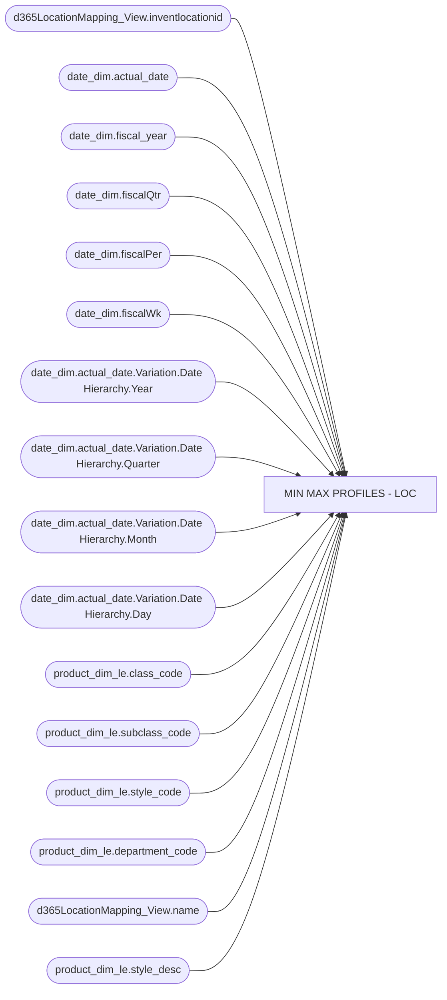

# MIN MAX PROFILES - LOC

**Workspace:** Enterprise Analytics Dev  
**Report ID:** e9b0458f-febe-4b7c-b3e9-9fb9ef88a49c  
**Dataset ID:** 05daff4b-5e80-4cd4-94ba-90a3110d5e14  
**Web URL:** https://app.powerbi.com/groups/109bd275-5f44-4366-b343-9b41b5cfb040/reports/e9b0458f-febe-4b7c-b3e9-9fb9ef88a49c  
**Semantic Model:** [Merchandise Transactional Model](../../SemanticModels/Enterprise Analytics Dev/Merchandise Transactional Model.md)  

## Architecture Diagram

## Field Dependencies

| Referenced Field |
|---|
| d365LocationMapping_View.inventlocationid |
| date_dim.actual_date |
| date_dim.fiscal_year |
| date_dim.fiscalQtr |
| date_dim.fiscalPer |
| date_dim.fiscalWk |
| date_dim.actual_date.Variation.Date Hierarchy.Year |
| date_dim.actual_date.Variation.Date Hierarchy.Quarter |
| date_dim.actual_date.Variation.Date Hierarchy.Month |
| date_dim.actual_date.Variation.Date Hierarchy.Day |
| product_dim_le.class_code |
| product_dim_le.subclass_code |
| product_dim_le.style_code |
| product_dim_le.department_code |
| d365LocationMapping_View.name |
| product_dim_le.style_desc |

## Pages

| Page | Visuals |
|---|---|
| MIN MAX PROFILES - LOC | 23 |

## Visuals

### MIN MAX PROFILES - LOC

| Visual | Type | Fields |
|---|---|---|
| 0b4140222c5f6ce0edbe | unknown |  |
| f920f4a3989b72fd51af | textbox |  |
| 0bcd43cda8b8c9272764 | textbox |  |
| 97f4659a5a12bc988c51 | image |  |
| 9ea736d49b75db93980e | textbox |  |
| ec739d70b14b7c06805a | actionButton |  |
| 44b856414f1a82fa1972 | unknown |  |
| d986b5ee6dd8555a4031 | slicer | d365LocationMapping_View.inventlocationid |
| 122ea31d98d5e46b728a | bookmarkNavigator |  |
| 97f4637b9433dd67029c | textFilter25A4896A83E0487089E2B90C9AE57C8A | d365LocationMapping_View.inventlocationid |
| ebf4a2dc4872072b777f | unknown |  |
| 9a7956cae86f44783ec2 | slicer | date_dim.actual_date |
| cc9c621b0f8156219228 | slicer | date_dim.fiscal_year, date_dim.actual_date, date_dim.fiscalQtr, date_dim.fiscalPer, date_dim.fiscalWk |
| 4df0d921ab0b5d077f2c | slicer | date_dim.actual_date.Variation.Date Hierarchy.Year, date_dim.actual_date.Variation.Date Hierarchy.Quarter, date_dim.actual_date.Variation.Date Hierarchy.Month, date_dim.actual_date.Variation.Date Hierarchy.Day |
| cca8d761cff72ee6b8d5 | bookmarkNavigator |  |
| 826e14c9840c3793285e | unknown |  |
| e8e740717323d0200f7a | slicer | product_dim_le.class_code |
| 7869095a179dc31dae86 | slicer | product_dim_le.subclass_code |
| 2c050ec017a6225d6f41 | slicer | product_dim_le.style_code |
| 0990f82a5dbf1a44dadb | slicer | product_dim_le.department_code |
| 6f0031da695b744bd74a | textbox |  |
| 0b2093608127704ad689 | actionButton |  |
| 22ef0782e8c8e8152f78 | tableEx | d365LocationMapping_View.name, product_dim_le.style_code, product_dim_le.style_desc, d365LocationMapping_View.inventlocationid |
