# Planning and Allocation – 53 Week Item Unit Sales by Style and Location – Ad Hoc

**Workspace:** Enterprise Analytics Dev  
**Report ID:** c78de181-bfb3-4bdc-8386-6ce20134f8e4  
**Dataset ID:** fba3b349-79e8-41c0-9703-c90e9ddeef23  
**Web URL:** https://app.powerbi.com/groups/109bd275-5f44-4366-b343-9b41b5cfb040/reports/c78de181-bfb3-4bdc-8386-6ce20134f8e4  
**Semantic Model:** [Merchandise Aggregate Semantic Model](../../SemanticModels/Enterprise Analytics Dev/Merchandise Aggregate Semantic Model.md)  

## Architecture Diagram

```mermaid
flowchart LR
    REPORT["Planning and Allocation – 53 Week Item Unit Sales by Style and Location – Ad Hoc"]
    product_dim_le_department_code(["product_dim_le.department_code"]) --> REPORT
    product_dim_le_style_code(["product_dim_le.style_code"]) --> REPORT
    date_dim_actual_date_Variation_Date_Hierarchy_Year(["date_dim.actual_date.Variation.Date Hierarchy.Year"]) --> REPORT
    product_dim_le_subclass_code(["product_dim_le.subclass_code"]) --> REPORT
    date_dim_actual_date(["date_dim.actual_date"]) --> REPORT
    date_dim_fiscal_year(["date_dim.fiscal_year"]) --> REPORT
    d365LocationMapping_View_inventlocationid(["d365LocationMapping_View.inventlocationid"]) --> REPORT
    product_dim_le_style_desc(["product_dim_le.style_desc"]) --> REPORT
    WeeklySalesView_Net_Sales_Units__01_(["WeeklySalesView.Net Sales Units (01)"]) --> REPORT
    WeeklySalesView_Net_Sales_Units__02_(["WeeklySalesView.Net Sales Units (02)"]) --> REPORT
    WeeklySalesView_Net_Sales_Units__03_(["WeeklySalesView.Net Sales Units (03)"]) --> REPORT
    WeeklySalesView_Net_Sales_Units__04_(["WeeklySalesView.Net Sales Units (04)"]) --> REPORT
    WeeklySalesView_Net_Sales_Units__05_(["WeeklySalesView.Net Sales Units (05)"]) --> REPORT
    WeeklySalesView_Net_Sales_Units__06_(["WeeklySalesView.Net Sales Units (06)"]) --> REPORT
    WeeklySalesView_Net_Sales_Units__07_(["WeeklySalesView.Net Sales Units (07)"]) --> REPORT
    WeeklySalesView_Net_Sales_Units__08_(["WeeklySalesView.Net Sales Units (08)"]) --> REPORT
    WeeklySalesView_Net_Sales_Units__09_(["WeeklySalesView.Net Sales Units (09)"]) --> REPORT
    WeeklySalesView_Net_Sales_Units__10_(["WeeklySalesView.Net Sales Units (10)"]) --> REPORT
    WeeklySalesView_Net_Sales_Units__11_(["WeeklySalesView.Net Sales Units (11)"]) --> REPORT
    WeeklySalesView_Net_Sales_Units__12_(["WeeklySalesView.Net Sales Units (12)"]) --> REPORT
    WeeklySalesView_Net_Sales_Units__13_(["WeeklySalesView.Net Sales Units (13)"]) --> REPORT
    WeeklySalesView_Net_Sales_Units__14_(["WeeklySalesView.Net Sales Units (14)"]) --> REPORT
    WeeklySalesView_Net_Sales_Units__15_(["WeeklySalesView.Net Sales Units (15)"]) --> REPORT
    WeeklySalesView_Net_Sales_Units__16_(["WeeklySalesView.Net Sales Units (16)"]) --> REPORT
    WeeklySalesView_Net_Sales_Units__17_(["WeeklySalesView.Net Sales Units (17)"]) --> REPORT
    WeeklySalesView_Net_Sales_Units__18_(["WeeklySalesView.Net Sales Units (18)"]) --> REPORT
    WeeklySalesView_Net_Sales_Units__19_(["WeeklySalesView.Net Sales Units (19)"]) --> REPORT
    WeeklySalesView_Net_Sales_Units__20_(["WeeklySalesView.Net Sales Units (20)"]) --> REPORT
    WeeklySalesView_Net_Sales_Units__21_(["WeeklySalesView.Net Sales Units (21)"]) --> REPORT
    WeeklySalesView_Net_Sales_Units__22_(["WeeklySalesView.Net Sales Units (22)"]) --> REPORT
    WeeklySalesView_Net_Sales_Units__23_(["WeeklySalesView.Net Sales Units (23)"]) --> REPORT
    WeeklySalesView_Net_Sales_Units__24_(["WeeklySalesView.Net Sales Units (24)"]) --> REPORT
    WeeklySalesView_Net_Sales_Units__25_(["WeeklySalesView.Net Sales Units (25)"]) --> REPORT
    WeeklySalesView_Net_Sales_Units__26_(["WeeklySalesView.Net Sales Units (26)"]) --> REPORT
    WeeklySalesView_Net_Sales_Units__27_(["WeeklySalesView.Net Sales Units (27)"]) --> REPORT
    WeeklySalesView_Net_Sales_Units__28_(["WeeklySalesView.Net Sales Units (28)"]) --> REPORT
    WeeklySalesView_Net_Sales_Units__29_(["WeeklySalesView.Net Sales Units (29)"]) --> REPORT
    WeeklySalesView_Net_Sales_Units__30_(["WeeklySalesView.Net Sales Units (30)"]) --> REPORT
    WeeklySalesView_Net_Sales_Units__31_(["WeeklySalesView.Net Sales Units (31)"]) --> REPORT
    WeeklySalesView_Net_Sales_Units__32_(["WeeklySalesView.Net Sales Units (32)"]) --> REPORT
    WeeklySalesView_Net_Sales_Units__33_(["WeeklySalesView.Net Sales Units (33)"]) --> REPORT
    WeeklySalesView_Net_Sales_Units__34_(["WeeklySalesView.Net Sales Units (34)"]) --> REPORT
    WeeklySalesView_Net_Sales_Units__35_(["WeeklySalesView.Net Sales Units (35)"]) --> REPORT
    WeeklySalesView_Net_Sales_Units__36_(["WeeklySalesView.Net Sales Units (36)"]) --> REPORT
    WeeklySalesView_Net_Sales_Units__37_(["WeeklySalesView.Net Sales Units (37)"]) --> REPORT
    WeeklySalesView_Net_Sales_Units__38_(["WeeklySalesView.Net Sales Units (38)"]) --> REPORT
    WeeklySalesView_Net_Sales_Units__39_(["WeeklySalesView.Net Sales Units (39)"]) --> REPORT
    WeeklySalesView_Net_Sales_Units__40_(["WeeklySalesView.Net Sales Units (40)"]) --> REPORT
    WeeklySalesView_Net_Sales_Units__41_(["WeeklySalesView.Net Sales Units (41)"]) --> REPORT
    WeeklySalesView_Net_Sales_Units__42_(["WeeklySalesView.Net Sales Units (42)"]) --> REPORT
    WeeklySalesView_Net_Sales_Units__43_(["WeeklySalesView.Net Sales Units (43)"]) --> REPORT
    WeeklySalesView_Net_Sales_Units__44_(["WeeklySalesView.Net Sales Units (44)"]) --> REPORT
    WeeklySalesView_Net_Sales_Units__45_(["WeeklySalesView.Net Sales Units (45)"]) --> REPORT
    WeeklySalesView_Net_Sales_Units__46_(["WeeklySalesView.Net Sales Units (46)"]) --> REPORT
    WeeklySalesView_Net_Sales_Units__47_(["WeeklySalesView.Net Sales Units (47)"]) --> REPORT
    WeeklySalesView_Net_Sales_Units__48_(["WeeklySalesView.Net Sales Units (48)"]) --> REPORT
    WeeklySalesView_Net_Sales_Units__49_(["WeeklySalesView.Net Sales Units (49)"]) --> REPORT
    WeeklySalesView_Net_Sales_Units__50_(["WeeklySalesView.Net Sales Units (50)"]) --> REPORT
    WeeklySalesView_Net_Sales_Units__51_(["WeeklySalesView.Net Sales Units (51)"]) --> REPORT
    WeeklySalesView_Net_Sales_Units__52_(["WeeklySalesView.Net Sales Units (52)"]) --> REPORT
    WeeklySalesView_Net_Sales_Units__53_(["WeeklySalesView.Net Sales Units (53)"]) --> REPORT
    d365LocationMapping_View_name(["d365LocationMapping_View.name"]) --> REPORT
    product_dim_le_class_code(["product_dim_le.class_code"]) --> REPORT
```

## Field Dependencies

| Referenced Field |
|---|
| product_dim_le.department_code |
| product_dim_le.style_code |
| date_dim.actual_date.Variation.Date Hierarchy.Year |
| product_dim_le.subclass_code |
| date_dim.actual_date |
| date_dim.fiscal_year |
| d365LocationMapping_View.inventlocationid |
| product_dim_le.style_desc |
| WeeklySalesView.Net Sales Units (01) |
| WeeklySalesView.Net Sales Units (02) |
| WeeklySalesView.Net Sales Units (03) |
| WeeklySalesView.Net Sales Units (04) |
| WeeklySalesView.Net Sales Units (05) |
| WeeklySalesView.Net Sales Units (06) |
| WeeklySalesView.Net Sales Units (07) |
| WeeklySalesView.Net Sales Units (08) |
| WeeklySalesView.Net Sales Units (09) |
| WeeklySalesView.Net Sales Units (10) |
| WeeklySalesView.Net Sales Units (11) |
| WeeklySalesView.Net Sales Units (12) |
| WeeklySalesView.Net Sales Units (13) |
| WeeklySalesView.Net Sales Units (14) |
| WeeklySalesView.Net Sales Units (15) |
| WeeklySalesView.Net Sales Units (16) |
| WeeklySalesView.Net Sales Units (17) |
| WeeklySalesView.Net Sales Units (18) |
| WeeklySalesView.Net Sales Units (19) |
| WeeklySalesView.Net Sales Units (20) |
| WeeklySalesView.Net Sales Units (21) |
| WeeklySalesView.Net Sales Units (22) |
| WeeklySalesView.Net Sales Units (23) |
| WeeklySalesView.Net Sales Units (24) |
| WeeklySalesView.Net Sales Units (25) |
| WeeklySalesView.Net Sales Units (26) |
| WeeklySalesView.Net Sales Units (27) |
| WeeklySalesView.Net Sales Units (28) |
| WeeklySalesView.Net Sales Units (29) |
| WeeklySalesView.Net Sales Units (30) |
| WeeklySalesView.Net Sales Units (31) |
| WeeklySalesView.Net Sales Units (32) |
| WeeklySalesView.Net Sales Units (33) |
| WeeklySalesView.Net Sales Units (34) |
| WeeklySalesView.Net Sales Units (35) |
| WeeklySalesView.Net Sales Units (36) |
| WeeklySalesView.Net Sales Units (37) |
| WeeklySalesView.Net Sales Units (38) |
| WeeklySalesView.Net Sales Units (39) |
| WeeklySalesView.Net Sales Units (40) |
| WeeklySalesView.Net Sales Units (41) |
| WeeklySalesView.Net Sales Units (42) |
| WeeklySalesView.Net Sales Units (43) |
| WeeklySalesView.Net Sales Units (44) |
| WeeklySalesView.Net Sales Units (45) |
| WeeklySalesView.Net Sales Units (46) |
| WeeklySalesView.Net Sales Units (47) |
| WeeklySalesView.Net Sales Units (48) |
| WeeklySalesView.Net Sales Units (49) |
| WeeklySalesView.Net Sales Units (50) |
| WeeklySalesView.Net Sales Units (51) |
| WeeklySalesView.Net Sales Units (52) |
| WeeklySalesView.Net Sales Units (53) |
| d365LocationMapping_View.name |
| product_dim_le.class_code |

## Pages

| Page | Visuals |
|---|---|
| 53 Week Item Unit Sales by Style and Location | 23 |

## Visuals

### 53 Week Item Unit Sales by Style and Location

| Visual | Type | Fields |
|---|---|---|
| 0990f82a5dbf1a44dadb | slicer | product_dim_le.department_code |
| 0b2093608127704ad689 | actionButton |  |
| 0b4140222c5f6ce0edbe | unknown |  |
| 0bcd43cda8b8c9272764 | textbox |  |
| 122ea31d98d5e46b728a | bookmarkNavigator |  |
| 2c050ec017a6225d6f41 | slicer | product_dim_le.style_code |
| 44b856414f1a82fa1972 | unknown |  |
| 4df0d921ab0b5d077f2c | slicer | date_dim.actual_date.Variation.Date Hierarchy.Year |
| 6f0031da695b744bd74a | textbox |  |
| 7869095a179dc31dae86 | slicer | product_dim_le.subclass_code |
| 826e14c9840c3793285e | unknown |  |
| 97f4637b9433dd67029c | textFilter25A4896A83E0487089E2B90C9AE57C8A | product_dim_le.style_code |
| 97f4659a5a12bc988c51 | image |  |
| 9a7956cae86f44783ec2 | slicer | date_dim.actual_date |
| 9ea736d49b75db93980e | textbox |  |
| cc9c621b0f8156219228 | slicer | date_dim.fiscal_year |
| cca8d761cff72ee6b8d5 | bookmarkNavigator |  |
| d986b5ee6dd8555a4031 | slicer | d365LocationMapping_View.inventlocationid |
| e0290b3bdcd982dcae6f | tableEx | product_dim_le.style_code, product_dim_le.style_desc, WeeklySalesView.Net Sales Units (01), WeeklySalesView.Net Sales Units (02), WeeklySalesView.Net Sales Units (03), WeeklySalesView.Net Sales Units (04), WeeklySalesView.Net Sales Units (05), WeeklySalesView.Net Sales Units (06), WeeklySalesView.Net Sales Units (07), WeeklySalesView.Net Sales Units (08), WeeklySalesView.Net Sales Units (09), WeeklySalesView.Net Sales Units (10), WeeklySalesView.Net Sales Units (11), WeeklySalesView.Net Sales Units (12), WeeklySalesView.Net Sales Units (13), WeeklySalesView.Net Sales Units (14), WeeklySalesView.Net Sales Units (15), WeeklySalesView.Net Sales Units (16), WeeklySalesView.Net Sales Units (17), WeeklySalesView.Net Sales Units (18), WeeklySalesView.Net Sales Units (19), WeeklySalesView.Net Sales Units (20), WeeklySalesView.Net Sales Units (21), WeeklySalesView.Net Sales Units (22), WeeklySalesView.Net Sales Units (23), WeeklySalesView.Net Sales Units (24), WeeklySalesView.Net Sales Units (25), WeeklySalesView.Net Sales Units (26), WeeklySalesView.Net Sales Units (27), WeeklySalesView.Net Sales Units (28), WeeklySalesView.Net Sales Units (29), WeeklySalesView.Net Sales Units (30), WeeklySalesView.Net Sales Units (31), WeeklySalesView.Net Sales Units (32), WeeklySalesView.Net Sales Units (33), WeeklySalesView.Net Sales Units (34), WeeklySalesView.Net Sales Units (35), WeeklySalesView.Net Sales Units (36), WeeklySalesView.Net Sales Units (37), WeeklySalesView.Net Sales Units (38), WeeklySalesView.Net Sales Units (39), WeeklySalesView.Net Sales Units (40), WeeklySalesView.Net Sales Units (41), WeeklySalesView.Net Sales Units (42), WeeklySalesView.Net Sales Units (43), WeeklySalesView.Net Sales Units (44), WeeklySalesView.Net Sales Units (45), WeeklySalesView.Net Sales Units (46), WeeklySalesView.Net Sales Units (47), WeeklySalesView.Net Sales Units (48), WeeklySalesView.Net Sales Units (49), WeeklySalesView.Net Sales Units (50), WeeklySalesView.Net Sales Units (51), WeeklySalesView.Net Sales Units (52), WeeklySalesView.Net Sales Units (53), d365LocationMapping_View.name, d365LocationMapping_View.inventlocationid |
| e8e740717323d0200f7a | slicer | product_dim_le.class_code |
| ebf4a2dc4872072b777f | unknown |  |
| ec739d70b14b7c06805a | actionButton |  |
| f920f4a3989b72fd51af | textbox |  |
