# Planning and Allocation – ATRIUM Channel Inventory and 12 Week On Order Position – Ad Hoc

**Workspace:** Enterprise Analytics Dev  
**Report ID:** 52be2fbd-11b9-40a4-bfbc-ac2f2a1f123b  
**Dataset ID:** fba3b349-79e8-41c0-9703-c90e9ddeef23  
**Web URL:** https://app.powerbi.com/groups/109bd275-5f44-4366-b343-9b41b5cfb040/reports/52be2fbd-11b9-40a4-bfbc-ac2f2a1f123b  
**Semantic Model:** [Merchandise Aggregate Semantic Model](../../SemanticModels/Enterprise Analytics Dev/Merchandise Aggregate Semantic Model.md)  

## Architecture Diagram

```mermaid
flowchart LR
    REPORT["Planning and Allocation – ATRIUM Channel Inventory and 12 Week On Order Position – Ad Hoc"]
    product_dim_le_chain(["product_dim_le.chain"]) --> REPORT
    productattributesummaryview_MSTAT(["productattributesummaryview.MSTAT"]) --> REPORT
    product_dim_le_style_code(["product_dim_le.style_code"]) --> REPORT
    productattributesummaryview_KEYSTY(["productattributesummaryview.KEYSTY"]) --> REPORT
    date_dim_actual_date_Variation_Date_Hierarchy_Year(["date_dim.actual_date.Variation.Date Hierarchy.Year"]) --> REPORT
    date_dim_actual_date_Variation_Date_Hierarchy_Quarter(["date_dim.actual_date.Variation.Date Hierarchy.Quarter"]) --> REPORT
    date_dim_actual_date_Variation_Date_Hierarchy_Month(["date_dim.actual_date.Variation.Date Hierarchy.Month"]) --> REPORT
    date_dim_actual_date_Variation_Date_Hierarchy_Day(["date_dim.actual_date.Variation.Date Hierarchy.Day"]) --> REPORT
    product_dim_le_style_desc(["product_dim_le.style_desc"]) --> REPORT
    product_dim_le_primary_vendor_code(["product_dim_le.primary_vendor_code"]) --> REPORT
    Sum_product_dim_le_Style_Order_Multiple_(["Sum(product_dim_le.Style Order Multiple)"]) --> REPORT
    Sum_product_dim_le_babDistribMultiple_(["Sum(product_dim_le.babDistribMultiple)"]) --> REPORT
    WeeklyOnOrderView_On_Order_Units__Total_0_12_Weeks_(["WeeklyOnOrderView.On Order Units (Total 0-12 Weeks)"]) --> REPORT
    WeeklyOnOrderView_On_Order_Units__Current_Weeks_(["WeeklyOnOrderView.On Order Units (Current Weeks)"]) --> REPORT
    WeeklyOnOrderView_On_Order_Units__Next_1_Weeks_(["WeeklyOnOrderView.On Order Units (Next 1 Weeks)"]) --> REPORT
    WeeklyOnOrderView_On_Order_Units__Next_2_Weeks_(["WeeklyOnOrderView.On Order Units (Next 2 Weeks)"]) --> REPORT
    WeeklyOnOrderView_On_Order_Units__Next_3_Weeks_(["WeeklyOnOrderView.On Order Units (Next 3 Weeks)"]) --> REPORT
    WeeklyOnOrderView_On_Order_Units__Next_4_Weeks_(["WeeklyOnOrderView.On Order Units (Next 4 Weeks)"]) --> REPORT
    WeeklyOnOrderView_On_Order_Units__Next_5_Weeks_(["WeeklyOnOrderView.On Order Units (Next 5 Weeks)"]) --> REPORT
    WeeklyOnOrderView_On_Order_Units__Next_6_Weeks_(["WeeklyOnOrderView.On Order Units (Next 6 Weeks)"]) --> REPORT
    WeeklyOnOrderView_On_Order_Units__Next_7_Weeks_(["WeeklyOnOrderView.On Order Units (Next 7 Weeks)"]) --> REPORT
    WeeklyOnOrderView_On_Order_Units__Next_8_Weeks_(["WeeklyOnOrderView.On Order Units (Next 8 Weeks)"]) --> REPORT
    WeeklyOnOrderView_On_Order_Units__Next_9_Weeks_(["WeeklyOnOrderView.On Order Units (Next 9 Weeks)"]) --> REPORT
    WeeklyOnOrderView_On_Order_Units__Next_10_Weeks_(["WeeklyOnOrderView.On Order Units (Next 10 Weeks)"]) --> REPORT
    WeeklyOnOrderView_On_Order_Units__Next_11_Weeks_(["WeeklyOnOrderView.On Order Units (Next 11 Weeks)"]) --> REPORT
    WeeklyOnOrderView_On_Order_Units__Next_12_Weeks_(["WeeklyOnOrderView.On Order Units (Next 12 Weeks)"]) --> REPORT
    Sum_InventSumCurrentViewForWHSEnabledItems_availphysical_(["Sum(InventSumCurrentViewForWHSEnabledItems.availphysical)"]) --> REPORT
    date_dim_actual_date(["date_dim.actual_date"]) --> REPORT
    d365LocationMapping_View_LocationCode(["d365LocationMapping_View.LocationCode"]) --> REPORT
```

## Field Dependencies

| Referenced Field |
|---|
| product_dim_le.chain |
| productattributesummaryview.MSTAT |
| product_dim_le.style_code |
| productattributesummaryview.KEYSTY |
| date_dim.actual_date.Variation.Date Hierarchy.Year |
| date_dim.actual_date.Variation.Date Hierarchy.Quarter |
| date_dim.actual_date.Variation.Date Hierarchy.Month |
| date_dim.actual_date.Variation.Date Hierarchy.Day |
| product_dim_le.style_desc |
| product_dim_le.primary_vendor_code |
| Sum(product_dim_le.Style Order Multiple) |
| Sum(product_dim_le.babDistribMultiple) |
| WeeklyOnOrderView.On Order Units (Total 0-12 Weeks) |
| WeeklyOnOrderView.On Order Units (Current Weeks) |
| WeeklyOnOrderView.On Order Units (Next 1 Weeks) |
| WeeklyOnOrderView.On Order Units (Next 2 Weeks) |
| WeeklyOnOrderView.On Order Units (Next 3 Weeks) |
| WeeklyOnOrderView.On Order Units (Next 4 Weeks) |
| WeeklyOnOrderView.On Order Units (Next 5 Weeks) |
| WeeklyOnOrderView.On Order Units (Next 6 Weeks) |
| WeeklyOnOrderView.On Order Units (Next 7 Weeks) |
| WeeklyOnOrderView.On Order Units (Next 8 Weeks) |
| WeeklyOnOrderView.On Order Units (Next 9 Weeks) |
| WeeklyOnOrderView.On Order Units (Next 10 Weeks) |
| WeeklyOnOrderView.On Order Units (Next 11 Weeks) |
| WeeklyOnOrderView.On Order Units (Next 12 Weeks) |
| Sum(InventSumCurrentViewForWHSEnabledItems.availphysical) |
| date_dim.actual_date |
| d365LocationMapping_View.LocationCode |

## Pages

| Page | Visuals |
|---|---|
| ATRIUM Channel Inventory and 12 Week On Order Position | 18 |

## Visuals

### ATRIUM Channel Inventory and 12 Week On Order Position

| Visual | Type | Fields |
|---|---|---|
| 0990f82a5dbf1a44dadb | slicer | product_dim_le.chain |
| 0b4140222c5f6ce0edbe | unknown |  |
| 0bcd43cda8b8c9272764 | textbox |  |
| 22da671c0667f2a982ae | slicer | productattributesummaryview.MSTAT |
| 2c050ec017a6225d6f41 | slicer | product_dim_le.style_code |
| 3edf860c41bfa20e56ed | slicer | productattributesummaryview.KEYSTY |
| 44b856414f1a82fa1972 | unknown |  |
| 4df0d921ab0b5d077f2c | slicer | date_dim.actual_date.Variation.Date Hierarchy.Year, date_dim.actual_date.Variation.Date Hierarchy.Quarter, date_dim.actual_date.Variation.Date Hierarchy.Month, date_dim.actual_date.Variation.Date Hierarchy.Day |
| 597e26005ae09ed7d96a | tableEx | product_dim_le.style_desc, productattributesummaryview.MSTAT, product_dim_le.chain, productattributesummaryview.KEYSTY, product_dim_le.primary_vendor_code, Sum(product_dim_le.Style Order Multiple), Sum(product_dim_le.babDistribMultiple), WeeklyOnOrderView.On Order Units (Total 0-12 Weeks), WeeklyOnOrderView.On Order Units (Current Weeks), WeeklyOnOrderView.On Order Units (Next 1 Weeks), WeeklyOnOrderView.On Order Units (Next 2 Weeks), WeeklyOnOrderView.On Order Units (Next 3 Weeks), WeeklyOnOrderView.On Order Units (Next 4 Weeks), WeeklyOnOrderView.On Order Units (Next 5 Weeks), WeeklyOnOrderView.On Order Units (Next 6 Weeks), WeeklyOnOrderView.On Order Units (Next 7 Weeks), WeeklyOnOrderView.On Order Units (Next 8 Weeks), WeeklyOnOrderView.On Order Units (Next 9 Weeks), WeeklyOnOrderView.On Order Units (Next 10 Weeks), WeeklyOnOrderView.On Order Units (Next 11 Weeks), WeeklyOnOrderView.On Order Units (Next 12 Weeks), Sum(InventSumCurrentViewForWHSEnabledItems.availphysical), product_dim_le.style_code |
| 6f0031da695b744bd74a | textbox |  |
| 826e14c9840c3793285e | unknown |  |
| 97f4637b9433dd67029c | Datepicker_1687358625 | date_dim.actual_date |
| 97f4659a5a12bc988c51 | image |  |
| 9ea736d49b75db93980e | textbox |  |
| d986b5ee6dd8555a4031 | textSlicer | d365LocationMapping_View.LocationCode |
| e8e740717323d0200f7a | slicer | product_dim_le.primary_vendor_code |
| ec739d70b14b7c06805a | actionButton |  |
| f920f4a3989b72fd51af | textbox |  |
